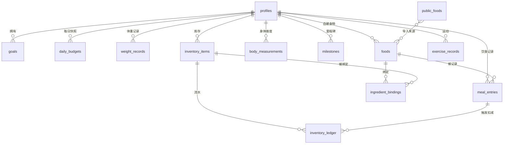
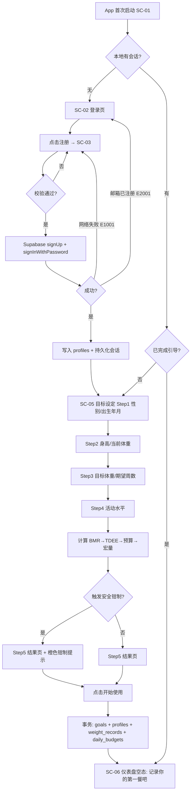
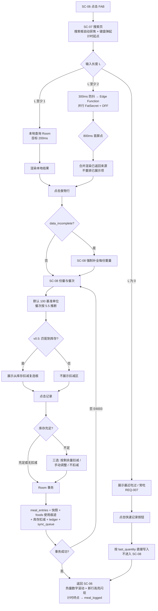
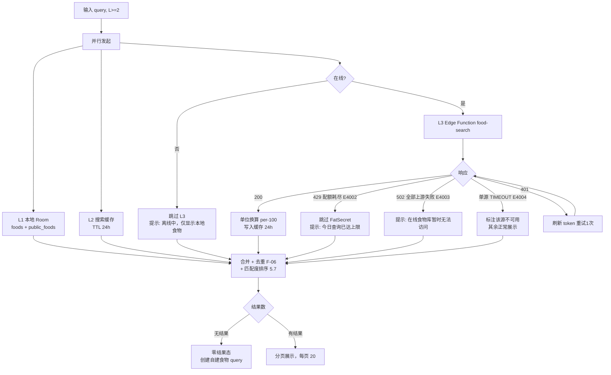
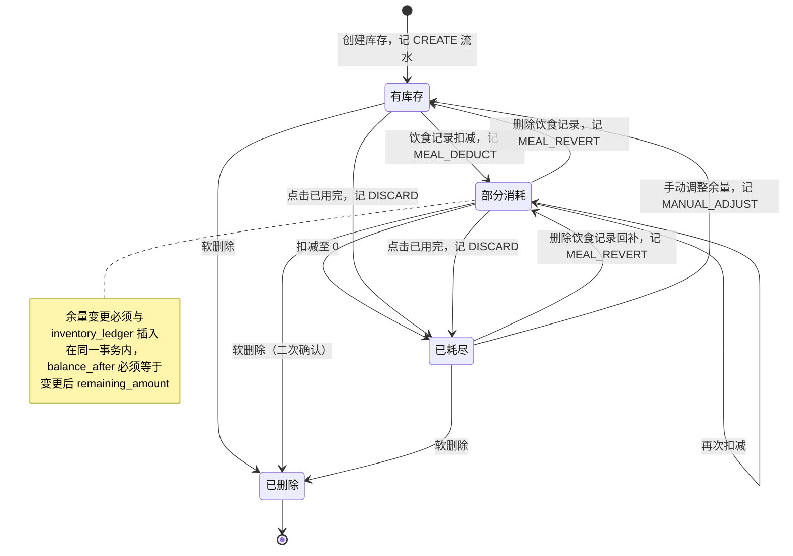
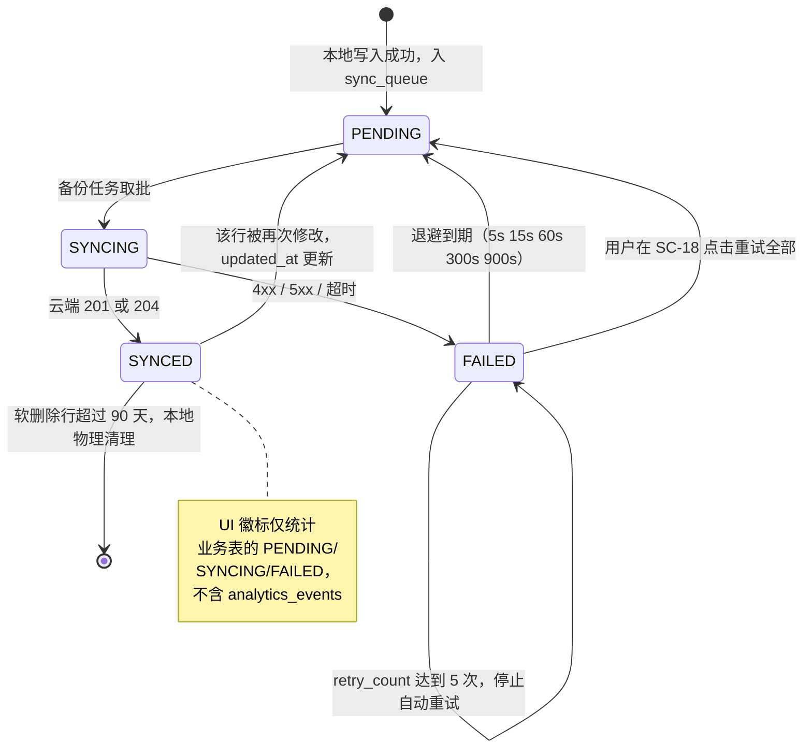
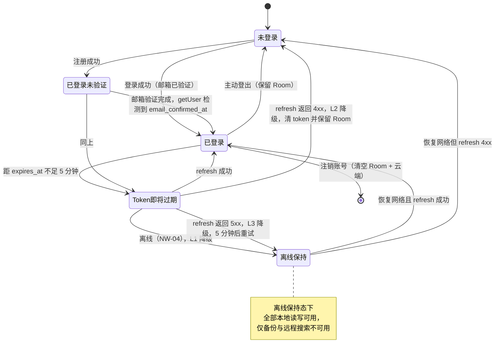
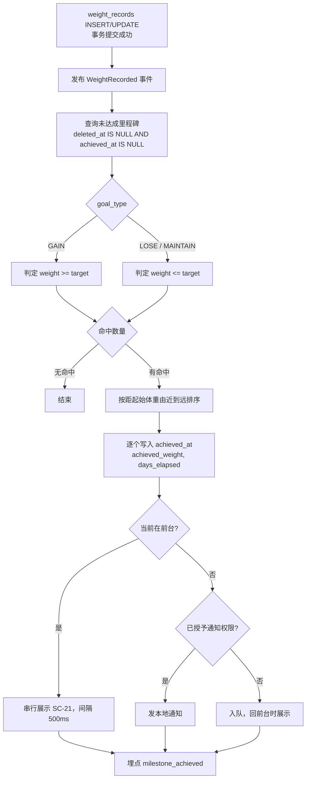

# 健康打卡 产品需求文档（正式版）

> **文档编号**: PRD-HC-2026-001
> **版本**: v2.0（正式版）
> **日期**: 2026-07-29
> **状态**: 待评审确认
> **适用范围**: Android 客户端（Jetpack Compose）+ Supabase 后端，v0.1 ~ v1.5
> **阅读对象**: 开发（Android / 后端 / 数据）、测试、设计、项目负责人

---

## 0. 文档信息

### 0.1 修订记录

| 版本 | 日期 | 修订人 | 修订内容 | 状态 |
|---|---|---|---|---|
| v1.0 | 2026-07-29 | 析客（需求分析师） | 初稿：产品目标、用户故事、竞品分析、需求池（14 条）、流程图、Non-goals、时间线 | 已废弃 |
| **v2.0** | **2026-07-29** | **需求评审** | 基于 109 项评审问题（P0 57 / P1 32 / P2 20）全面重构：① 拆分「前端表现 / 后端逻辑 / 数据存储 / 接口 / 异常分支 / 埋点 / 验收标准」七段式；② 补齐 7 条遗漏 P0 需求；③ 量化全部算法与判定规则；④ 新增数据模型、接口契约、埋点字典、错误码表、权限模型、非功能需求、UI 规范、状态机；⑤ 移除竞品/定价等非规格内容至附录引用 | **当前生效** |

### 0.2 与其他文档的关系

| 文档 | 职责边界 | 引用关系 |
|---|---|---|
| 本文档（PRD v2.0） | **需求与规格的唯一来源**：定义「做什么」「按什么规则做」「如何验收」。包含需求清单与人天估算 | 被路线图引用 |
| `roadmap-health-checkin-mvp-2026-07-29.md` | **排期与风险的唯一来源**：定义「何时做」「谁做」「风险与缓解」。周次、里程碑日期、行动清单以路线图为准 | 引用本文档的需求编号 |
| `prd-review-health-checkin-2026-07-29.md` | v1.0 评审意见与问题清单，本版修订依据 | — |

> **一致性规则**：本文档不再出现周次排期与甘特图；路线图不再出现需求验收标准。任一侧变更需同步另一侧并升版本号。
> **待同步项**：路线图需按本文档 §7.2 / §7.3 更新 P0 需求数量（7 → 14）、人天（26 → 40）与 P0 周期（6 → 9 周）。

### 0.3 需求变更管理

1. 本文档为范围基线。任何需求变更须提交变更单，记入 §0.1 修订记录并升次版本号。
2. **等价交换原则**：新增一条 P0 需求，必须同时降级或移除等量人天的现有 P0 需求。
3. 变更影响到数据模型（§6）或接口契约（§13）时，须同时给出 Room Migration 方案（§19.3）。

---

## 1. 产品概述

### 1.1 一句话定义

健康打卡是一款面向个人用户的 Android 健康管理应用，通过「极低摩擦的饮食记录」与「采购→库存→消耗全链路闭环」，帮助用户在热量预算内做出饮食决策。

### 1.2 版本目标与成功指标

产品目标按版本拆分，每个目标必须有唯一、可计算的度量口径。

| # | 目标 | 生效版本 | 度量口径（可计算） | 目标值 |
|---|---|---|---|---|
| **G1** | 降低饮食记录摩擦 | v0.1 | 埋点 `meal_logged.duration_ms` 的 **P50**，统计窗口=最近 20 条记录，计时定义见 §14.3 | P50 ≤ 5000 ms |
| **G2** | 打通采购→库存→消耗闭环 | **v0.5** | 库存关联率 = `meal_logged` 中 `from_inventory=true` 的条数 ÷ 总条数，统计窗口=自然周 | ≥ 50% |
| **G3** | 支撑数据驱动的自我调节 | v0.1 | 有效记录天数占比 = 当自然周内「当日饮食记录条数 ≥ 2」的天数 ÷ 7 | ≥ 5/7（即 71.4%） |

**北极星指标（WER，周有效记录）**：自然周（**周一 00:00 至周日 23:59:59，本地时区**）内满足「当日饮食记录条数 ≥ 2」的天数 ≥ 5 天，则该周计为达标。MVP 阶段用户数 = 1，WER 退化为二元指标，目标为「连续 4 周中 ≥ 3 周达标」。

**辅助指标**

| 指标 | 计算口径 | 目标值 |
|---|---|---|
| 日均饮食记录条数 | 统计周期内记录总条数 ÷ 有记录的天数 | ≥ 2.5 |
| 次日回访率 | 相邻两个自然日均存在 `app_session_start` 的比例 | ≥ 70% |
| 搜索零结果率 | `food_search_performed` 中 `result_count=0` 的比例 | ≤ 15% |
| 同步失败率 | `sync_failed` 条数 ÷ `sync_batch_completed` 条数 | ≤ 2% |

> 说明：单用户场景下所有百分比指标为观察值，不具统计显著性；其作用是验证功能是否按预期工作，不用于统计推断。行业基准数据见附录 C（仅供参考，不作为验收依据）。

### 1.3 版本范围

| 版本 | 主题 | 需求 | 人天 |
|---|---|---|---|
| **v0.1（P0）** | 核心记录闭环 | 14 条（§8） | 40.0 |
| **v0.5（P1）** | 库存闭环与身体数据 | 5 条（§9） | 17.0 |
| **v1.0（P2）** | 智能决策 | 2 条（§10） | 16.0 |
| **v1.5（P3）** | 运动记录 | 1 条（§11） | 5.0 |
| **合计** | — | **22 条** | **78.0 人天** |

> 人天按「有效人天」计（1 有效人天 ≈ 3 小时深度开发，5 有效人天/周）。P0 = 40 人天 ≈ 8 周开发 + 1 周测试与缓冲 = **9 周**。此估算已含 vibe coding 效率波动（AS-7），不需再乘系数。

### 1.4 技术栈（约束条件，非需求）

| 层 | 技术选型 | 约束 |
|---|---|---|
| 客户端 | Android 原生 / Kotlin / Jetpack Compose / Material 3 | minSdk 26、targetSdk 35 |
| 本地存储 | Room（SQLite） | **本地为唯一真源**，见 §4.6 |
| 依赖注入 | Hilt | — |
| 网络 | Retrofit + OkHttp + kotlinx.serialization | — |
| 图表 | Vico（Compose 图表库） | 不自行实现 Canvas 绘制 |
| 认证 | Supabase Auth（邮箱+密码） | — |
| 云端存储 | Supabase PostgreSQL | 仅使用标准 PostgreSQL 特性；禁用专有 SQL 扩展 |
| 服务端代理 | Supabase Edge Function（仅 1 个，无状态纯转发） | 见决策 D-03 |
| OCR（v1.0） | Google ML Kit Text Recognition v2（中文模型，端侧） | 不上传图片 |

---

## 2. 术语与缩写表

| 术语 | 全称 / 英文 | 定义与计算口径 |
|---|---|---|
| **BMR** | Basal Metabolic Rate，基础代谢率 | 静息状态下每日最低能量消耗，单位 kcal/日。本产品使用 Mifflin-St Jeor 公式计算，见 §5.1。**v1.0 中的「BEE」为同一概念，本版统一为 BMR** |
| **PAL** | Physical Activity Level，活动系数 | 用于将 BMR 换算为 TDEE 的乘数，取值见 §5.2 |
| **TDEE** | Total Daily Energy Expenditure，每日总消耗 | `TDEE = round(BMR × PAL)`，单位 kcal/日 |
| **每日热量预算** | Daily Calorie Budget | 用户每日应摄入的目标热量，`= TDEE + 每日热量差值`，见 §5.3，单位 kcal |
| **每日热量差值** | Daily Calorie Delta | 减重为负、增重为正、维持为 0，见 §5.3 |
| **宏量营养素** | Macronutrients | 蛋白质、碳水化合物、脂肪三项。产热系数：蛋白质 4 kcal/g、碳水 4 kcal/g、脂肪 9 kcal/g |
| **剩余热量** | Remaining Calories | `= 当日预算 − 当日已摄入热量`，可为负数 |
| **餐次** | Meal Slot | 枚举 `BREAKFAST / LUNCH / DINNER / SNACK`，自动推断规则见 §5.5 |
| **营养基准** | Nutrition Basis | 食物营养值的计量基准，`per 100 g`（固态）或 `per 100 ml`（液态） |
| **份量** | Serving | 用户习惯的计量单位（如「1 碗」），必须绑定对应克数 `serving_grams` |
| **食物快照** | Food Snapshot | 饮食记录创建时冗余保存的食物营养数据，保证历史记录不受外部数据源变化影响 |
| **食材键** | Ingredient Key | 归一化后的食材标识（如 `chicken_breast`），用于食物库与库存的匹配，见 §5.9 |
| **临期** | Near Expiry | 距保质期到期日 ≤ 3 个自然日且未过期 |
| **连续天数** | Streak | 连续满足某行为条件的自然日数量，判定规则见 §5.11 |
| **WER** | Weekly Effective Recording | 周有效记录，定义见 §1.2 |
| **匹配度** | Relevance Score | 食物搜索结果的排序得分，计算公式见 §5.7 |
| **LWW** | Last-Write-Wins | 冲突解决策略：以 `updated_at` 较大者为准 |
| **软删除** | Soft Delete | 通过 `deleted_at` 标记删除而不物理删除，保证删除动作可被同步 |
| **有效人天** | — | 1 个有效人天 = 单人 vibe coding 模式下约 3 小时深度开发时间；换算为 5 有效人天/周 |

---

## 3. 角色与权限模型

### 3.1 角色定义

| 角色 | 说明 | v0.1 是否支持 |
|---|---|---|
| **未登录访客** | 未持有有效会话 | 支持（仅可访问登录/注册/重置密码页） |
| **已登录用户（未验证邮箱）** | 持有有效会话，`email_confirmed_at` 为空 | 支持，**功能不受限**，设置页常驻验证提醒 |
| **已登录用户（已验证邮箱）** | 持有有效会话且邮箱已验证 | 支持 |

> 本产品无管理员角色、无多用户协作、无角色继承。所有数据归属单一 `user_id`。

### 3.2 页面访问权限矩阵

| 页面 | 未登录访客 | 已登录（未验证） | 已登录（已验证） |
|---|---|---|---|
| SC-01 启动页 | ✅ | ✅ | ✅ |
| SC-02 登录 / SC-03 注册 / SC-04 忘记密码 | ✅ | ❌（重定向至 SC-06） | ❌（重定向至 SC-06） |
| SC-05 目标设定向导 | ❌ | ✅（未完成时强制） | ✅ |
| SC-06 ~ SC-20（其余全部页面） | ❌（重定向至 SC-02） | ✅ | ✅ |

### 3.3 数据权限（Supabase RLS）

**所有业务表必须启用 Row Level Security**。每张含 `user_id` 的表创建以下 4 条策略：

```sql
ALTER TABLE <table> ENABLE ROW LEVEL SECURITY;

CREATE POLICY "<table>_select_own" ON <table>
  FOR SELECT USING (auth.uid() = user_id);
CREATE POLICY "<table>_insert_own" ON <table>
  FOR INSERT WITH CHECK (auth.uid() = user_id);
CREATE POLICY "<table>_update_own" ON <table>
  FOR UPDATE USING (auth.uid() = user_id) WITH CHECK (auth.uid() = user_id);
CREATE POLICY "<table>_delete_own" ON <table>
  FOR DELETE USING (auth.uid() = user_id);
```

公共食物表 `public_foods`（预建中式食物）例外：

```sql
ALTER TABLE public_foods ENABLE ROW LEVEL SECURITY;
CREATE POLICY "public_foods_read_all" ON public_foods
  FOR SELECT TO authenticated USING (true);
-- 无 INSERT/UPDATE/DELETE 策略，仅通过 service_role 维护
```

**验收要求**：使用 anon key 且未登录时，对任一业务表的读写请求必须返回 0 行或 401/403。此项为 P0 发布的阻断性检查项（TC-SEC-01）。

### 3.4 密钥与凭据管理

| 凭据 | 存放位置 | 禁止事项 |
|---|---|---|
| Supabase URL / anon key | APK（`BuildConfig`） | 允许，因 RLS 已生效；但**必须**确认 §3.3 已实施 |
| Supabase service_role key | 仅本地开发机 / CI Secret | **严禁**打包进 APK |
| FatSecret client_id / client_secret | 仅 Edge Function 环境变量 | **严禁**打包进 APK 或提交至仓库 |
| 用户 access_token / refresh_token | `EncryptedSharedPreferences`（AES-256-GCM） | 严禁写入日志、严禁存入 Room |
| 用户密码 | 不存储（仅内存中传输给 Supabase Auth） | 严禁本地持久化、严禁写入日志 |

### 3.5 Android 运行时权限

| 权限 | 用途 | 需求 | 申请时机 | 拒绝后降级 |
|---|---|---|---|---|
| `INTERNET` | 网络访问 | 全局 | 安装时授予（普通权限） | 不适用 |
| `ACCESS_NETWORK_STATE` | 判断在线/离线 | REQ-011 | 安装时授予 | 不适用 |
| `CAMERA` | 拍摄小票 | REQ-020 | 用户点击「拍照扫描」时 | 隐藏拍照入口，保留「从相册选择」与「手动录入」 |
| `READ_MEDIA_IMAGES`（API ≥ 33）<br>`READ_EXTERNAL_STORAGE`（API 26-32） | 从相册选择小票 | REQ-020 | 用户点击「从相册选择」时 | 优先改用 `PhotoPicker`（无需权限）；若设备不支持则隐藏入口 |
| `POST_NOTIFICATIONS`（API ≥ 33） | 里程碑达成通知 | REQ-016 | 用户创建首个里程碑后 | 仅应用内展示成就卡片，不发通知 |

**规则**：
1. 所有运行时权限必须在**使用点**申请，禁止在启动时批量申请。
2. 用户选择「不再询问」后，再次触发时展示引导弹窗（含「前往设置」按钮），不得反复弹系统对话框。
3. 相册选择优先使用 Android Photo Picker（`ActivityResultContracts.PickVisualMedia`），可完全规避存储权限。

---

## 4. 全局规则与约定

> 本章规则对所有需求生效。需求条目中不再重复描述这些规则，仅在有例外时说明。

### 4.1 时间与日期

| # | 规则 |
|---|---|
| **T-01** | **时区基准**：一切「日期」以设备**本地时区**计算。自然日区间为 `[00:00:00.000, 23:59:59.999]`。 |
| **T-02** | **时间戳存储**：所有时间戳字段以 UTC 存储（`TIMESTAMPTZ` / Room 中为 `Long` epoch millis）。 |
| **T-03** | **业务日期存储**：所有需要按日聚合的记录**同时**存储 `local_date`（`DATE`，`YYYY-MM-DD`）与 `tz_offset_minutes`（`INT`，写入时的本地时区偏移分钟数）。聚合查询一律使用 `local_date`，**禁止**在查询时从时间戳动态换算时区。 |
| **T-04** | **归属判定**：饮食记录归属日期 = `consumed_at` 转换为「写入时时区」后的日期。示例：本地时间 `2026-07-29 23:50` 记录归属 07-29；`2026-07-30 00:30` 归属 07-30。 |
| **T-05** | **跨零点进食**：不做特殊处理，按 T-04 归属。夜宵在 §5.5 中被推断为 `SNACK`，但日期归属仍按 T-04。 |
| **T-06** | **时区变更**：用户跨时区后，历史记录展示按其 `tz_offset_minutes` 快照，不重算；新记录使用新时区。 |
| **T-07** | **设备时间异常**：若 `System.currentTimeMillis()` 与最近一次服务端响应头 `Date` 的差值 > 24 小时，在仪表盘展示黄色提示条「设备时间可能不准确，可能影响记录日期」，但**不阻断**记录。 |
| **T-08** | **未来日期**：所有用户可编辑的日期字段禁止选择未来日期（> 今日本地日期）。日期选择器上限锁定为今日。 |
| **T-09** | **历史补录下限**：可补录日期下限 = `max(注册日期, 今日 − 365 天)`。 |

### 4.2 单位与换算

| # | 规则 |
|---|---|
| **U-01** | **营养基准**：食物营养值统一按 100 单位基准存储。`basis_unit ∈ {G, ML}`：固态食物用 `G`（每 100 g），液态用 `ML`（每 100 ml）。 |
| **U-02** | **记录单位**：饮食记录的 `unit ∈ {G, ML, SERVING}`。`unit` 必须与食物的 `basis_unit` 兼容：`G` ↔ `basis_unit=G`，`ML` ↔ `basis_unit=ML`，`SERVING` 对两者均可。 |
| **U-03** | **份量换算**：`unit=SERVING` 时必须存在 `serving_grams > 0`（对 `basis_unit=ML` 的食物该字段语义为「每份毫升数」）。换算：`basis_amount = quantity × serving_grams`。 |
| **U-04** | **摄入量计算**：`实际摄入营养值 = 食物每100基准值 × basis_amount ÷ 100`，其中 `unit ∈ {G, ML}` 时 `basis_amount = quantity`。 |
| **U-05** | **外部数据源换算**：外部 API 返回 per-serving 营养值时，换算为 per-100：`per100 = perServing × 100 ÷ serving_grams`。若 `serving_grams` 缺失、为 0 或非数值，该条结果标记 `data_incomplete = true`（见 U-06）。 |
| **U-06** | **不完整数据处理**：`data_incomplete = true` 的食物在搜索结果中以灰色副标题「份量信息缺失，需手动补全」展示；用户选中后进入「补全份量」步骤（必填 `serving_grams`），补全后方可记录。补全结果写入本地 `foods` 表。 |
| **U-07** | **库存单位**：库存 `unit ∈ {G, KG, ML, L, PIECE}`。基准换算：`1 KG = 1000 G`，`1 L = 1000 ML`。`PIECE` 必须绑定 `piece_grams > 0` 才能参与饮食扣减（REQ-017-LINK）。 |
| **U-08** | **体重单位**：kg，1 位小数。身高：cm，1 位小数。身体维度：cm，1 位小数。本版本不支持英制。 |

### 4.3 数值精度与取整

| # | 规则 |
|---|---|
| **N-01** | **存储精度**：热量与宏量在数据库中存储为 `NUMERIC(8,2)`（Room 中为 `Double`），保留 2 位小数。 |
| **N-02** | **展示精度**：热量展示为整数；宏量（g）展示为 1 位小数；体重与维度展示为 1 位小数；百分比展示为整数。 |
| **N-03** | **取整方式**：一律 `RoundingMode.HALF_UP`。 |
| **N-04** | **聚合顺序**：**先按 2 位小数精度累加，再对结果取整展示**。严禁逐条取整后累加。此规则保证「饮食列表逐条热量之和」与「已摄入总热量」的展示值一致（差值必为 0）。 |
| **N-05** | **除零保护**：任何以预算为分母的计算（如剩余占比），当分母 ≤ 0 时结果按「0%」处理并按红色态渲染。 |
| **N-06** | **千分位**：≥ 1000 的热量数值展示时使用千分位分隔符（如 `1,680`）。 |

### 4.4 输入校验通用规则

| # | 规则 |
|---|---|
| **V-01** | **校验时机**：数值/文本输入在**失焦时**与**提交时**校验；提交前不阻止输入（允许中间态），但提交按钮在存在校验错误时置灰。 |
| **V-02** | **错误展示**：错误信息展示在对应输入框下方，红色 12sp，同时输入框描边变红。一次仅展示该字段的第一条错误。 |
| **V-03** | **前后端一致**：所有校验规则必须在客户端（Kotlin）与数据库（`CHECK` 约束）双端实施，规则参数集中定义于单一常量文件，禁止分散硬编码。 |
| **V-04** | **文本裁剪**：所有文本输入在校验与保存前执行 `trim()`；连续空白折叠为单个空格。 |
| **V-05** | **文本长度**：食物名称 1-50 字符；自定义描述类字段 ≤ 200 字符；邮箱 ≤ 254 字符。超长时截断输入并轻提示。 |

### 4.5 网络与重试

| # | 规则 |
|---|---|
| **NW-01** | **传输安全**：仅允许 HTTPS（TLS 1.2+）。`AndroidManifest` 设置 `android:usesCleartextTraffic="false"`，并通过 `network_security_config.xml` 禁用明文。 |
| **NW-02** | **超时配置**：连接超时 5s、读取超时 10s；食物搜索单来源超时 3s（见 §5.6）。 |
| **NW-03** | **重试策略**：仅对**幂等**请求（GET、带幂等键的 UPSERT）自动重试；退避序列 `1s → 3s → 9s`，最多 3 次。非幂等请求不自动重试，由用户手动触发。 |
| **NW-04** | **离线判定**：以 `NetworkCapabilities.NET_CAPABILITY_VALIDATED` 为准，而非仅判断连接存在。 |
| **NW-05** | **请求竞态**：同一输入框的搜索请求，新请求发出时必须取消上一个未完成请求（`Job.cancel()`），并丢弃其结果。 |
| **NW-06** | **日志脱敏**：Release 构建禁止输出网络请求体与响应体；Token、邮箱、密码在任何构建类型下均不得写入日志。 |

### 4.6 存储架构与同步（v0.1 基线：本地真源 + 云端备份）

> **决策 D-05**：v0.1 采用「Room 为唯一真源 + 云端单向备份」，不做实时双向同步。理由：单人单设备场景下双向同步收益为零而复杂度最高（评审 P0-12 / Q-B）。双向同步延后至 v0.5 与库存功能一并实施。

| # | 规则 |
|---|---|
| **S-01** | **唯一真源**：所有读取一律来自 Room。UI 通过 Room `Flow` 订阅数据变化，不直接消费网络响应。 |
| **S-02** | **写入路径**：写操作 → 校验 → Room 事务提交 → 立即刷新 UI（乐观更新）→ 入备份队列。**网络失败绝不影响写入成功**。 |
| **S-03** | **主键**：所有业务表主键为客户端生成的 `UUID`（v7，时间有序），类型 `TEXT`/`UUID`。**禁止**使用数据库自增主键。 |
| **S-04** | **幂等**：云端写入统一使用 `INSERT ... ON CONFLICT (id) DO UPDATE`，保证重复上传不产生脏数据。 |
| **S-05** | **备份触发**：① 应用进入后台且距上次成功备份 > 30 分钟；② 每日首次冷启动；③ 设置页手动触发。仅在 WiFi 或用户显式允许时使用移动网络（默认允许，数据量极小）。 |
| **S-06** | **备份范围**：自 `last_backup_at` 之后 `updated_at` 有变化的全部业务行（含软删除行），按表分批上传，单批 ≤ 200 行。 |
| **S-07** | **备份状态**：`sync_state ∈ {PENDING, SYNCING, SYNCED, FAILED}`（状态机见 §12.5）。 |
| **S-08** | **失败退避**：备份失败按 `5s → 15s → 60s → 300s → 900s` 退避，最多 5 次；仍失败则置 `FAILED`，在设置页展示「待备份 N 条，点击重试」，并上报埋点 `sync_failed`。 |
| **S-09** | **软删除**：所有业务表使用 `deleted_at` 软删除。UI 查询一律附加 `deleted_at IS NULL`。物理删除仅在「本地清理任务」中执行（`deleted_at < now() − 90 天` 且 `sync_state = SYNCED`）。 |
| **S-10** | **恢复流程**：在新设备登录或用户点击「从云端恢复」时，全量下载该 `user_id` 的所有行并覆盖本地（覆盖前提示「本地未备份数据将丢失」并展示待备份条数）。 |
| **S-11** | **冲突解决**：v0.1 不存在并发写入场景。若检测到云端 `updated_at` > 本地 `updated_at`（如用户换机后又用旧机），采用 LWW：`updated_at` 大者胜；两者相等时以 `device_id` 字典序较大者胜（保证结果确定性）。 |
| **S-12** | **离线可用范围**：除「食物远程搜索」「云端备份/恢复」「邮箱验证/重置密码」外，**全部功能离线可用**。 |

### 4.7 文案规范

| # | 规则 |
|---|---|
| **C-01** | 全部用户可见文案定义于 `strings.xml`，禁止硬编码。 |
| **C-02** | 空态文案使用行动引导句式，禁止使用「暂无数据」「无记录」。例：「记录你的第一餐吧」「站上体重秤，开始追踪变化」。 |
| **C-03** | 错误文案结构 = 「发生了什么 + 可以怎么做」。例：「网络不太顺畅，已保存到本地，稍后会自动同步」。禁止暴露技术细节（错误码仅在设置页「诊断信息」中展示）。 |
| **C-04** | 健康相关提示使用中性表述，不使用评判性词汇（「你吃太多了」→「今日摄入已超出预算 320 大卡」）。 |
| **C-05** | 数字与单位之间不加空格（`1,680大卡` 或 `1,680 kcal` 二者择一，全局统一使用「大卡」）。 |

---

## 5. 核心算法与判定规则

> 本章所有规则为可直接实现的确定性算法。输入越界时的行为均已定义。

### 5.1 BMR 计算（Mifflin-St Jeor）

**输入**：`sex ∈ {MALE, FEMALE}`、`weight_kg`（当前体重）、`height_cm`、`age_years`

```
MALE:   BMR = 10 × weight_kg + 6.25 × height_cm − 5 × age_years + 5
FEMALE: BMR = 10 × weight_kg + 6.25 × height_cm − 5 × age_years − 161

BMR_final = round(BMR)   // HALF_UP，整数 kcal
```

| 边界 | 处理 |
|---|---|
| 计算结果 < 800 | 钳制为 800，并记录 `bmr_clamped = true` |
| 输入任一项缺失 | 不计算，向导不可进入下一步 |

**年龄计算**：`age_years = 满岁`，以 `birth_year_month`（`YYYY-MM`）与今日本地日期计算：`age = year(today) − year(birth) − (month(today) < month(birth) ? 1 : 0)`。

### 5.2 活动系数（PAL）

| 枚举值 | 展示名称 | 展示副标题 | PAL |
|---|---|---|---|
| `SEDENTARY` | 久坐 | 办公室工作，几乎不运动 | 1.200 |
| `LIGHT` | 轻度活动 | 每周运动 1-3 次 | 1.375 |
| `MODERATE` | 中度活动 | 每周运动 3-5 次 | 1.550 |
| `ACTIVE` | 高度活动 | 每周运动 6-7 次 | 1.725 |
| `ATHLETE` | 运动员 | 每天高强度训练或体力工作 | 1.900 |

```
TDEE = round(BMR_final × PAL)
```

### 5.3 目标类型、热量差值与每日预算

**Step 1｜目标类型判定**

```
Δw = target_weight_kg − current_weight_kg

goal_type = LOSE      if Δw < −0.5
          = GAIN      if Δw >  0.5
          = MAINTAIN  if −0.5 ≤ Δw ≤ 0.5
```

**Step 2｜理论每日热量差值**

采用能量当量 `7700 kcal / kg` 体重。

```
total_days   = target_weeks × 7                       // target_weeks ∈ [4, 52]
raw_delta    = 7700 × |Δw| / total_days               // kcal/日，正数

MAINTAIN: daily_delta = 0
LOSE:     daily_delta = −min(raw_delta, 1000)         // 减重缺口上限 1000 kcal/日
GAIN:     daily_delta = +min(raw_delta,  500)         // 增重盈余上限  500 kcal/日
```

**Step 3｜预算与安全下限**

```
budget_raw   = TDEE + daily_delta
safety_floor = 1500 (MALE) / 1200 (FEMALE)
budget       = round(max(budget_raw, safety_floor))
clamped      = (budget_raw < safety_floor) OR (raw_delta 被 Step 2 钳制)
```

**Step 4｜反算实际达成周数**（钳制生效时用于告知用户）

```
actual_daily_delta = budget − TDEE                    // 负数=减重，正数=增重
if actual_daily_delta == 0:
    est_weeks = null                                  // 维持目标，无达成周数
else:
    est_weeks = ceil( 7700 × |Δw| / (|actual_daily_delta| × 7) )
```

**Step 5｜前端提示规则**

| 条件 | 提示内容（展示在计算结果页，橙色提示条，不阻断） |
|---|---|
| `clamped = false` | 不提示 |
| `clamped = true` 且 `est_weeks` 存在 | 「为保证健康，每日热量差值已限制为 {\|actual_daily_delta\|} 大卡。按此速度预计需要 {est_weeks} 周达成目标（你的期望为 {target_weeks} 周）。」 |
| `est_weeks > 52` | 追加「建议调整目标体重或延长时间」 |

**示例校验表**（实现后必须逐行比对，作为单元测试用例 TC-ALG-01）

| # | 性别 | 年龄 | 身高 | 当前 | 目标 | 周数 | 活动 | BMR | TDEE | raw_delta | daily_delta | budget | est_weeks |
|---|---|---|---|---|---|---|---|---|---|---|---|---|---|
| 1 | MALE | 30 | 175 | 80.0 | 70.0 | 20 | LIGHT | 1749 | 2405 | 550.0 | −550 | 1855 | 20 |
| 2 | MALE | 30 | 175 | 80.0 | 70.0 | 4 | LIGHT | 1749 | 2405 | 2750.0 | −1000 | **1500** | **13** |
| 3 | FEMALE | 28 | 162 | 58.0 | 55.0 | 12 | SEDENTARY | 1292 | 1550 | 275.0 | −275 | 1275 | 12 |
| 4 | FEMALE | 28 | 162 | 52.0 | 55.0 | 12 | MODERATE | 1232 | 1910 | 275.0 | +275 | 2185 | 12 |
| 5 | MALE | 45 | 170 | 70.0 | 70.0 | 12 | MODERATE | 1543 | 2392 | 0.0 | 0 | 2392 | null |

**逐行说明（用于校验实现）**

| # | 说明 |
|---|---|
| 1 | `BMR = 10×80 + 6.25×175 − 5×30 + 5 = 1748.75 → 1749`；`TDEE = 1749 × 1.375 = 2404.875 → 2405`；`raw_delta = 7700×10/140 = 550`，未触发钳制；`budget = 2405 − 550 = 1855`；`est_weeks = ceil(77000/(550×7)) = 20` |
| 2 | 双重钳制：`raw_delta = 7700×10/28 = 2750` 被限为 `1000` → `budget_raw = 1405`；`1405 < 1500`（男性下限）→ `budget = 1500`；`actual_daily_delta = 1500 − 2405 = −905`；`est_weeks = ceil(77000/(905×7)) = ceil(12.16) = 13`。前端提示「每日热量差值已限制为 905 大卡，预计需要 13 周」 |
| 3 | `BMR = 580 + 1012.5 − 140 − 161 = 1291.5 → 1292`（HALF_UP）；`TDEE = 1292 × 1.2 = 1550.4 → 1550`；`raw_delta = 7700×3/84 = 275`；`budget_raw = 1275 > 1200`（女性下限），不钳制，`clamped = false` |
| 4 | 增重场景：`BMR = 520 + 1012.5 − 140 − 161 = 1231.5 → 1232`；`TDEE = 1232 × 1.55 = 1909.6 → 1910`；`raw_delta = 275 < 500`，不钳制，`budget = 1910 + 275 = 2185` |
| 5 | 维持场景：`BMR = 700 + 1062.5 − 225 + 5 = 1542.5 → 1543`；`TDEE = 1543 × 1.55 = 2391.65 → 2392`；`Δw = 0` 落入 `[−0.5, 0.5]` → `MAINTAIN`，`daily_delta = 0`，`budget = TDEE = 2392`，`est_weeks = null` |

### 5.4 宏量营养素目标

**Step 1｜默认比例（按热量占比）**

| goal_type | 蛋白质 | 碳水 | 脂肪 |
|---|---|---|---|
| `LOSE` | 30% | 40% | 30% |
| `MAINTAIN` | 20% | 50% | 30% |
| `GAIN` | 25% | 50% | 25% |

**Step 2｜蛋白质下限钳制**

```
protein_floor_g = (goal_type == LOSE ? 1.6 : 1.2) × current_weight_kg
protein_g_raw   = budget × protein_ratio / 4
protein_g       = max(protein_g_raw, protein_floor_g)
```

**Step 3｜脂肪下限与碳水兜底**

```
fat_g_min = budget × 0.20 / 9                          // 脂肪供能不低于 20%
fat_g     = max(budget × fat_ratio / 9, fat_g_min)

carb_g    = (budget − protein_g × 4 − fat_g × 9) / 4
if carb_g < 50:                                        // 碳水绝对下限 50 g
    carb_g = 50
    // 按比例回缩蛋白与脂肪，但不低于各自下限
    surplus = protein_g × 4 + fat_g × 9 + 200 − budget
    if surplus > 0:
        缩减顺序：先减脂肪至 fat_g_min，再减蛋白至 protein_floor_g
        若仍有 surplus > 0，则提升 budget = protein_g×4 + fat_g×9 + 200
        并标记 macro_budget_adjusted = true（在结果页提示「已按营养下限上调预算」）
```

**Step 4｜取整与展示**

```
protein_g / carb_g / fat_g 展示保留 1 位小数
校验：|protein_g×4 + carb_g×4 + fat_g×9 − budget| ≤ 20   // 允许取整误差
```

### 5.5 餐次自动推断

按 `consumed_at` 的**本地时间**推断，覆盖 24 小时无空隙、无重叠：

| 本地时间区间 | 推断餐次 |
|---|---|
| `[04:00, 10:30)` | `BREAKFAST` |
| `[10:30, 14:30)` | `LUNCH` |
| `[14:30, 17:00)` | `SNACK` |
| `[17:00, 21:30)` | `DINNER` |
| `[21:30, 24:00)` ∪ `[00:00, 04:00)` | `SNACK` |

**规则**：
1. 推断值作为餐次选择器的默认选中项，用户可手动改为任意餐次。
2. 用户手动修改后，本次记录使用手动值；不学习、不记忆（避免不可预期行为）。
3. 补录历史日期时，`consumed_at` 的默认时间 = 该餐次区间的中点（早 08:00 / 午 12:00 / 晚 19:00 / 加餐 15:30）。

### 5.6 食物搜索触发与超时

| # | 规则 |
|---|---|
| **F-01** | **触发条件**：输入框内容 `trim()` 后长度 `L`。`L ≥ 1` 查询本地（Room：自建食物 + `public_foods` + 24h 搜索缓存）；`L ≥ 2` 额外查询远程（Edge Function 代理 FatSecret + Open Food Facts）。`L = 0` 展示「最近与常吃」默认列表（REQ-007）。 |
| **F-02** | **防抖**：输入停止 300 ms 后发起查询。本地查询不防抖（立即执行，保证输入即响应）。 |
| **F-03** | **竞态**：新查询发起时取消旧查询（NW-05）。 |
| **F-04** | **并行与首屏**：本地与远程并行执行。本地结果到达即渲染（目标 ≤ 200 ms）。远程各来源独立超时 3000 ms；发起远程查询后 800 ms 时进行一次「首屏合并渲染」（渲染已返回的来源），其余来源到达后以列表追加动画补充，**不重排已展示项的相对顺序**（避免用户点击时列表跳动）。 |
| **F-05** | **结果上限**：每来源最多 20 条；合并去重后本地缓存 50 条，每页展示 20 条，滚动到底加载下一页。 |
| **F-06** | **去重键**：`normalize(name) + '|' + normalize(brand ?: '')`。`normalize` = 转小写 → 全角转半角 → 去除所有空白与标点。重复时保留匹配度得分最高者，并在其上标记全部来源。 |
| **F-07** | **缓存**：远程结果按 `normalize(query)` 为键写入 `food_search_cache`，TTL 24 小时。离线或配额耗尽时命中缓存即视为可用结果，列表顶部展示灰色提示「显示的是缓存结果」。 |
| **F-08** | **配额管理**：FatSecret 免费额度 5000 次/日。Edge Function 维护当日计数器（UTC 日切）。剩余 < 200 时，仅在本地与缓存均未命中时才调用；剩余 = 0 时跳过该来源并在列表顶部提示「今日在线食物库查询已达上限，正在使用本地数据」。 |
| **F-09** | **零结果**：所有来源均返回 0 条时，展示零结果态：主按钮「创建自建食物『{query}』」（点击后自动填入名称，跳转 SC-11）。 |

### 5.7 搜索结果匹配度（Relevance Score）

```
score = 0.45 × nameMatch
      + 0.25 × sourceWeight
      + 0.20 × personalRecency
      + 0.10 × dataCompleteness
```

| 因子 | 取值规则 |
|---|---|
| `nameMatch` | 归一化后比较（同 F-06 的 normalize）：完全相等 `1.00`；以 query 开头 `0.80`；包含 query `0.60`；query 按字/词切分后全部命中 `0.50`；部分命中 `0.30 × 命中比例`；否则 `0` |
| `sourceWeight` | 自建食物 `1.00`；`public_foods`（预建中式食物）`0.85`；FatSecret `0.70`；Open Food Facts `0.40` |
| `personalRecency` | `min(n / 5, 1.00)`，`n` = 该食物在最近 30 个自然日内被本人记录的次数 |
| `dataCompleteness` | 热量+蛋白+碳水+脂肪 四项齐全 `1.00`；缺 1 项 `0.60`；缺 ≥ 2 项 `0.20`；`data_incomplete=true` 额外 × `0.5` |

**排序规则**：`score` 降序 → `last_used_at` 降序（无则视为 0）→ `name` 升序（`Collator` 中文排序）。

> **注意**：不做「自建食物硬置顶」（评审 P1-21）。自建食物通过 `sourceWeight = 1.00` 获得优势，但名称完全不匹配时不会占据首位。

### 5.8 热量状态颜色判定

```
remaining = budget − consumed                  // 可为负
ratio     = (budget > 0) ? remaining / budget : 0

state = OVER    if remaining < 0
      = WARN    if 0 ≤ ratio ≤ 0.15
      = NORMAL  if ratio > 0.15
```

| state | 颜色（浅色主题 / 深色主题） | 主数字展示 | 副文案 |
|---|---|---|---|
| `NORMAL` | `#4CAF50` / `#81C784` | `剩余 {remaining}` | `预算 {budget} 大卡` |
| `WARN` | `#FF9800` / `#FFB74D` | `剩余 {remaining}` | `快到今日上限了` |
| `OVER` | `#F44336` / `#E57373` | `已超出 {abs(remaining)}` | `预算 {budget} 大卡` |

区间闭合性验证：`remaining = 0` → `ratio = 0` → `WARN`；`remaining = -1` → `OVER`；`ratio = 0.15` → `WARN`；`ratio = 0.1501` → `NORMAL`。无重叠、无空隙。

### 5.9 食材键（Ingredient Key）与库存匹配

用于连接「食物库食物」与「用户库存食材」（支撑 REQ-018、REQ-019）。

**Step 1｜归一化**
```
key_candidate = normalize(name)      // 同 F-06
```

**Step 2｜三级匹配（按顺序，命中即停）**

| 级别 | 规则 | 置信度 |
|---|---|---|
| L1 手动绑定 | `ingredient_bindings` 表中存在 `(food_id → inventory_item_id)` 记录 | 1.00（确定） |
| L2 别名字典 | `ingredient_aliases` 表中 `alias = key_candidate`，取其 `ingredient_key`，再匹配库存中同 `ingredient_key` 的项 | 0.90 |
| L3 名称包含 | 库存项名称归一化后与食物名称归一化后互相包含，且较短一方长度 ≥ 2 | 0.60 |

**Step 3｜使用规则**
- 置信度 ≥ 0.90：饮食记录页默认勾选「从库存扣减」。
- 置信度 = 0.60：默认**不勾选**，勾选时展示「将扣减库存中的『{库存项名称}』，是否正确？」并提供「换一个」。
- 无匹配：不展示扣减选项，但展示「绑定到库存」次级入口（建立 L1 绑定）。

### 5.10 健康提示规则

| 规则 ID | 触发条件（每日 00:05 本地时间及每次进入仪表盘时评估） | 提示文案 | 关闭后冷却 |
|---|---|---|---|
| **W-01 摄入过低** | 最近连续 3 个自然日（**不含今日**）均满足：`当日记录条数 ≥ 2` **且** `当日总摄入 < 800 kcal` | 「最近三天的记录摄入偏低，身体需要足够能量。如果记录不完整，可以补录一下。」 | 7 天 |
| **W-02 长期超标** | 最近连续 3 个自然日（不含今日）均满足：`当日记录条数 ≥ 2` **且** `当日总摄入 > 当日预算 × 1.5` | 「最近三天摄入都超出预算 50% 以上，可以看看是哪些食物贡献较多。」 | 7 天 |
| **W-03 记录中断** | 昨日与前日均无任何饮食记录，且今日尚无记录 | 「有两天没有记录了，现在补上还来得及。」 | 3 天 |

**规则**：
1. 「当日记录条数 ≥ 2」为**必要前置条件**，用于排除「用户只是忘记记录」造成的假阳性。
2. 展示形态：仪表盘顶部 Banner（单行 + 关闭按钮），**不弹窗、不阻断、不发通知**。
3. 同时命中多条时，按 `W-01 > W-02 > W-03` 优先级只展示一条。
4. 关闭后按上表冷却期内不再展示**同一规则**；冷却期记录于本地 `app_settings`。
5. 本产品不提供医疗建议，Banner 底部附「本提示不构成医疗建议」小字（10sp，灰色）。

### 5.11 连续天数（Streak）判定

| 用途 | 有效日定义 | 判定 |
|---|---|---|
| 记录 streak（v0.1，用于 `streak_updated` 埋点） | 当日饮食记录条数 ≥ 1 | 从今日（或最近有效日）向前连续计数 |
| 运动 streak（v1.5，REQ-022） | 当日运动记录总时长 ≥ 10 分钟 | 同上 |

**规则**：
1. 以 `local_date` 为单位，按自然日连续。
2. 每日 00:00 后，若前一日非有效日，则 streak 归零（在下一次打开应用时重算，不做后台任务）。
3. **补录可续接**：补录使某历史日成为有效日后，重新计算 streak（全量重算，不做增量）。
4. 删除记录导致某日不再有效时，同样全量重算。
5. `best_streak` 单独记录历史最大值，不因重算而下降。

### 5.12 自建食物营养一致性校验

```
calc_kcal = protein_g × 4 + carb_g × 4 + fat_g × 9
tolerance = max(30, kcal × 0.20)
pass      = |calc_kcal − kcal| ≤ tolerance
```

| 结果 | 处理 |
|---|---|
| `pass = true` | 直接保存 |
| `pass = false` | 展示确认弹窗：「按三大营养素计算约 {calc_kcal} 大卡，与你填写的 {kcal} 大卡差异较大。」提供「按 {calc_kcal} 修正」「保持 {kcal} 不变」「返回修改」三个选项。选择「保持不变」时置 `nutrition_warning = true`，该食物在搜索结果中显示黄色小标「营养数据待核对」 |

### 5.13 里程碑达成判定

**触发时机**：`weight_records` 的 INSERT 或 UPDATE 成功提交 Room 事务后，同步（同一协程）执行判定。不依赖网络。

```
for m in milestones where m.deleted_at IS NULL and m.achieved_at IS NULL:
    hit = (goal_type == GAIN) ? (weight_kg >= m.target_weight_kg)
                              : (weight_kg <= m.target_weight_kg)
    if hit:
        m.achieved_at   = now()
        m.achieved_weight = weight_kg
        m.days_elapsed  = local_date(now()) − local_date(m.created_at)   // 自然日差
        enqueue(m)
```

| 边界 | 处理 |
|---|---|
| 多个里程碑同时达成 | 按 `target_weight_kg` 距离**起始体重**由近到远排序，串行展示成就卡片，每张关闭后间隔 500 ms 展示下一张 |
| 达成后体重回涨再次达到 | **不重复触发**（`achieved_at` 非空即跳过），保证幂等 |
| 用户删除该次体重记录 | 已达成状态**不回滚**；提供「重置里程碑」手动操作（清空 `achieved_at`） |
| 未达成里程碑数量 | 上限 10 个，达上限时创建入口置灰并提示 |
| `goal_type = MAINTAIN` | 按 `LOSE` 方向判定（`≤`） |

### 5.14 库存临期与过期判定

```
days_stored = local_date(today) − local_date(purchase_date)          // 自然日差，≥ 0

若 expiry_date 为空:
    status = NORMAL                                                   // 不参与临期判定
否则:
    days_left = local_date(expiry_date) − local_date(today)
    status = EXPIRED     if days_left < 0
           = NEAR_EXPIRY if 0 ≤ days_left ≤ 3
           = NORMAL      if days_left > 3
```

| status | 列表展示 | 是否可扣减 |
|---|---|---|
| `NORMAL` | 常规样式 | 可 |
| `NEAR_EXPIRY` | 名称后橙色标签「{days_left} 天后过期」（0 天显示「今天到期」） | 可 |
| `EXPIRED` | 名称后红色标签「已过期 {abs(days_left)} 天」，整行 60% 透明度 | 可（仅二次确认） |

**规则**：过期项**不自动删除、不自动归零**，由用户手动处理（提供「已丢弃」快捷操作，将 `remaining_amount` 置 0 并记流水）。

### 5.15 OCR 小票解析规则（v1.0）

**Step 1｜文本获取**：ML Kit Text Recognition v2 中文模型，端侧识别，得到按行组织的 `TextBlock/Line` 列表（含 `boundingBox`）。

**Step 2｜排除行**：命中以下任一正则的行直接丢弃。
```
^(合计|总计|应收|实收|找零|抹零|优惠|折扣|会员|积分|收银员|流水号|门店|电话|地址|谢谢|欢迎|税号|发票)
^\d{4}[-/年]\d{1,2}[-/月]\d{1,2}
^[\s\W]*$
```

**Step 3｜商品行解析**：对剩余行按以下模板依次尝试匹配（命中即停）。
```
P1: ^(?<name>.+?)\s+(?<qty>\d+(\.\d+)?)\s*(?<unit>kg|g|KG|G|ml|ML|L|升|克|千克|毫升|个|袋|盒|瓶|包|把|斤)\s*(?<price>\d+(\.\d{1,2})?)?$
P2: ^(?<name>.+?)\s+(?<qty>\d+(\.\d+)?)\s*(?<unit>…)$
P3: ^(?<name>.+?)\s+(?<price>\d+\.\d{2})$              // 无数量，qty 默认 1 PIECE
P4: ^(?<name>[\u4e00-\u9fa5A-Za-z]{2,})$               // 仅名称，qty 默认 1 PIECE
```

**Step 4｜单位归一**：`斤 → 500 G`；`克/g → G`；`千克/kg → KG`；`毫升/ml → ML`；`升/L → L`；`个/袋/盒/瓶/包/把 → PIECE`。

**Step 5｜解析可信度**（替代不可靠的 ML Kit `confidence`，评审 P0-54）
```
parse_rate = (命中 P1 或 P2 的行数) / (Step 2 后的候选行数)
```
| 条件 | 处理 |
|---|---|
| `候选行数 = 0` | 提示「没有识别到商品信息，试试重新拍照或手动录入」，不进入确认页 |
| `parse_rate < 0.70` | 进入确认页，但顶部展示橙色提示「识别质量一般，请仔细核对」 |
| `parse_rate ≥ 0.70` | 正常进入确认页 |

**Step 6｜确认页**：所有条目**默认全选**但**必须经用户确认**才写入库存；每条可编辑名称/数量/单位、可删除。**任何情况下不自动入库**。

**Step 7｜名称清洗**：去除前缀促销词（`特价|促销|新品|进口|精选|优质`）与规格尾缀（`\d+(\.\d+)?\s*(g|kg|ml|L|克|千克|毫升|升)$`）后，作为库存名称；原始文本保留在 `raw_text` 字段供追溯。

### 5.16 营养缺口推荐算法（v1.0）

**输入**：当日 `budget`、`consumed`、宏量目标与已摄入、库存可用项（`remaining_amount > 0` 且未过期）。

**Step 1｜计算缺口**
```
gap_kcal    = max(budget  − consumed_kcal, 0)
gap_protein = max(target_protein − consumed_protein, 0)
gap_carb    = max(target_carb    − consumed_carb,    0)
gap_fat     = max(target_fat     − consumed_fat,     0)
```

**Step 2｜候选集**：库存项经 §5.9 匹配到食物营养数据者，最多取 30 项（按 `NEAR_EXPIRY` 优先、`purchase_date` 升序）。无法匹配营养数据的库存项排除。

**Step 3｜单品打分**（按每 100 基准单位）
```
w_protein = gap_protein / (gap_protein + gap_carb + gap_fat + ε)     // 归一化权重
w_carb    = gap_carb    / (…)
w_fat     = gap_fat     / (…)

nutrientScore(f) = w_protein × min(f.protein/30, 1)
                 + w_carb    × min(f.carb   /50, 1)
                 + w_fat     × min(f.fat    /20, 1)

expiryBonus(f)   = 0.15 if status == NEAR_EXPIRY else 0
itemScore(f)     = 0.85 × nutrientScore(f) + expiryBonus(f)
```

**Step 4｜组合生成**：从得分 Top 8 的候选中枚举大小为 1、2、3 的组合（上限 `C(8,1)+C(8,2)+C(8,3) = 92` 个，计算量可忽略）。每个组合按下述规则确定份量：
```
对组合内每项，初始份量 = 100 基准单位；
按 itemScore 降序，以 50 单位为步长逐项增加，直到组合总热量 ∈ [gap_kcal × 0.8, gap_kcal × 1.0]
或任一项达到该库存项剩余量上限或 500 单位上限为止。
若无法进入区间，该组合作废。
```

**Step 5｜组合评分与排序**
```
comboScore = 0.50 × (1 − |comboKcal − gap_kcal| / max(gap_kcal, 1))
           + 0.35 × 缺口满足率                                    // Σ min(供给,缺口) / Σ 缺口（三宏量）
           + 0.15 × 组合内 NEAR_EXPIRY 项占比
```
按 `comboScore` 降序取 Top 3；组合之间要求至少有 1 项不同（去重）。

**Step 6｜降级策略**

| 条件 | 输出 |
|---|---|
| `gap_kcal < 100` | 「今日预算已基本用完，剩余 {gap_kcal} 大卡，建议明天再规划。」 |
| 候选集为空（库存空或均无法匹配营养） | 通用建议：按缺口最大的宏量输出固定文案，如「蛋白质还差 {gap_protein} g，约等于 {gap_protein/31×100} g 鸡胸肉 或 {ceil(gap_protein/6.5)} 个鸡蛋」（文案与换算表见 §16.9） |
| 有候选但无可行组合 | 展示单品列表（Step 3 的 Top 5）+ 说明「以下食材可以帮助补足缺口」 |

**Step 7｜闭环**：每条推荐提供「记这一餐」按钮，一键将组合内各项按推荐份量批量写入饮食记录（并按 §5.9 勾选库存扣减）。

### 5.17 运动消耗估算（v1.5）

```
kcal = MET × weight_kg × duration_hours          // duration_hours = duration_minutes / 60
kcal_display = round(kcal)
```

| 运动类型 | 枚举 | MET |
|---|---|---|
| 跑步（8 km/h） | `RUNNING` | 8.0 |
| 快走（5.5 km/h） | `BRISK_WALKING` | 4.3 |
| 骑行（16-19 km/h） | `CYCLING` | 6.8 |
| 游泳（自由泳，中等强度） | `SWIMMING` | 7.0 |
| 力量训练（中等强度） | `STRENGTH` | 5.0 |
| 瑜伽 | `YOGA` | 2.5 |
| 自定义 | `CUSTOM` | 用户输入 MET，范围 `[1.0, 20.0]`，默认 4.0 |

**约束**：估算值**不参与**任何热量预算计算。不参与计算的位置清单见 REQ-022。

---

## 6. 数据模型

### 6.1 ER 关系



### 6.2 通用字段约定

以下字段**所有业务表必须包含**：

| 字段 | 类型（PG / Room） | 约束 | 说明 |
|---|---|---|---|
| `id` | `UUID` / `String` | PK，客户端生成 UUIDv7 | 见 S-03 |
| `user_id` | `UUID` / `String` | NOT NULL，FK → `auth.users.id` | RLS 依据 |
| `created_at` | `TIMESTAMPTZ` / `Long` | NOT NULL，DEFAULT now() | UTC epoch millis |
| `updated_at` | `TIMESTAMPTZ` / `Long` | NOT NULL | 每次写入必须更新，LWW 依据 |
| `deleted_at` | `TIMESTAMPTZ` / `Long?` | NULL | 软删除标记（S-09） |
| `device_id` | `TEXT` / `String` | NOT NULL | 安装级 UUID，冲突兜底（S-11） |
| `sync_state` | — / `String` | 仅本地，见 S-07 | 云端表不含此列 |

### 6.3 表结构

#### 6.3.1 `profiles`（用户档案，1 行/用户）

| 字段 | 类型 | 约束 | 说明 |
|---|---|---|---|
| `id` | UUID | PK = `auth.users.id` | — |
| `email` | TEXT | NOT NULL | 冗余存储，便于导出 |
| `sex` | TEXT | NOT NULL，CHECK IN ('MALE','FEMALE') | — |
| `birth_year_month` | TEXT | NOT NULL，CHECK `~ '^\d{4}-\d{2}$'` | 年龄计算见 §5.1 |
| `height_cm` | NUMERIC(4,1) | NOT NULL，CHECK 100.0-250.0 | — |
| `initial_weight_kg` | NUMERIC(4,1) | NOT NULL，CHECK 25.0-300.0 | 首次目标设定时的当前体重，用于进度计算 |
| `onboarding_completed_at` | TIMESTAMPTZ | NULL | 为空表示需强制进入 SC-05 |
| `registered_local_date` | DATE | NOT NULL | 补录下限依据（T-09） |

#### 6.3.2 `goals`（目标与预算参数，多行，保留历史）

| 字段 | 类型 | 约束 | 说明 |
|---|---|---|---|
| `current_weight_kg` | NUMERIC(4,1) | NOT NULL，CHECK 25.0-300.0 | 设定时的当前体重 |
| `target_weight_kg` | NUMERIC(4,1) | NOT NULL，CHECK 25.0-300.0 | — |
| `target_weeks` | INT | NOT NULL，CHECK 4-52 | — |
| `activity_level` | TEXT | NOT NULL，CHECK IN 5 枚举 | §5.2 |
| `goal_type` | TEXT | NOT NULL，CHECK IN ('LOSE','MAINTAIN','GAIN') | 派生存储（§5.3 Step 1） |
| `bmr_kcal` | INT | NOT NULL | 派生存储 |
| `tdee_kcal` | INT | NOT NULL | 派生存储 |
| `daily_delta_kcal` | INT | NOT NULL | 可负 |
| `budget_kcal` | INT | NOT NULL，CHECK 1000-6000 | 派生存储 |
| `protein_g` / `carb_g` / `fat_g` | NUMERIC(6,1) | NOT NULL | 派生存储（§5.4） |
| `clamped` | BOOLEAN | NOT NULL DEFAULT false | 是否触发安全钳制 |
| `est_weeks` | INT | NULL | 反算达成周数 |
| `effective_from` | DATE | NOT NULL | 生效起始本地日期 |
| `is_active` | BOOLEAN | NOT NULL | 唯一部分索引：`UNIQUE(user_id) WHERE is_active AND deleted_at IS NULL` |

> **派生值存储理由**：预算是历史数据的解释依据，公式或参数变更不得追溯改写历史。

#### 6.3.3 `daily_budgets`（每日预算快照）

| 字段 | 类型 | 约束 | 说明 |
|---|---|---|---|
| `local_date` | DATE | NOT NULL | `UNIQUE(user_id, local_date)` |
| `goal_id` | UUID | NOT NULL，FK → goals.id | 溯源 |
| `budget_kcal` | INT | NOT NULL | 快照 |
| `protein_g` / `carb_g` / `fat_g` | NUMERIC(6,1) | NOT NULL | 快照 |

**写入时机**：① 每日首次进入仪表盘时，若当日无快照则以当前 active goal 创建；② 用户修改目标时，覆盖**当日**快照，历史快照不变（P0-24）。

#### 6.3.4 `foods`（食物，含自建与外部缓存）

| 字段 | 类型 | 约束 | 说明 |
|---|---|---|---|
| `source` | TEXT | NOT NULL，CHECK IN ('CUSTOM','PUBLIC','FATSECRET','OFF') | — |
| `external_id` | TEXT | NULL | 外部来源 ID，`UNIQUE(user_id, source, external_id)` |
| `name` | TEXT | NOT NULL，CHECK length 1-50 | — |
| `name_normalized` | TEXT | NOT NULL | F-06 归一化结果，建索引 |
| `brand` | TEXT | NULL，≤ 50 | — |
| `basis_unit` | TEXT | NOT NULL，CHECK IN ('G','ML') | U-01 |
| `kcal_per_100` | NUMERIC(8,2) | NOT NULL，CHECK 0-900 | — |
| `protein_per_100` | NUMERIC(8,2) | NULL，CHECK 0-100 | — |
| `carb_per_100` | NUMERIC(8,2) | NULL，CHECK 0-100 | — |
| `fat_per_100` | NUMERIC(8,2) | NULL，CHECK 0-100 | — |
| `serving_name` | TEXT | NULL，≤ 20 | 如「1 碗」 |
| `serving_grams` | NUMERIC(8,2) | NULL，CHECK > 0 | U-03 |
| `data_incomplete` | BOOLEAN | NOT NULL DEFAULT false | U-06 |
| `nutrition_warning` | BOOLEAN | NOT NULL DEFAULT false | §5.12 |
| `ingredient_key` | TEXT | NULL | §5.9，P0 阶段仅预留字段 |
| `last_used_at` | TIMESTAMPTZ | NULL | 排序与「最近食物」 |
| `use_count_30d` | INT | NOT NULL DEFAULT 0 | 每日重算，§5.7 |
| `last_quantity` / `last_unit` / `last_meal_slot` | NUMERIC(8,2) / TEXT / TEXT | NULL | 份量记忆（REQ-007） |

#### 6.3.5 `public_foods`（预建中式食物，全局共享只读）

字段同 `foods`，但**无 `user_id`**，RLS 见 §3.3。由 `service_role` 通过 SQL 脚本维护。首批 ≥ 50 条（见 §21 A-02）。

#### 6.3.6 `meal_entries`（饮食记录）

| 字段 | 类型 | 约束 | 说明 |
|---|---|---|---|
| `local_date` | DATE | NOT NULL | 聚合键（T-03），建索引 `(user_id, local_date)` |
| `tz_offset_minutes` | INT | NOT NULL | T-03 |
| `consumed_at` | TIMESTAMPTZ | NOT NULL | T-04 |
| `meal_slot` | TEXT | NOT NULL，CHECK IN 4 枚举 | §5.5 |
| `food_id` | UUID | NULL，FK → foods.id ON DELETE SET NULL | 食物可被软删，记录不受影响 |
| `quantity` | NUMERIC(8,2) | NOT NULL，CHECK 0.1-5000 | — |
| `unit` | TEXT | NOT NULL，CHECK IN ('G','ML','SERVING') | U-02 |
| `basis_amount` | NUMERIC(8,2) | NOT NULL | 换算后基准量（U-03），派生存储 |
| **食物快照**（P0-38） | | | |
| `snap_food_name` | TEXT | NOT NULL | — |
| `snap_brand` | TEXT | NULL | — |
| `snap_source` | TEXT | NOT NULL | — |
| `snap_basis_unit` | TEXT | NOT NULL | — |
| `snap_kcal_per_100` | NUMERIC(8,2) | NOT NULL | — |
| `snap_protein_per_100` / `snap_carb_per_100` / `snap_fat_per_100` | NUMERIC(8,2) | NULL | — |
| `snap_serving_name` / `snap_serving_grams` | TEXT / NUMERIC(8,2) | NULL | — |
| **计算结果**（派生存储，避免每次查询重算） | | | |
| `kcal` | NUMERIC(8,2) | NOT NULL | U-04 |
| `protein_g` / `carb_g` / `fat_g` | NUMERIC(8,2) | NULL | U-04 |
| **库存联动**（v0.5） | | | |
| `from_inventory` | BOOLEAN | NOT NULL DEFAULT false | 埋点与 G2 依据 |
| `inventory_item_id` | UUID | NULL，FK → inventory_items.id | — |
| `inventory_deducted_amount` | NUMERIC(8,2) | NULL | 实际扣减量（基准单位） |
| **来源标记** | | | |
| `entry_source` | TEXT | NOT NULL，CHECK IN ('SEARCH','RECENT','CUSTOM','RECOMMEND','OCR') | 分析用 |

#### 6.3.7 `weight_records`

| 字段 | 类型 | 约束 |
|---|---|---|
| `local_date` | DATE | NOT NULL，`UNIQUE(user_id, local_date) WHERE deleted_at IS NULL` |
| `tz_offset_minutes` | INT | NOT NULL |
| `weight_kg` | NUMERIC(4,1) | NOT NULL，CHECK 25.0-300.0 |
| `note` | TEXT | NULL，≤ 100 |

#### 6.3.8 `body_measurements`（v0.5）

| 字段 | 类型 | 约束 |
|---|---|---|
| `local_date` | DATE | NOT NULL，`UNIQUE(user_id, metric, local_date) WHERE deleted_at IS NULL` |
| `metric` | TEXT | NOT NULL，CHECK IN ('WAIST','HIP','THIGH','UPPER_ARM','CHEST') |
| `value_cm` | NUMERIC(4,1) | NOT NULL，CHECK 20.0-200.0 |

#### 6.3.9 `milestones`（v0.5）

| 字段 | 类型 | 约束 |
|---|---|---|
| `title` | TEXT | NOT NULL，1-30 字符 |
| `target_weight_kg` | NUMERIC(4,1) | NOT NULL，CHECK 25.0-300.0 |
| `reward_text` | TEXT | NULL，≤ 100 |
| `achieved_at` | TIMESTAMPTZ | NULL（幂等键，§5.13） |
| `achieved_weight_kg` | NUMERIC(4,1) | NULL |
| `days_elapsed` | INT | NULL |
| `shared_count` | INT | NOT NULL DEFAULT 0 |

#### 6.3.10 `inventory_items`（v0.5）

| 字段 | 类型 | 约束 |
|---|---|---|
| `name` | TEXT | NOT NULL，1-50 |
| `name_normalized` | TEXT | NOT NULL，索引 |
| `ingredient_key` | TEXT | NULL，§5.9 |
| `category` | TEXT | NOT NULL，CHECK IN ('VEGETABLE','MEAT','STAPLE','DAIRY','SEASONING','OTHER') |
| `initial_amount` | NUMERIC(10,2) | NOT NULL，CHECK > 0 |
| `remaining_amount` | NUMERIC(10,2) | NOT NULL，CHECK >= 0 |
| `unit` | TEXT | NOT NULL，CHECK IN ('G','KG','ML','L','PIECE') |
| `piece_grams` | NUMERIC(8,2) | NULL，CHECK > 0（`unit='PIECE'` 且需参与扣减时必填，U-07） |
| `purchase_date` | DATE | NOT NULL，CHECK ≤ today |
| `expiry_date` | DATE | NULL，CHECK ≥ purchase_date |
| `unit_price` | NUMERIC(8,2) | NULL | OCR 识别的单价，仅展示用 |
| `version` | INT | NOT NULL DEFAULT 0 | 乐观锁，扣减时 +1 |

#### 6.3.11 `inventory_ledger`（库存流水，v0.5）

| 字段 | 类型 | 约束 | 说明 |
|---|---|---|---|
| `inventory_item_id` | UUID | NOT NULL，FK | — |
| `change_type` | TEXT | NOT NULL，CHECK IN ('CREATE','MEAL_DEDUCT','MEAL_REVERT','MANUAL_ADJUST','DISCARD') | — |
| `delta_amount` | NUMERIC(10,2) | NOT NULL | 负数为减少 |
| `balance_after` | NUMERIC(10,2) | NOT NULL | 变更后余量 |
| `ref_meal_entry_id` | UUID | NULL | 关联饮食记录，用于回滚（P0-53） |

**存在理由**：库存余量的每一次变化必须可追溯与可回滚。删除已扣减的饮食记录时，通过 `ref_meal_entry_id` 生成 `MEAL_REVERT` 流水补偿。

#### 6.3.12 `ingredient_aliases` / `ingredient_bindings`（v0.5）

| 表 | 字段 | 说明 |
|---|---|---|
| `ingredient_aliases` | `alias`（归一化文本，PK 之一）、`ingredient_key` | 全局共享只读表，随包内置 JSON 初始化（≥ 100 条常见食材别名） |
| `ingredient_bindings` | `food_id`、`inventory_item_id`、`user_id` | 用户手动绑定，`UNIQUE(user_id, food_id)` |

#### 6.3.13 `exercise_records`（v1.5）

| 字段 | 类型 | 约束 |
|---|---|---|
| `local_date` | DATE | NOT NULL |
| `exercise_type` | TEXT | NOT NULL，CHECK IN 7 枚举 |
| `custom_name` | TEXT | NULL，≤ 20（`CUSTOM` 时必填） |
| `met_value` | NUMERIC(4,1) | NOT NULL，CHECK 1.0-20.0 |
| `duration_minutes` | INT | NOT NULL，CHECK 1-600 |
| `estimated_kcal` | INT | NOT NULL | §5.17 派生存储 |

#### 6.3.14 `analytics_events`（埋点）

| 字段 | 类型 | 约束 |
|---|---|---|
| `event_name` | TEXT | NOT NULL |
| `event_at` | TIMESTAMPTZ | NOT NULL |
| `local_date` | DATE | NOT NULL |
| `session_id` | TEXT | NOT NULL |
| `app_version` | TEXT | NOT NULL |
| `os_version` | TEXT | NOT NULL |
| `device_model` | TEXT | NOT NULL |
| `params` | JSONB | NOT NULL DEFAULT '{}' | 事件参数，字典见 §14 |

#### 6.3.15 本地专用表（不同步）

| 表 | 用途 | 关键字段 |
|---|---|---|
| `sync_queue` | 备份出站队列 | `table_name`、`row_id`、`operation`、`retry_count`、`next_retry_at`、`last_error_code` |
| `food_search_cache` | 远程搜索结果缓存（F-07） | `query_normalized`（PK）、`payload_json`、`fetched_at`、`expires_at` |
| `app_settings` | 本地设置与提示冷却 | `key`（PK）、`value_json` |

### 6.4 索引清单

| 表 | 索引 | 用途 |
|---|---|---|
| `meal_entries` | `(user_id, local_date) WHERE deleted_at IS NULL` | 仪表盘当日聚合 |
| `meal_entries` | `(user_id, food_id, local_date)` | `use_count_30d` 重算 |
| `weight_records` | `(user_id, local_date DESC) WHERE deleted_at IS NULL` | 曲线查询 |
| `foods` | `(user_id, name_normalized)` | 本地搜索 |
| `foods` | `(user_id, last_used_at DESC) WHERE deleted_at IS NULL` | 最近食物 |
| `inventory_items` | `(user_id, category, expiry_date)` | 库存列表与临期 |
| `analytics_events` | `(user_id, event_name, local_date)` | 指标聚合 |

---

## 7. 需求总览

### 7.1 优先级定义

| 优先级 | 版本 | 含义 |
|---|---|---|
| **P0** | v0.1 | 缺任一条则不可发布。构成「登录→设目标→记录饮食→看仪表盘→追体重」的完整可用闭环 |
| **P1** | v0.5 | 建立差异化壁垒（库存闭环）与身体数据扩展 |
| **P2** | v1.0 | 从「记录工具」升级为「决策助手」 |
| **P3** | v1.5 | 独立模块，与核心流程解耦，可随时裁减 |

### 7.2 需求清单

| 编号 | 需求名称 | 优先级 | 人天 | 前置依赖 | 主要页面 |
|---|---|---|---|---|---|
| REQ-001 | 邮箱注册、登录与会话管理 | P0 | 3.0 | — | SC-01/02/03 |
| REQ-002 | 账号安全与生命周期 | P0 | 2.0 | REQ-001 | SC-04/14 |
| REQ-003 | 身体档案与目标设定 | P0 | 4.0 | REQ-001 | SC-05 |
| REQ-004 | 仪表盘首页 | P0 | 5.0 | REQ-003, REQ-011 | SC-06 |
| REQ-005 | 饮食记录（新增/编辑/删除/补录） | P0 | 6.5 | REQ-006, REQ-011 | SC-07/08/10 |
| REQ-006 | 食物搜索（三层数据源） | P0 | 4.0 | REQ-011 | SC-07/09 |
| REQ-007 | 最近与常吃食物 | P0 | 1.0 | REQ-005 | SC-07 |
| REQ-008 | 自建食物管理 | P0 | 2.0 | REQ-006 | SC-11/12 |
| REQ-009 | 体重记录与曲线 | P0 | 3.0 | REQ-003 | SC-13 |
| REQ-010 | 健康提示与预警 | P0 | 1.0 | REQ-004, REQ-005 | SC-06 |
| REQ-011 | 本地优先存储与云端备份 | P0 | 4.0 | REQ-001 | SC-14/18 |
| REQ-012 | 数据导出 | P0 | 1.5 | REQ-011 | SC-16 |
| REQ-013 | 埋点采集 | P0 | 2.0 | REQ-011 | — |
| REQ-014 | 设置中心与关于 | P0 | 1.0 | REQ-001 | SC-14/17 |
| **P0 合计** | **14 条** | | **40.0** | | |
| REQ-015 | 身体维度记录 | P1 | 2.5 | REQ-009 | SC-19 |
| REQ-016 | 里程碑与成就分享 | P1 | 4.0 | REQ-009 | SC-20/21 |
| REQ-017 | 采购库存管理 | P1 | 4.0 | REQ-011 | SC-22/23 |
| REQ-018 | 库存→饮食联动扣减 | P1 | 4.5 | REQ-017, REQ-019, REQ-005 | SC-08/22 |
| REQ-019 | 食材字典与手动绑定 | P1 | 2.0 | REQ-017 | SC-23 |
| **P1 合计** | **5 条** | | **17.0** | | |
| REQ-020 | OCR 小票识别 | P2 | 8.0 | REQ-017 | SC-24 |
| REQ-021 | 营养缺口推荐引擎 | P2 | 8.0 | REQ-017, REQ-004 | SC-25 |
| **P2 合计** | **2 条** | | **16.0** | | |
| REQ-022 | 运动记录 | P3 | 5.0 | REQ-001 | SC-26 |
| **总计** | **22 条** | | **78.0** | | |

### 7.3 与 v1.0 草稿的需求编号映射

| v2.0 编号 | v1.0 编号 | 变更类型 |
|---|---|---|
| REQ-001 | REQ-001 | 拆分（账号生命周期独立为 REQ-002） |
| REQ-002 | — | **新增**（评审 P0-16） |
| REQ-003 | REQ-002 | 重编号 + 算法全量补齐 |
| REQ-004 | REQ-003 | 重编号 + 补页面区块与四态 |
| REQ-005 | REQ-004 | 重编号 + 新增编辑/补录能力 |
| REQ-006 | REQ-005 | 重编号 + 补排序算法、配额、代理层 |
| REQ-007 | — | **新增**（评审 P0-37，承载洞察 I1） |
| REQ-008 | REQ-007 | 重编号 + 补校验与管理能力 |
| REQ-009 | REQ-006 | 重编号 + 解除对 P1 的依赖 |
| REQ-010 | （原 §5.4 无需求归属） | **新增**（评审 P0-29） |
| REQ-011 | （原 Q6 建议） | **新增**（评审 P0-12） |
| REQ-012 | （原 Q2 未落地） | **新增**（评审 P0-13） |
| REQ-013 | （原 §5.3 无需求归属） | **新增**（评审 P0-44） |
| REQ-014 | （原 REQ-005 内的数据来源标注） | **新增**（承载 FatSecret 署名条款） |
| REQ-015 | REQ-008 | 重编号 |
| REQ-016 | REQ-009 | 重编号 + 幂等与边界补齐 |
| REQ-017 | REQ-010 | 重编号 + 单位体系与流水表 |
| REQ-018 | REQ-011 | 重编号 + 匹配规则与回滚 |
| REQ-019 | — | **新增**（评审 P0-51） |
| REQ-020 | REQ-012 | 重编号 + 可实现的置信度定义 |
| REQ-021 | REQ-013 | 重编号 + 完整算法 |
| REQ-022 | REQ-014 | 重编号 + MET 表与 streak 规则 |

### 7.4 需求条目的标准结构

每条需求按七段式描述，段落含义如下。**未在需求中出现的规则，一律按 §4 全局规则执行。**

| 段 | 内容 | 主要读者 |
|---|---|---|
| **A. 前端表现** | 页面元素、布局层级、交互动作、状态变化、动效、文案 | Android 开发、设计 |
| **B. 后端逻辑与业务规则** | 判定条件、计算规则、状态流转、副作用 | Android 开发、后端 |
| **C. 数据存储** | 涉及的表、字段读写、事务边界 | Android 开发、后端 |
| **D. 接口** | 请求方法、路径、参数、响应、错误 | Android 开发、后端 |
| **E. 异常分支** | 触发条件 → 系统行为 → 用户可见文案 → 错误码 | 全体 |
| **F. 埋点** | 事件名与关键参数 | 数据 |
| **G. 验收标准** | 编号化 Given-When-Then，每条可独立测试 | 测试 |

---

## 8. P0 需求详述（v0.1）

### REQ-001 邮箱注册、登录与会话管理

| 项 | 内容 |
|---|---|
| 优先级 / 版本 | P0 / v0.1 | 
| 估算 | 3.0 人天 |
| 依赖 | 无 |
| 页面 | SC-01 启动页、SC-02 登录、SC-03 注册 |
| 关键决策 | **D-01：邮箱验证非登录前置条件**（评审 P0-14 / Q-C）。注册即登录，验证异步进行，未验证账号功能不受限 |

#### A. 前端表现

**SC-01 启动页**
1. 元素：应用图标（居中，96dp）+ 应用名 + 底部版本号（10sp 灰色）。无进度条。
2. 驻留期间执行：读取 `EncryptedSharedPreferences` 中的会话 → 判定路由。
3. 路由规则（按顺序判定，命中即跳转）：

| 条件 | 目标 |
|---|---|
| 本地无会话 | SC-02 登录 |
| 有会话 且 `profiles.onboarding_completed_at` 为空 | SC-05 目标设定向导（Step 1） |
| 有会话 且 已完成引导 | SC-06 仪表盘 |

4. **启动期间不得出现 SC-02 的任何像素**。若判定未在 800 ms 内完成，继续停留在 SC-01（不跳登录页），最长停留 3000 ms；超时后按「本地无会话」处理。

**SC-03 注册**
1. 元素：邮箱输入框、密码输入框（默认隐藏，右侧眼睛图标切换）、确认密码输入框、密码规则提示文本（常驻，非错误态为灰色）、「注册」主按钮、「已有账号？登录」文字链。
2. 密码规则提示常驻展示：「8-64 个字符，需同时包含字母和数字」。
3. 「注册」按钮在三个字段均通过校验前保持置灰。
4. 提交中：按钮内嵌 16dp 转圈，按钮文字变为「注册中…」，全屏输入禁用。
5. 成功后：直接进入 SC-05，并在 SC-05 顶部展示一次性 Snackbar「验证邮件已发送到 {email}，验证后可使用密码重置功能」（8 秒）。

**SC-02 登录**
1. 元素：邮箱输入框（自动填入上次成功登录的邮箱）、密码输入框、「登录」主按钮、「忘记密码？」文字链（→ SC-04）、「没有账号？注册」文字链。
2. 键盘：邮箱框 `KeyboardType.Email`，密码框 `KeyboardType.Password`，`ImeAction.Done` 触发登录。
3. 首次进入时邮箱框自动获焦并弹出键盘。

#### B. 后端逻辑与业务规则

**B1. 校验规则**

| 字段 | 规则 | 失败文案 |
|---|---|---|
| 邮箱 | `trim()` 后长度 ≤ 254；匹配 `^[A-Za-z0-9._%+\-]+@[A-Za-z0-9.\-]+\.[A-Za-z]{2,}$` | 「请输入正确的邮箱地址」 |
| 密码 | 长度 8-64；必须同时包含至少 1 个字母与 1 个数字；不含空白字符 | 「密码需 8-64 个字符，且同时包含字母和数字」 |
| 确认密码 | 与密码完全相等 | 「两次输入的密码不一致」 |

**B2. 注册流程**
1. 调用 Supabase Auth `signUp`（`email`, `password`），启用邮件确认。
2. Supabase 在启用邮件确认时返回 session（取决于项目配置）：本产品配置为 **`Confirm email` 开启但允许未验证登录**，即 `signUp` 后立即调用 `signInWithPassword` 获取 session。
3. 持久化 session（见 B4），创建本地 `profiles` 行（仅 `id`/`email`/`registered_local_date`，其余字段留空）。
4. `registered_local_date` = 注册时本地日期（T-09 依据）。

**B3. 登录流程**
1. 调用 `signInWithPassword`。
2. 成功后持久化 session；若本地无 `profiles` 行，则从云端拉取（若云端也无，则视为需重新完成引导）。
3. **登录成功后不自动执行云端恢复**。恢复由用户在 SC-14 主动触发（见 REQ-011 S-10），避免误覆盖本地数据。

**B4. 会话管理**

| 项 | 规则 |
|---|---|
| `access_token` 有效期 | 1 小时（Supabase 默认） |
| `refresh_token` 有效期 | 30 天，滑动刷新 |
| 存储 | `EncryptedSharedPreferences`（AES-256-GCM，Key 由 Android Keystore 托管） |
| 刷新时机 | ① 启动时若 `expires_at − now < 5 分钟`；② 任一请求返回 401 时刷新一次并重放该请求（仅重放 1 次） |
| 刷新失败三级降级 | **L1 离线**（NW-04 判定为离线）：不视为失效，保留会话，进入「离线只读+可写本地」模式，仪表盘展示离线徽标；**L2 刷新返回 4xx**（token 已失效）：清除 token，跳转 SC-02，Snackbar「登录已过期，请重新登录」，**保留全部本地 Room 数据**；**L3 刷新返回 5xx/超时**：保留会话，按 L1 处理，后台每 5 分钟重试一次 |
| 关键约束 | **任何情况下不得因鉴权失败而清除或阻断本地 Room 数据的读写** |

**B5. 登录失败次数限制**
- 本地计数：同一邮箱连续密码错误达 5 次，锁定该邮箱的登录按钮 60 秒（倒计时展示于按钮文字）；成功登录后计数清零。
- 计数存于 `app_settings`，随卸载清除。此为体验保护，非安全边界（真正的速率限制由 Supabase 侧提供）。

**B6. 邮箱验证**
| 项 | 规则 |
|---|---|
| 验证链接有效期 | 24 小时（Supabase 配置） |
| 重发冷却 | 60 秒；每自然日上限 5 次（本地计数 + 服务端限制） |
| 重发入口 | 仅 SC-14 设置中心的「邮箱未验证」条目 |
| 未验证限制 | 功能不受限，但 REQ-002 的密码重置在未验证时不可用（因重置依赖邮件通道），SC-14 中对应条目置灰并说明原因 |
| 验证成功检测 | 每次冷启动调用 `getUser()` 刷新 `email_confirmed_at`；变为非空时移除设置页提醒 |

#### C. 数据存储

| 表 | 操作 |
|---|---|
| `profiles`（本地 Room + 云端） | 注册时 INSERT（`id`=auth uid, `email`, `registered_local_date`, `device_id`） |
| `app_settings`（本地） | `last_login_email`、`login_fail_count`、`login_lock_until`、`verify_resend_count_{date}` |
| EncryptedSharedPreferences | `access_token`、`refresh_token`、`expires_at`、`user_id` |

#### D. 接口

| # | 接口 | 说明 |
|---|---|---|
| D1 | `POST {SUPABASE_URL}/auth/v1/signup` | 入参 `{email, password}`；成功 200 返回 user（可能不含 session） |
| D2 | `POST {SUPABASE_URL}/auth/v1/token?grant_type=password` | 入参 `{email, password}`；成功返回 `{access_token, refresh_token, expires_in, user}` |
| D3 | `POST {SUPABASE_URL}/auth/v1/token?grant_type=refresh_token` | 入参 `{refresh_token}` |
| D4 | `GET {SUPABASE_URL}/auth/v1/user` | Header `Authorization: Bearer {access_token}`；返回 `email_confirmed_at` |
| D5 | `POST {SUPABASE_URL}/auth/v1/resend` | 入参 `{type:"signup", email}` |

> 全部通过 Supabase Kotlin SDK 调用，不手写 HTTP。此处列出底层接口用于问题排查与契约确认。

#### E. 异常分支

| # | 触发条件 | 系统行为 | 用户可见文案 | 错误码 |
|---|---|---|---|---|
| E1-01 | 邮箱已注册（signup 返回 422 `user_already_exists`） | 停留 SC-03，邮箱框标红 | 「该邮箱已注册，可直接登录或重置密码」+ 提供「去登录」按钮 | E2001 |
| E1-02 | 密码错误（token 返回 400 `invalid_grant`） | 停留 SC-02，密码框清空并标红，失败计数 +1 | 「邮箱或密码不正确」 | E2002 |
| E1-03 | 连续失败 5 次 | 登录按钮锁定 60s，倒计时 | 「尝试过于频繁，请 {n} 秒后再试」 | E2003 |
| E1-04 | 网络不可用（NW-04） | 停留当前页，不清空输入 | 「网络似乎没有连接，请检查后重试」 | E1001 |
| E1-05 | 请求超时 | 同上，「重试」按钮可用 | 「网络响应超时，请重试」 | E1002 |
| E1-06 | Supabase 5xx | 同上 | 「服务暂时不可用，请稍后重试」 | E1003 |
| E1-07 | 注册成功但获取 session 失败 | 视为「注册成功、未登录」，跳转 SC-02 并自动填入邮箱 | 「注册成功，请登录」 | E2004 |
| E1-08 | 启动时 refresh 返回 4xx | 按 B4-L2 处理 | 「登录已过期，请重新登录」 | E2005 |
| E1-09 | 启动时离线且 token 已过期 | 按 B4-L1 处理，进入应用 | 顶部离线徽标「离线模式」 | — |
| E1-10 | 验证邮件重发达当日上限 | 入口置灰 | 「今日重发次数已用完，明天再试」 | E2006 |
| E1-11 | Keystore 不可用导致加密存储失败 | 降级为内存会话（本次运行有效），并提示 | 「设备安全存储不可用，本次登录状态不会被保留」 | E6001 |

#### F. 埋点

`app_session_start`、`sign_up_succeeded`、`sign_up_failed`、`sign_in_succeeded`、`sign_in_failed`、`session_expired`（字段见 §14.2）

#### G. 验收标准

| # | 验收条件 |
|---|---|
| AC-001-01 | **Given** 全新安装 **When** 首次启动 **Then** 停留 SC-01 后进入 SC-02；SC-01 驻留时长 P90 ≤ 800 ms（连续 10 次冷启动测量） |
| AC-001-02 | **Given** 在 SC-03 输入合法邮箱 + 合法密码 + 一致的确认密码 **When** 点击注册 **Then** 3 秒内进入 SC-05 Step 1，且 Snackbar 提示验证邮件已发送 |
| AC-001-03 | **Given** 密码为 `abcdefgh`（无数字） **When** 失焦 **Then** 密码框标红并提示「密码需 8-64 个字符，且同时包含字母和数字」，注册按钮置灰 |
| AC-001-04 | **Given** 已注册用户 **When** 用正确密码登录 **Then** 进入 SC-06；**When** 用错误密码登录 5 次 **Then** 第 5 次后按钮锁定并展示 60 秒倒计时 |
| AC-001-05 | **Given** 已登录且已完成引导 **When** 杀进程后重新打开 **Then** 直接进入 SC-06，全程不出现 SC-02 的任何像素（录屏逐帧核查） |
| AC-001-06 | **Given** 已登录 **When** 开启飞行模式后冷启动 **Then** 进入 SC-06，顶部展示「离线模式」徽标，且可正常新增饮食记录 |
| AC-001-07 | **Given** 已登录 **When** 手动使 refresh_token 失效后冷启动 **Then** 跳转 SC-02 并提示「登录已过期」，**且重新登录后本地历史记录完整存在**（记录条数与登出前一致） |
| AC-001-08 | **Given** 邮箱未验证 **When** 进入 SC-14 **Then** 展示「邮箱未验证，去验证」条目，且「修改密码」以外的重置类功能按 B6 置灰并说明原因 |

---

### REQ-002 账号安全与生命周期

| 项 | 内容 |
|---|---|
| 优先级 / 版本 | P0 / v0.1 |
| 估算 | 2.0 人天 |
| 依赖 | REQ-001 |
| 页面 | SC-04 忘记密码、SC-14 设置中心 |

#### A. 前端表现

**SC-04 忘记密码**
1. 元素：说明文本、邮箱输入框（自动填入 SC-02 已输入的邮箱）、「发送重置邮件」主按钮。
2. 发送成功后切换为结果态：成功图标 + 「重置链接已发送到 {email}，请在 60 分钟内完成设置」+ 「返回登录」按钮 + 「重新发送（{n}s）」倒计时按钮。
3. 用户点击邮件中的链接 → 通过 Deep Link（`healthcheckin://reset-password?token=...`）回到应用的重置密码页：新密码 + 确认新密码 + 「确认修改」。

**SC-14 中的账号区块**（四个条目，均为列表项形态）

| 条目 | 交互 |
|---|---|
| 邮箱 `{email}`（未验证时右侧橙色「未验证」标签 + 「重新发送」） | 点击标签触发重发（60s 冷却） |
| 修改密码 | 弹出全屏页：当前密码 + 新密码 + 确认新密码 |
| 退出登录 | 二次确认弹窗（见 B2） |
| 注销账号 | 二次确认弹窗（见 B3），文字为红色 |

#### B. 后端逻辑与业务规则

**B1. 密码重置**
| 项 | 规则 |
|---|---|
| 前置条件 | 邮箱已注册。**为避免账号枚举，无论邮箱是否存在，一律返回成功态** |
| 链接有效期 | 60 分钟 |
| 重发冷却 | 60 秒；每自然日上限 5 次 |
| 新密码规则 | 同 REQ-001 B1；且不得与当前密码相同（由 Supabase 校验，失败时提示） |
| 重置成功后 | 撤销全部现有 session（Supabase `signOut(scope=global)`），强制回到 SC-02 重新登录；**本地 Room 数据保留** |

**B2. 退出登录**
1. 二次确认弹窗内容按待备份条数动态变化：

| 条件 | 弹窗文案 | 按钮 |
|---|---|---|
| 待备份条数 = 0 | 「退出后本地数据会保留，重新登录即可继续使用。」 | 取消 / 退出 |
| 待备份条数 > 0 | 「还有 {n} 条数据尚未备份到云端。退出登录不会删除本地数据，但建议先完成备份。」 | 取消 / 先备份再退出 / 直接退出 |

2. 执行内容：清除 EncryptedSharedPreferences 中的 token → **不清除任何 Room 数据** → 跳转 SC-02。
3. 理由：本地为唯一真源（S-01），清除本地数据等同于数据丢失。

**B3. 注销账号（删除账号与数据）**
1. 二次确认为**双重确认**：第一层弹窗说明后果；第二层要求用户输入当前密码。
2. 弹窗文案：「注销后将永久删除你的账号与云端数据，本机数据也会被清除，此操作不可撤销。」
3. 执行顺序（任一步失败即中止并回滚 UI 状态，不进入下一步）：
   1. 校验密码（`signInWithPassword` 静默验证）。
   2. 调用注销接口删除云端数据与 auth 用户（见 D3）。
   3. 清除全部 Room 表（`clearAllTables()`）。
   4. 清除 EncryptedSharedPreferences 与 `app_settings`。
   5. 跳转 SC-03 注册页，Snackbar「账号已注销」。
4. 云端删除依赖 Edge Function（`account-delete`），因删除 auth 用户需要 service_role 权限，客户端不可持有该密钥。

**B4. 修改密码**
1. 需输入当前密码（用 `signInWithPassword` 静默校验）。
2. 成功后撤销其他 session（`scope=others`），当前设备保持登录。

#### C. 数据存储

| 表 | 操作 |
|---|---|
| `app_settings` | `reset_resend_count_{date}`、`reset_resend_cooldown_until` |
| 全部业务表 | 注销时 `clearAllTables()` |

#### D. 接口

| # | 接口 | 说明 |
|---|---|---|
| D1 | `POST /auth/v1/recover` | `{email}`；无论是否存在均返回 200 |
| D2 | `PUT /auth/v1/user` | `{password}`；需 Bearer token（重置链接换取的临时 token 或当前 token） |
| D3 | `POST {SUPABASE_URL}/functions/v1/account-delete` | Header 携带用户 token；Edge Function 内以 service_role 依次删除各业务表行与 auth 用户；返回 `{deleted: true}` |

**D3 幂等要求**：重复调用返回 200 `{deleted:true}`（用户已不存在时视为成功）。

#### E. 异常分支

| # | 触发条件 | 系统行为 | 文案 | 错误码 |
|---|---|---|---|---|
| E2-01 | 重置邮件发送网络失败 | 停留 SC-04，可重试 | 「发送失败，请检查网络后重试」 | E1001 |
| E2-02 | 重置链接已过期（D2 返回 401/403） | 展示失效页 | 「重置链接已失效，请重新发起」+「重新发送」 | E2007 |
| E2-03 | Deep Link 未携带 token 或格式错误 | 跳转 SC-02 | 「链接无效，请重新发起密码重置」 | E2008 |
| E2-04 | 修改密码时当前密码错误 | 当前密码框标红 | 「当前密码不正确」 | E2002 |
| E2-05 | 新密码与旧密码相同 | 新密码框标红 | 「新密码不能与当前密码相同」 | E2009 |
| E2-06 | 注销时密码校验失败 | 弹窗内标红，不执行删除 | 「密码不正确，账号未注销」 | E2002 |
| E2-07 | 注销时云端删除失败 | **中止**，不清除本地数据 | 「注销失败，你的数据未被删除，请稍后重试」 | E2010 |
| E2-08 | 注销时云端成功但本地清除失败 | 强制退出登录并提示 | 「账号已注销，请手动卸载重装以清除本机残留数据」 | E6002 |
| E2-09 | 未验证邮箱点击「忘记密码」 | 允许发起（Supabase 支持向未验证邮箱发送重置） | 正常流程 | — |

#### F. 埋点

`password_reset_requested`、`password_reset_completed`、`password_changed`、`sign_out`、`account_deleted`

#### G. 验收标准

| # | 验收条件 |
|---|---|
| AC-002-01 | **Given** SC-04 输入**未注册**邮箱 **When** 点击发送 **Then** 展示与已注册邮箱**完全相同**的成功态（不泄漏账号是否存在） |
| AC-002-02 | **Given** 收到重置邮件 **When** 点击链接 **Then** 应用被唤起并进入重置密码页；设置新密码成功后跳转 SC-02，且旧密码不可再登录 |
| AC-002-03 | **Given** 重置链接生成后经过 61 分钟 **When** 点击链接 **Then** 展示「重置链接已失效」并提供重新发送入口 |
| AC-002-04 | **Given** 本地有 50 条饮食记录且 0 条待备份 **When** 退出登录并重新登录 **Then** 50 条记录完整存在 |
| AC-002-05 | **Given** 本地有 3 条待备份数据 **When** 点击退出登录 **Then** 弹窗展示「还有 3 条数据尚未备份」且提供「先备份再退出」选项 |
| AC-002-06 | **Given** 点击注销并输入正确密码 **When** 完成 **Then** 云端该 `user_id` 的所有业务表行数为 0，auth 用户不存在，本机 Room 全部表为空，应用停留 SC-03 |
| AC-002-07 | **Given** 注销时 Edge Function 返回 500 **When** 流程中断 **Then** 本地数据**完整保留**，用户仍处于登录态 |

---

### REQ-003 身体档案与目标设定

| 项 | 内容 |
|---|---|
| 优先级 / 版本 | P0 / v0.1 |
| 估算 | 4.0 人天 |
| 依赖 | REQ-001 |
| 页面 | SC-05 目标设定向导（5 步） |
| 算法 | §5.1 BMR、§5.2 PAL、§5.3 预算、§5.4 宏量 |

#### A. 前端表现

**向导结构**：5 步单页滚动式（每步占满一屏），顶部进度指示（5 个点，当前步高亮），底部「下一步」主按钮 + 「上一步」文字链（Step 1 无）。**首次引导不可跳过、不可返回退出**（返回键无响应并轻提示「完成设置后即可开始使用」）。从 SC-14 进入编辑模式时，返回键可退出且不保存。

| Step | 字段 | 控件 | 默认值 |
|---|---|---|---|
| 1 | 性别 | 两个大卡片单选（男 / 女） | 无（必选） |
| 1 | 出生年月 | 滚轮选择器（年 + 月） | 1995-01 |
| 2 | 身高 | 数字输入框 + 单位后缀「cm」 | 空，占位「170.0」 |
| 2 | 当前体重 | 数字输入框 + 单位后缀「kg」 | 空，占位「65.0」 |
| 3 | 目标体重 | 数字输入框 + 单位后缀「kg」 | 空 |
| 3 | 期望达成时间 | 滑块（4-52，步长 1）+ 数值显示「{n} 周」 | 12 |
| 4 | 活动水平 | 5 个列表项单选（主标题 + 副标题，见 §5.2） | `LIGHT` |
| 5 | 计算结果 | 只读展示 + 确认按钮 | — |

**Step 3 实时反馈**：目标体重输入完成后，滑块上方实时展示「目标：{减/增} {abs(Δw)} kg」，`MAINTAIN` 时展示「保持当前体重」并将滑块置灰（不参与计算）。

**Step 5 计算结果页元素（自上而下）**
1. 每日热量预算大数字（48sp，粗体）+ 「大卡 / 天」。
2. 三大宏量卡片（横向三等分）：名称 + 克数（1 位小数）+ 热量占比（整数 %）。
3. 折叠面板「如何计算的？」（默认折叠），展开后展示：BMR {x} → × 活动系数 {PAL} = TDEE {y} → {加/减} {abs(daily_delta)} = 预算 {budget}。此面板为满足「无需猜测」的可解释性要求。
4. 钳制提示条（仅 `clamped=true` 时展示，橙色，文案见 §5.3 Step 5）。
5. `macro_budget_adjusted=true` 时追加提示「为满足营养下限，预算已上调至 {budget} 大卡」。
6. 「开始使用」主按钮。

#### B. 后端逻辑与业务规则

**B1. 字段校验**

| 字段 | 范围 | 精度 | 失败文案 |
|---|---|---|---|
| `sex` | `MALE` / `FEMALE` | — | 「请选择性别」 |
| `birth_year_month` | 对应年龄 ∈ [14, 100] 岁 | 年-月 | 「年龄需在 14-100 岁之间」 |
| `height_cm` | [100.0, 250.0] | 1 位小数 | 「身高需在 100.0-250.0 cm 之间」 |
| `current_weight_kg` | [25.0, 300.0] | 1 位小数 | 「体重需在 25.0-300.0 kg 之间」 |
| `target_weight_kg` | [25.0, 300.0] | 1 位小数 | 「目标体重需在 25.0-300.0 kg 之间」 |
| `target_weeks` | [4, 52] | 整数 | 滑块物理限制，不会越界 |
| `activity_level` | 5 枚举之一 | — | 「请选择活动水平」 |

**B2. 计算流程**：严格按 §5.1 → §5.2 → §5.3 → §5.4 顺序执行，全部在客户端计算（离线可完成），派生结果写入 `goals`。

**B3. 首次完成引导**
1. 事务内依次：INSERT `goals`（`is_active=true`, `effective_from=今日`）→ UPDATE `profiles`（`sex`/`birth_year_month`/`height_cm`/`initial_weight_kg=current_weight_kg`/`onboarding_completed_at=now()`）→ INSERT `weight_records`（`local_date=今日`, `weight_kg=current_weight_kg`，作为体重曲线起点）→ INSERT `daily_budgets`（今日快照）。
2. `weight_records` 的自动写入使体重曲线从第一天就有数据点（避免 SC-13 空态）。若今日已有体重记录则跳过。

**B4. 修改目标（从 SC-14 进入）**
1. 预填当前 active goal 的全部字段。
2. 保存时：事务内 UPDATE 旧 goal `is_active=false` → INSERT 新 goal（`is_active=true`, `effective_from=今日`）→ **UPSERT 今日 `daily_budgets` 快照**（覆盖）。
3. **历史日期的 `daily_budgets` 一律不变**。历史仪表盘与统计始终使用当日快照值（P0-24）。
4. 若用户在修改中改变了「当前体重」，**不自动写入 `weight_records`**（避免用户为算预算而随手填的体重污染曲线）；改为在保存后展示 Snackbar「要把 {x} kg 记录到体重曲线吗？」+「记录」按钮（8 秒）。

**B5. 年龄自然增长**
- `age_years` 每次计算时实时推导（§5.1）。
- 冷启动时若检测到「当前 active goal 的 `bmr_kcal`」与「按今日年龄重算的 BMR」差值 ≥ 10 kcal，在 SC-14 展示提示条「你的年龄已更新，建议重新计算热量预算」+「立即更新」按钮。**不自动改写**（避免预算无声变化）。

#### C. 数据存储

| 表 | 操作 |
|---|---|
| `profiles` | UPDATE（首次引导时补全全部档案字段） |
| `goals` | INSERT（每次设定/修改新增一行，历史保留）；UPDATE 旧行 `is_active=false` |
| `daily_budgets` | UPSERT（`user_id + local_date` 唯一） |
| `weight_records` | INSERT（仅首次引导） |

**事务边界**：B3 与 B4 的全部写入必须在**同一 Room 事务**内，保证不出现「goal 已切换但快照未更新」的中间态。

#### D. 接口

无专用接口。数据经 REQ-011 的备份通道上传至 `profiles` / `goals` / `daily_budgets` / `weight_records` 表。

#### E. 异常分支

| # | 触发条件 | 系统行为 | 文案 | 错误码 |
|---|---|---|---|---|
| E3-01 | 任一字段越界 | 「下一步」置灰 + 字段标红 | 见 B1 | E3001 |
| E3-02 | 身高/体重输入非数字或多个小数点 | 输入过滤，拒绝非法字符输入 | 无（静默过滤） | — |
| E3-03 | 计算得 `BMR < 800` | 钳制为 800，`bmr_clamped=true` | Step 5 提示「你的身体数据较为特殊，计算结果已按最低安全值处理，建议咨询专业人士」 | — |
| E3-04 | `est_weeks > 52` | 正常保存 | 「按健康速度，达成目标预计需要 {est_weeks} 周，建议调整目标体重或延长时间」 | — |
| E3-05 | 目标体重与当前体重差 > 50 kg | 允许保存但二次确认 | 「目标与当前体重相差 {n} kg，请确认输入无误」 | — |
| E3-06 | Room 事务提交失败 | 停留 Step 5，可重试 | 「保存失败，请重试」 | E6003 |
| E3-07 | 修改目标时 active goal 不存在（数据异常） | 视为首次设定，走 B3 | 无 | — |
| E3-08 | 用户在向导中途杀进程 | 不保存任何中间状态，下次启动重新从 Step 1 开始 | 无 | — |

#### F. 埋点

`onboarding_started`、`onboarding_step_completed`、`onboarding_complete`、`goal_updated`

#### G. 验收标准

| # | 验收条件 |
|---|---|
| AC-003-01 | **Given** §5.3 示例校验表的 5 组输入 **When** 依次完成向导 **Then** Step 5 展示的 BMR / TDEE / daily_delta / budget / est_weeks 与表中期望值**逐项完全一致**（单元测试 TC-ALG-01） |
| AC-003-02 | **Given** 输入目标体重 `20` **When** 失焦 **Then** 标红提示「目标体重需在 25.0-300.0 kg 之间」，「下一步」置灰 |
| AC-003-03 | **Given** 男性、TDEE 2405、目标 4 周减 10kg **When** 到达 Step 5 **Then** 预算展示 `1,500`，且橙色提示条展示「每日热量差值已限制为 905 大卡，预计需要 13 周达成目标」 |
| AC-003-04 | **Given** 目标体重 = 当前体重 **When** 到达 Step 3 **Then** 周数滑块置灰并展示「保持当前体重」；Step 5 的 `daily_delta = 0`，不展示达成周数 |
| AC-003-05 | **Given** 完成首次引导 **When** 进入 SC-13 **Then** 体重曲线已有 1 个数据点（等于引导中填写的当前体重） |
| AC-003-06 | **Given** 昨日已有饮食记录且昨日预算为 1855 **When** 今日把目标改为预算 1500 **Then** 今日仪表盘预算为 1500，**昨日数据按 1855 展示**（`daily_budgets` 历史行未被修改） |
| AC-003-07 | **Given** 完成 Step 5 展开「如何计算的？」 **Then** 展示的 BMR、PAL、TDEE、差值、预算五个数字满足 `round(BMR × PAL) = TDEE` 且 `TDEE + 差值 = 预算`（钳制时按钳制后值展示） |
| AC-003-08 | **Given** 处于飞行模式 **When** 完成整个向导 **Then** 全部步骤可正常完成并保存，进入 SC-06 |

---

### REQ-004 仪表盘首页

| 项 | 内容 |
|---|---|
| 优先级 / 版本 | P0 / v0.1 |
| 估算 | 5.0 人天 |
| 依赖 | REQ-003、REQ-011 |
| 页面 | SC-06 |
| 算法 | §5.8 颜色判定、§5.10 健康提示 |

#### A. 前端表现

**A1. 页面区块清单（自上而下，完整）**

| # | 区块 | 内容 | 空/异常态 |
|---|---|---|---|
| 1 | 顶部状态栏 | 左：日期（`7月29日 周三`，非今日时展示完整日期并附「返回今天」按钮）；右：同步状态徽标（见 A3）、设置图标（→ SC-14） | 常驻 |
| 2 | 健康提示 Banner | REQ-010，可关闭 | 无命中规则时不占位 |
| 3 | 热量卡片 | 大数字（48sp）+ 状态文案 + 环形进度（已摄入/预算）+ 「预算 {budget} · 已摄入 {consumed}」 | 无预算时展示「去设置目标」 |
| 4 | 宏量进度区 | 三行横向进度条：名称 + `{已摄入} / {目标} g` + 百分比 | 已摄入为 0 时进度条为空槽 |
| 5 | 体重卡片 | 最新体重（24sp）+ 与上一条差值（带箭头与颜色）+ 「距目标还有 {n} kg」+ 右侧 chevron（→ SC-13） | 无记录时展示「站上体重秤，开始追踪变化」 |
| 6 | 今日饮食列表 | 按餐次分组（早/午/晚/加餐），组头含餐次名 + 该餐总热量；组内按 `consumed_at` 正序；每行：食物名 + 份量 + 热量 + 数据来源小标 | 无记录时整区展示空态插画 + 「记录你的第一餐吧」 |
| 7 | FAB | 右下角「+」，56dp，`primaryContainer` 色，距右 16dp / 距底 16dp | 常驻 |

> 区块 6 的分组方式相对 v1.0「按时间倒序」做了修正（评审 P1-10）：倒序会使早餐排在最后，与用户回顾一天的心智不符。仅展示**存在记录**的餐次分组。

**A2. 关键交互**

| 交互 | 行为 |
|---|---|
| 点击 FAB | 跳转 SC-07，默认餐次按 §5.5 推断，默认日期 = 当前查看日期 |
| 点击饮食行 | 跳转 SC-10 编辑页 |
| 左滑饮食行 | 露出红色「删除」按钮（宽 72dp）；点击后立即删除并展示 Snackbar「已删除」+「撤销」（5 秒）。**不弹确认弹窗**（评审 P1-14，用撤销替代确认以降低摩擦） |
| 下拉 | 触发手动备份（REQ-011），顶部展示刷新指示器 |
| 点击热量卡片 | 无跳转（避免误触） |
| 点击体重卡片 | 跳转 SC-13 |
| 左右滑动页面 | 切换查看日期（左滑=前一天，右滑=后一天，不可超过今天）；切换时热量、宏量、饮食列表全部按该日期重算 |

**A3. 同步状态徽标**

| `sync_state` 汇总 | 徽标 | 点击行为 |
|---|---|---|
| 全部 `SYNCED` 且在线 | 不展示（保持界面干净） | — |
| 离线 | 灰色云朵 + 斜线，文字「离线」 | Toast「数据已保存在本机，联网后会自动备份」 |
| 存在 `PENDING`/`SYNCING` | 蓝色旋转箭头 + 「{n}」 | Toast「{n} 条数据待备份」 |
| 存在 `FAILED` | 橙色感叹号 + 「{n}」 | 跳转 SC-18 诊断信息 |

**A4. 加载与失败态**

| 态 | 表现 |
|---|---|
| 首次加载（Room 查询未返回） | 骨架屏：热量卡片、宏量三行、体重卡片、饮食列表 3 行的灰色占位块，`shimmer` 动效 |
| 加载完成 | 骨架屏淡出 150 ms，内容淡入 150 ms |
| Room 查询异常 | 全屏错误态：图标 + 「数据读取失败」+「重试」按钮，并上报 `E6004` |

#### B. 后端逻辑与业务规则

**B1. 数据来源**：全部来自 Room（S-01）。UI 订阅两个 `Flow`：
1. `observeDailySummary(local_date)` → 预算快照 + 聚合结果。
2. `observeMealEntries(local_date)` → 饮食明细。

**B2. 聚合计算**（SQL 层完成，避免内存遍历）
```sql
SELECT
  COALESCE(SUM(kcal),      0) AS consumed_kcal,
  COALESCE(SUM(protein_g), 0) AS consumed_protein,
  COALESCE(SUM(carb_g),    0) AS consumed_carb,
  COALESCE(SUM(fat_g),     0) AS consumed_fat,
  COUNT(*)                    AS entry_count
FROM meal_entries
WHERE user_id = :uid AND local_date = :date AND deleted_at IS NULL;
```
展示时按 N-04 先累加后取整。

**B3. 预算取值优先级**
1. 当日 `daily_budgets` 快照存在 → 使用快照。
2. 快照不存在且 `local_date = 今日` → 以 active goal 创建快照后使用。
3. 快照不存在且 `local_date < 今日` → 使用「`effective_from ≤ local_date` 的最新 goal」；若不存在则使用最早的 goal，并在该日期的热量卡片副标题附灰色小字「预算为推算值」。
4. 无任何 goal → 热量卡片展示「去设置目标」，点击跳 SC-05。

**B4. 宏量进度条规则**
- 进度 = `min(已摄入 / 目标, 1.0)`，进度条**截断于 100%**。
- 超出时：百分比文字展示真实值（如 `126%`）并变为 `OVER` 色；条尾展示「超 {n}g」（N-02 精度）。
- 目标为 0 或缺失时：进度条置灰，数值展示「—」。

**B5. 体重卡片规则**
- 最新体重 = `weight_records` 中 `local_date` 最大且未删除的一条。
- 差值 = 最新 − 次新（按 `local_date` 排序）。仅 1 条记录时不展示差值。
- 差值颜色：减重目标下「下降」为绿色、「上升」为橙色；增重目标反之；`MAINTAIN` 一律灰色。
- 「距目标还有」= `abs(最新体重 − target_weight_kg)`，≤ 0.1 kg 时展示「已达成目标」。

**B6. 日期切换约束**
- 可查看范围：`[max(registered_local_date, 今日 − 365 天), 今日]`。
- 非今日时，FAB 仍可用（等价于补录），SC-08 的默认日期为当前查看日期。

#### C. 数据存储

只读 `daily_budgets`、`meal_entries`、`weight_records`、`goals`；可能 INSERT `daily_budgets`（B3-2）。

#### D. 接口

无。

#### E. 异常分支

| # | 触发条件 | 系统行为 | 文案 | 错误码 |
|---|---|---|---|---|
| E4-01 | 无 active goal | 热量与宏量区块降级为引导态 | 「先设置目标，才能计算每日预算」+「去设置」 | — |
| E4-02 | `budget_kcal ≤ 0`（异常数据） | 按 N-05 处理：`ratio=0`，红色态 | 「预算数据异常，建议重新设置目标」 | E3002 |
| E4-03 | 设备时间异常（T-07） | 展示黄色提示条 | 「设备时间可能不准确，可能影响记录日期」 | — |
| E4-04 | 撤销删除时该行已被物理清理 | 撤销失败 | 「撤销失败，请手动重新记录」 | E6005 |
| E4-05 | 日期左滑超出下限 | 阻止切换 + 轻微回弹动效 | Toast「只能查看最近 365 天的记录」 | — |
| E4-06 | 日期右滑超出今天 | 阻止切换 + 回弹 | 无提示（符合直觉） | — |
| E4-07 | Room 查询抛异常 | 全屏错误态 + 重试 | 「数据读取失败」 | E6004 |

#### F. 埋点

`app_session_start`、`dashboard_viewed`、`calorie_budget_status`（每日首次，评审 P1-31）、`meal_deleted`、`dashboard_date_changed`

#### G. 验收标准

| # | 验收条件 |
|---|---|
| AC-004-01 | **Given** 预算 1680、当日已摄入 1000 **Then** 大数字展示 `680`，`ratio = 0.405 > 0.15` → 绿色 `#4CAF50`，副文案「预算 1,680 大卡」 |
| AC-004-02 | **Given** 预算 1680、已摄入 1500 **Then** `ratio = 0.107` → 橙色 `#FF9800`，副文案「快到今日上限了」 |
| AC-004-03 | **Given** 预算 1680、已摄入 1680 **Then** `remaining = 0`、`ratio = 0` → **橙色**（区间闭合验证） |
| AC-004-04 | **Given** 预算 1680、已摄入 1900 **Then** 展示「已超出 220」，红色 `#F44336` |
| AC-004-05 | **Given** 蛋白目标 120g、已摄入 151.2g **Then** 进度条填充 100%（不溢出布局），百分比展示 `126%` 并为红色，条尾展示「超 31.2g」 |
| AC-004-06 | **Given** 当日 5 条记录 **Then** 「饮食列表各行热量之和」与「热量卡片的已摄入值」**完全相等**（N-04 验证） |
| AC-004-07 | **Given** 当日有早餐 2 条、晚餐 1 条、无午餐 **Then** 列表展示「早餐」「晚餐」两个分组（不展示空的「午餐」分组），组内按时间正序 |
| AC-004-08 | **Given** 处于飞行模式 **When** 新增一条记录 **Then** 热量数字在 300 ms 内更新，同步徽标展示「待备份 1」 |
| AC-004-09 | **Given** 左滑删除一条 300 大卡的记录 **Then** 剩余热量立即增加 300，Snackbar 展示「已删除」+「撤销」；点击撤销后记录恢复且热量回退 |
| AC-004-10 | **Given** 冷启动 **Then** 从点击图标到 SC-06 首屏可交互（骨架屏消失且 FAB 可点击）P90 ≤ 2000 ms（基准机型，见 §15.1） |
| AC-004-11 | **Given** 无任何饮食记录 **Then** 饮食区展示「记录你的第一餐吧」，热量大数字等于预算值 |
| AC-004-12 | **Given** 在 SC-06 左滑一次 **Then** 展示昨日数据，顶部日期变为昨日并出现「返回今天」按钮；宏量与热量均按昨日 `daily_budgets` 快照计算 |

---

### REQ-005 饮食记录（新增 / 编辑 / 删除 / 补录）

| 项 | 内容 |
|---|---|
| 优先级 / 版本 | P0 / v0.1 |
| 估算 | 6.5 人天 |
| 依赖 | REQ-006、REQ-011 |
| 页面 | SC-07 搜索、SC-08 份量与餐次确认、SC-10 编辑 |
| 算法 | §5.5 餐次推断、§4.2 单位换算 |

#### A. 前端表现

**A1. SC-07 食物搜索页**
1. 进场：从 FAB 位置展开的 `SharedTransition`，搜索框**自动获焦并弹出键盘**（`WindowInsets` 处理，避免键盘遮挡）。
2. 布局：顶部搜索框（占屏高约 1/6，含返回箭头、输入框、清除「×」）；下方列表占其余空间。
3. 输入为空时展示「最近与常吃」（REQ-007）。
4. 输入非空时按 §5.6 / §5.7 展示搜索结果，每行：
   - 主标题：食物名（1 行，超长省略）
   - 副标题：`{brand · }{kcal_per_100} 大卡/100{g|ml}`
   - 右侧：来源小标签（`自建` / `常见` / `FatSecret` / `OFF`），10sp 圆角标签
   - 数据异常标记：`data_incomplete` → 灰标「需补份量」；`nutrition_warning` → 黄标「待核对」
5. 每行右侧提供「详情」图标（→ SC-09 食物详情）；点击行主体进入 SC-08。
6. 底部固定「找不到？创建自建食物」文字按钮（常驻，非零结果时也展示）。

**A2. SC-08 份量与餐次确认页**（底部弹出式 Sheet，占屏高约 60%）
1. 顶部：食物名 + 来源标签。
2. 份量控制区：
   - 单位切换 Chip 组：按 §4.2 U-02 展示可选单位（`G`/`ML` 二者其一 + `SERVING`（仅当 `serving_grams` 存在））。
   - 数值输入框 + 左右「−」「+」按钮。步长：`G`/`ML` 为 10，`SERVING` 为 0.5。长按连续调整（首次 500 ms 后每 100 ms 一次）。
   - 快捷份量 Chip：`50g` `100g` `150g` `200g`（`SERVING` 时为 `0.5份` `1份` `1.5份` `2份`）。
3. 实时营养展示（随输入即时更新，无动画延迟）：热量大数字 + 三宏量小字。
4. 餐次选择：4 个 Chip 单选，默认按 §5.5 推断。
5. 时间行：`{日期} {时间}`，可点击修改（日期选择器上限今日，T-08）。默认为当前时间（补录时见 §5.5 规则 3）。
6. 主按钮「记录」，右下角。
7. `data_incomplete=true` 时：单位切换区上方插入必填的「每份重量（g）」输入框，未填写时「记录」置灰。

**A3. SC-10 编辑页**：与 SC-08 布局一致，预填现有值；主按钮为「保存」，顶部右侧提供「删除」图标（点击后同 A2 的删除逻辑）。

**A4. 记录成功反馈**
1. Sheet 关闭动画 200 ms。
2. 返回 SC-06 时，新增行以 300 ms 高亮背景闪现一次（`primaryContainer` → 透明）。
3. 热量大数字使用 400 ms 数字滚动动画过渡到新值。
4. **不展示成功 Toast**（减少视觉噪音，界面变化本身即反馈）。

#### B. 后端逻辑与业务规则

**B1. 字段校验**

| 字段 | 规则 | 失败文案 |
|---|---|---|
| `quantity` | (0, 5000]，1 位小数；`SERVING` 时 (0, 50] | 「份量需大于 0 且不超过 {上限}」 |
| `unit` | 符合 U-02 兼容性 | 由 UI 保证不越界 |
| `consumed_at` | 不晚于当前时间；日期 ≥ T-09 下限 | 「不能记录未来的饮食」 |
| `meal_slot` | 4 枚举之一 | UI 保证 |
| `serving_grams`（补全时） | (0, 5000] | 「每份重量需大于 0」 |

**B2. 派生值计算**（写入前完成，派生存储）
```
basis_amount = (unit == SERVING) ? quantity × serving_grams : quantity
factor       = basis_amount / 100
kcal      = round2(snap_kcal_per_100    × factor)
protein_g = snap_protein_per_100 != null ? round2(snap_protein_per_100 × factor) : null
carb_g    = 同上
fat_g     = 同上
local_date        = localDate(consumed_at, 当前时区)
tz_offset_minutes = 当前时区偏移
```

**B3. 食物快照**：写入时把 `foods` 表对应行的营养字段复制到 `snap_*` 字段（P0-38）。此后该记录的展示与计算**只使用快照**，不再 JOIN `foods`。

**B4. 副作用（同一 Room 事务内）**
1. UPDATE `foods`：`last_used_at = now()`、`last_quantity`、`last_unit`、`last_meal_slot`（支撑 REQ-007 的份量记忆）。
2. 若食物来源为远程（`FATSECRET`/`OFF`）且本地 `foods` 表无对应行 → INSERT 该行（`source` 保留原值，`external_id` 记录）。
3. UPSERT 当日 `daily_budgets`（若不存在）。
4. 入 `sync_queue`。
5. `entry_source` 按入口写入：搜索结果 → `SEARCH`；最近/常吃 → `RECENT`；自建后直接记录 → `CUSTOM`。

**B5. 编辑规则**
- 可编辑：`quantity`、`unit`、`meal_slot`、`consumed_at`。**不可**更换食物（需删除后重记，避免快照与食物不一致）。
- 修改 `consumed_at` 导致 `local_date` 变化时，同时更新 `local_date`，两日的仪表盘均需刷新。
- 重新计算 B2 全部派生值，`updated_at = now()`，`sync_state = PENDING`。
- v0.5 起：若该记录 `from_inventory = true`，编辑份量时按 REQ-018 差额补偿库存。

**B6. 删除规则**
- 软删除：`deleted_at = now()`、`updated_at = now()`、`sync_state = PENDING`。
- 撤销窗口 5 秒：撤销即 `deleted_at = null`。5 秒内 App 被杀则删除生效。
- v0.5 起：若 `from_inventory = true`，删除时按 REQ-018 回滚库存并记 `MEAL_REVERT` 流水。

**B7. 重复记录**：同一食物、同一餐次可多次记录，**不合并**（评审 P2-05），便于溯源与撤销。

**B8. 补录**
- 入口：SC-06 切换到历史日期后点 FAB；或在 SC-08 手动修改日期。
- 补录不触发 REQ-010 的健康提示重算延迟（下次进入仪表盘时自然重算）。
- 补录会触发 §5.11 streak 全量重算。

#### C. 数据存储

| 表 | 操作 |
|---|---|
| `meal_entries` | INSERT / UPDATE / 软删除 |
| `foods` | UPDATE（使用痕迹）；INSERT（远程食物首次落地） |
| `daily_budgets` | UPSERT（首次） |
| `sync_queue` | INSERT |

#### D. 接口

无直接接口（写入本地）。数据经 REQ-011 备份至云端 `meal_entries` 表。

#### E. 异常分支

| # | 触发条件 | 系统行为 | 文案 | 错误码 |
|---|---|---|---|---|
| E5-01 | `quantity` 为 0 或空 | 「记录」置灰 | 「请输入份量」 | E3003 |
| E5-02 | `quantity` 超上限 | 输入被截断至上限 | Toast「份量最多 5000」 | E3003 |
| E5-03 | `data_incomplete` 且未填每份重量 | 「记录」置灰 | 「请补充每份重量后再记录」 | E3004 |
| E5-04 | 修改时间为未来 | 日期/时间选择器不可选 | — | — |
| E5-05 | 修改日期早于 T-09 下限 | 选择器下限锁定 | Toast「只能补录最近 365 天」 | — |
| E5-06 | 食物营养字段全为 null（仅有名称） | 允许记录，`kcal = 0` 并二次确认 | 「这条食物没有热量数据，记录后不会计入预算，确认继续？」 | — |
| E5-07 | Room 事务失败 | Sheet 保持打开，按钮恢复可点 | 「保存失败，请重试」 | E6003 |
| E5-08 | 编辑时该记录已被删除（并发场景） | 关闭 SC-10 | Toast「这条记录已被删除」 | E6006 |
| E5-09 | 快捷 Chip 与手动输入冲突 | 手动输入覆盖 Chip 选中态 | 无 | — |
| E5-10 | 键盘遮挡「记录」按钮 | Sheet 内容随键盘上推，按钮始终可见 | — | — |

#### F. 埋点

`meal_logged`（含 `duration_ms`，计时定义见 §14.3）、`meal_edited`、`meal_deleted`、`meal_delete_undone`、`serving_completed`（补全份量）

#### G. 验收标准

| # | 验收条件 |
|---|---|
| AC-005-01 | **Given** 点击 FAB **When** SC-07 打开 **Then** 搜索框已获焦、键盘已弹出，无需额外点击即可输入（连续 10 次均成立） |
| AC-005-02 | **Given** 食物「米饭」`kcal_per_100 = 116`、`basis_unit = G` **When** 输入 150g 并记录 **Then** `basis_amount = 150`、`kcal = 174.00`，仪表盘已摄入增加 174 |
| AC-005-03 | **Given** 食物「牛奶」`basis_unit = ML`、`kcal_per_100 = 66`、`serving_name = 1盒`、`serving_grams = 250` **When** 选择 `SERVING` 且数量 1 **Then** `basis_amount = 250`、`kcal = 165.00` |
| AC-005-04 | **Given** 本地时间 12:30 **When** 打开 SC-08 **Then** 餐次默认选中「午餐」；**Given** 本地时间 22:00 **Then** 默认选中「加餐」 |
| AC-005-05 | **Given** 本地时间 2026-07-29 23:50 **When** 记录 **Then** `local_date = 2026-07-29`；**Given** 2026-07-30 00:30 记录 **Then** `local_date = 2026-07-30` |
| AC-005-06 | **Given** 一条 174 大卡的记录 **When** 编辑份量为 200g **Then** `kcal = 232.00`，仪表盘已摄入增加 58 |
| AC-005-07 | **Given** 一条记录的 `consumed_at` 为今日 **When** 改为昨日 **Then** 该记录从今日列表消失、出现在昨日列表，两日热量汇总均正确 |
| AC-005-08 | **Given** 从 FatSecret 结果记录一条 **When** 之后进入飞行模式查看该记录 **Then** 食物名与营养值完整展示（快照生效，不依赖网络） |
| AC-005-09 | **Given** 在 SC-06 切到 3 天前 **When** 点 FAB 记录一条 **Then** 该记录 `local_date` 为 3 天前，今日汇总不变 |
| AC-005-10 | **Given** 连续完成 20 次记录（搜索→选择→确认） **Then** `meal_logged.duration_ms` 的 P50 ≤ 5000 ms（基准机型） |
| AC-005-11 | **Given** `data_incomplete = true` 的食物 **When** 进入 SC-08 **Then** 「记录」置灰，填入每份重量 200 后按钮可用，记录后该食物的 `serving_grams` 已持久化为 200 |
| AC-005-12 | **Given** 记录成功返回 SC-06 **Then** 不出现成功 Toast，新增行有一次 300 ms 高亮闪现 |

---

### REQ-006 食物搜索（三层数据源）

| 项 | 内容 |
|---|---|
| 优先级 / 版本 | P0 / v0.1 |
| 估算 | 4.0 人天 |
| 依赖 | REQ-011 |
| 页面 | SC-07 搜索、SC-09 食物详情 |
| 算法 | §5.6 触发与超时、§5.7 匹配度、§4.2 单位换算 |
| 关键决策 | **D-03：第三方 API 必须经服务端代理**（评审 P0-31b / Q-A）。使用单个 Supabase Edge Function `food-search`，限定为无状态纯转发 + 配额计数，不含业务逻辑，以控制迁移成本 |

#### A. 前端表现

**A1. 结果区状态**

| 态 | 表现 |
|---|---|
| 本地结果已到、远程未到 | 展示本地结果 + 列表底部单行加载指示「正在搜索在线食物库…」 |
| 远程部分到达（800 ms 首屏点） | 合并渲染，底部保留加载指示直到全部来源结束或超时 |
| 全部到达 | 移除加载指示 |
| 命中缓存 | 列表顶部灰色单行「显示的是缓存结果」 |
| 配额耗尽 | 列表顶部灰色单行「今日在线食物库查询已达上限，正在使用本地数据」 |
| 离线 | 列表顶部灰色单行「离线中，仅显示本地食物」 |
| 零结果 | 居中插画 + 「没有找到「{query}」」+ 主按钮「创建自建食物」 |
| 远程全部失败但本地有结果 | 正常展示本地结果 + 顶部灰色「在线食物库暂时无法访问」 |

**A2. 列表行为**
- **不重排已展示项**：新来源结果追加到列表尾部，已展示项的相对顺序保持不变（F-04），避免用户点击时错点。
- 滚动到底部触发下一页（每页 20），加载中展示底部转圈。
- 输入变化时立即清空列表并展示骨架 3 行（避免旧结果与新 query 混淆）。

**A3. SC-09 食物详情页**

| 区块 | 字段 | 缺失时 |
|---|---|---|
| 头部 | 名称、品牌、来源标签 | 品牌缺失时不占位 |
| 营养表（每 100 {g\|ml}） | 热量、蛋白质、碳水化合物、脂肪 | 展示「—」 |
| 份量信息 | `serving_name` + `serving_grams` | 展示「未提供」 |
| 数据来源 | 「数据来源：{FatSecret / Open Food Facts / 我的自建 / 常见食物库}」 | 常驻 |
| 底部 | 「记录这个」主按钮（→ SC-08） | 常驻 |

#### B. 后端逻辑与业务规则

**B1. 三层数据源职责**

| 层 | 来源 | 触发条件 | 说明 |
|---|---|---|---|
| L1 本地 | Room `foods`（`source ∈ {CUSTOM, PUBLIC, FATSECRET, OFF}` 的已落地行） + `public_foods` | `L ≥ 1` | 含历史用过的远程食物 |
| L2 缓存 | `food_search_cache`（TTL 24h） | `L ≥ 2` 且命中 | 离线/配额耗尽时的主力 |
| L3 远程 | Edge Function `food-search`（内部并行调用 FatSecret + Open Food Facts） | `L ≥ 2` 且在线 | 见 D1 |

**B2. 排序与去重**：严格按 §5.7 与 F-06 执行。`use_count_30d` 由每日首次冷启动时的后台任务重算（近 30 日窗口，单次全量 SQL）。

**B3. 单位换算**：外部结果按 U-05 换算为 per-100 基准；`serving_grams` 缺失时置 `data_incomplete = true`。

**B4. 条形码预留**（评审 P1-18 / NG-7）：`food-search` 接口预留 `barcode` 查询参数，客户端 DTO 预留 `barcode` 字段并持久化。v0.1 不实现扫码 UI，但接口与数据结构就位。

**B5. 配额计数**：Edge Function 使用云端表 `api_quota_counter(provider, utc_date, count)` 计数（原子 `UPDATE ... RETURNING`），返回体附 `quota_remaining` 供客户端展示提示。

**B6. FatSecret 署名要求**：FatSecret 服务条款要求标注数据来源。实现位置：① 搜索结果行的来源标签；② SC-09 详情页的「数据来源」行；③ SC-17 关于页的完整署名（REQ-014）。三处缺一不可。

#### C. 数据存储

| 表 | 操作 |
|---|---|
| `foods` | SELECT（本地搜索）；INSERT（远程食物被记录时落地，见 REQ-005 B4-2） |
| `public_foods` | SELECT |
| `food_search_cache` | SELECT / UPSERT（远程成功后写入，`expires_at = now + 24h`） |
| `api_quota_counter`（云端） | Edge Function 内 UPDATE |

#### D. 接口

**D1. `GET {SUPABASE_URL}/functions/v1/food-search`**

| 项 | 内容 |
|---|---|
| Header | `Authorization: Bearer {user_access_token}`（Edge Function 内校验 JWT，未通过返回 401） |
| Query | `q`（必填，≤ 50 字符）、`page`（默认 0）、`page_size`（默认 20，上限 20）、`barcode`（可选，预留） |
| 响应 200 | 见下 |
| 响应 400 | `{"error_code":"E4001","message":"invalid query"}` |
| 响应 401 | `{"error_code":"E2011"}` |
| 响应 429 | `{"error_code":"E4002","quota_remaining":0}` |
| 响应 502 | `{"error_code":"E4003"}`（上游全部失败） |

```json
{
  "query": "鸡胸肉",
  "quota_remaining": 4832,
  "sources": {
    "fatsecret": { "status": "OK",      "count": 12 },
    "off":       { "status": "TIMEOUT", "count": 0  }
  },
  "items": [
    {
      "source": "FATSECRET",
      "external_id": "12345",
      "name": "鸡胸肉（去皮，生）",
      "brand": null,
      "basis_unit": "G",
      "kcal_per_100": 120.0,
      "protein_per_100": 22.5,
      "carb_per_100": 0.0,
      "fat_per_100": 2.6,
      "serving_name": "100 g",
      "serving_grams": 100.0,
      "data_incomplete": false,
      "barcode": null
    }
  ]
}
```

**契约要求**
1. **Edge Function 内完成单位换算**（U-05），客户端只消费 per-100 数据，避免换算逻辑双端重复。
2. `sources` 字段用于客户端展示「部分来源不可用」提示。
3 . 上游部分失败时仍返回 200 并在 `sources` 中标注，仅当**全部**上游失败才返回 502。
4. Edge Function 代码约束：不访问业务表（除 `api_quota_counter`）、不写日志中的 query 内容、无状态。

#### E. 异常分支

| # | 触发条件 | 系统行为 | 文案 | 错误码 |
|---|---|---|---|---|
| E6-01 | 离线（NW-04） | 跳过 L3，仅 L1+L2 | 顶部「离线中，仅显示本地食物」 | — |
| E6-02 | 单来源超时 3 s | 该来源标记 `TIMEOUT`，其余正常展示 | 顶部「部分在线来源响应较慢」（仅当无任何远程结果时展示） | E4004 |
| E6-03 | 全部远程失败（502） | 展示 L1+L2 结果 | 顶部「在线食物库暂时无法访问」 | E4003 |
| E6-04 | 配额耗尽（429） | 跳过 FatSecret，OFF 仍尝试 | 顶部「今日在线食物库查询已达上限」 | E4002 |
| E6-05 | 401（token 失效） | 触发 REQ-001 B4 刷新并重试 1 次；仍失败则按 E1-08 | — | E2011 |
| E6-06 | 输入含仅空白/表情符号 | 视为空输入，展示「最近与常吃」 | — | — |
| E6-07 | 上游返回营养字段缺失 | 该项 `data_incomplete` 或字段置 null，仍展示 | 行内灰标「需补份量」 | — |
| E6-08 | 上游返回 `kcal_per_100 > 900` | 视为脏数据，过滤该项不展示 | — | — |
| E6-09 | 缓存写入失败（磁盘满） | 忽略，结果仍展示 | — | E6007 |
| E6-10 | 快速连续输入 | 按 F-02 防抖 + NW-05 取消，仅最后一次生效 | — | — |

#### F. 埋点

`food_search_performed`（`query_length`、`result_count`、`local_count`、`remote_count`、`elapsed_ms`、`sources_status`、`is_cache_hit`）、`food_detail_viewed`、`food_search_zero_result`

#### G. 验收标准

| # | 验收条件 |
|---|---|
| AC-006-01 | **Given** 输入 1 个字符「鸡」 **Then** 仅查询本地，200 ms 内展示本地结果，不发起远程请求（抓包验证） |
| AC-006-02 | **Given** 输入 2 个字符「鸡胸」 **Then** 发起远程请求；本地结果先展示，远程结果在 800 ms 后合并追加 |
| AC-006-03 | **Given** 在 300 ms 内连续输入「鸡」「鸡胸」「鸡胸肉」 **Then** 仅对「鸡胸肉」发起 1 次远程请求（抓包验证请求数 = 1） |
| AC-006-04 | **Given** 自建食物「我的燕麦粥」与 FatSecret 结果「燕麦粥」 **When** 搜索「燕麦粥」 **Then** FatSecret 的「燕麦粥」（`nameMatch=1.00`）得分 `0.45+0.175+…` 高于自建的「我的燕麦粥」（`nameMatch=0.60`）—— 验证不做硬置顶（对照 §5.7 手工计算表 TC-ALG-02） |
| AC-006-05 | **Given** FatSecret 与 OFF 返回同名同品牌食物 **Then** 列表中仅出现 1 条，且其来源标签展示得分较高的来源 |
| AC-006-06 | **Given** 上游返回 per-serving 数据（serving 30 g，每份 150 kcal） **Then** 列表展示 `500 大卡/100g`（`150 × 100 / 30`） |
| AC-006-07 | **Given** 上游返回 `serving_grams = null` 且营养为 per-serving **Then** 该项标记「需补份量」，点击后 SC-08 强制填写每份重量 |
| AC-006-08 | **Given** 首次搜索「鸡胸肉」成功后进入飞行模式 **When** 再次搜索「鸡胸肉」 **Then** 命中缓存并展示相同结果，顶部提示「显示的是缓存结果」 |
| AC-006-09 | **Given** Edge Function 返回 429 **Then** 搜索仍可用（本地+缓存），顶部展示配额提示，不出现错误弹窗 |
| AC-006-10 | **Given** 反编译 APK **Then** 不包含 FatSecret 的 `client_id` 或 `client_secret` 字符串（安全检查项 TC-SEC-02） |
| AC-006-11 | **Given** 搜索「zzzzzz」 **Then** 展示零结果态与「创建自建食物」按钮；点击后 SC-11 名称字段已预填「zzzzzz」 |
| AC-006-12 | **Given** SC-09 展示 FatSecret 来源食物 **Then** 页面包含「数据来源：FatSecret」文本 |

---

### REQ-007 最近与常吃食物

| 项 | 内容 |
|---|---|
| 优先级 / 版本 | P0 / v0.1 |
| 估算 | 1.0 人天 |
| 依赖 | REQ-005 |
| 页面 | SC-07（搜索框为空时的默认态） |
| 承载洞察 | I1「5 秒法则 / 最近食物优先展示」（评审 P0-37） |

#### A. 前端表现

1. SC-07 搜索框为空时，列表区展示两个分组：

| 分组 | 组头 | 数据 | 上限 |
|---|---|---|---|
| 最近吃过 | 「最近吃过」 | 按 `last_used_at` 降序 | 10 条 |
| 常吃 | 「常吃」 | 按 `use_count_30d` 降序（排除已在「最近吃过」中出现的） | 10 条 |

2. 每行展示：食物名 + 「上次 {last_quantity}{单位}」+ 该份量对应的热量。
3. **一键记录**：行右侧「快速记录」按钮（`+` 图标，48dp 点击区）。点击后**不进入 SC-08**，直接按 `last_quantity` / `last_unit` / 当前时间推断的餐次写入记录，并关闭 SC-07 返回 SC-06。
4. 点击行主体（非按钮区）→ 进入 SC-08（可调整份量）。
5. 两个分组均为空时（新用户）：展示引导文案「记录过的食物会出现在这里，下次一键就能记」+ 搜索提示。
6. 长按行 → 弹出菜单：「从最近列表移除」（仅清空 `last_used_at`，不删除食物）。

#### B. 后端逻辑与业务规则

**B1. 查询**
```sql
-- 最近吃过
SELECT * FROM foods
WHERE user_id = :uid AND deleted_at IS NULL AND last_used_at IS NOT NULL
ORDER BY last_used_at DESC LIMIT 10;

-- 常吃（排除上面已出现的 id）
SELECT * FROM foods
WHERE user_id = :uid AND deleted_at IS NULL AND use_count_30d > 0
  AND id NOT IN (:recentIds)
ORDER BY use_count_30d DESC, last_used_at DESC LIMIT 10;
```

**B2. `use_count_30d` 重算**：每日首次冷启动时执行一次（`WorkManager` 一次性任务或启动协程）：
```sql
UPDATE foods SET use_count_30d = (
  SELECT COUNT(*) FROM meal_entries m
  WHERE m.food_id = foods.id AND m.deleted_at IS NULL
    AND m.local_date >= date('now','localtime','-30 day')
) WHERE user_id = :uid;
```

**B3. 一键记录**
- 份量取 `last_quantity` / `last_unit`；若为空（数据异常）则回退为 `100 / basis_unit`。
- 餐次按 §5.5 推断；日期为 SC-06 当前查看日期。
- `entry_source = 'RECENT'`。
- 埋点 `meal_logged` 的 `duration_ms` 从 SC-07 首帧计时到写入完成（通常 < 1500 ms）。

#### C. 数据存储

只读 + UPDATE `foods.use_count_30d`、`last_used_at`（移除操作）；INSERT `meal_entries`（一键记录）。

#### D. 接口

无。

#### E. 异常分支

| # | 触发条件 | 系统行为 | 文案 | 错误码 |
|---|---|---|---|---|
| E7-01 | 两组均为空 | 展示引导态 | 「记录过的食物会出现在这里，下次一键就能记」 | — |
| E7-02 | 一键记录时 `last_quantity` 为空 | 回退为 100 基准单位 | 无 | — |
| E7-03 | 一键记录时食物已被软删除 | 从列表移除该行 | Toast「这个食物已被删除」 | E6008 |
| E7-04 | 一键记录写入失败 | 列表保持，按钮恢复 | 「记录失败，请重试」 | E6003 |

#### F. 埋点

`quick_log_used`（`source_group` ∈ `RECENT`/`FREQUENT`、`rank`）、`meal_logged`（`entry_source='RECENT'`）

#### G. 验收标准

| # | 验收条件 |
|---|---|
| AC-007-01 | **Given** 昨天记录过 150g 米饭 **When** 今天打开 SC-07（不输入） **Then** 「最近吃过」首位为「米饭」，副标题「上次 150g」并展示对应热量 174 大卡 |
| AC-007-02 | **Given** 上述状态 **When** 点击该行的「快速记录」按钮 **Then** **不进入 SC-08**，直接返回 SC-06 且已新增一条 150g 米饭记录，餐次为按当前时间推断的值 |
| AC-007-03 | **Given** 从点击 FAB 开始 **When** 通过一键记录完成 **Then** `meal_logged.duration_ms` ≤ 2000 ms（连续 10 次 P50） |
| AC-007-04 | **Given** 近 30 天记录「鸡蛋」8 次、「米饭」20 次 **Then** 「常吃」分组中「米饭」排在「鸡蛋」之前（若二者未被「最近吃过」占用） |
| AC-007-05 | **Given** 全新用户无任何记录 **When** 打开 SC-07 **Then** 展示引导文案，不展示空白列表 |
| AC-007-06 | **Given** 长按「最近吃过」中某行并选择移除 **Then** 该行从最近列表消失，但在搜索该食物名时仍可找到（食物未被删除） |

---

### REQ-008 自建食物管理

| 项 | 内容 |
|---|---|
| 优先级 / 版本 | P0 / v0.1 |
| 估算 | 2.0 人天 |
| 依赖 | REQ-006 |
| 页面 | SC-11 自建食物表单、SC-12 自建食物列表 |
| 算法 | §5.12 营养一致性校验 |

#### A. 前端表现

**SC-11 表单字段**

| 字段 | 控件 | 必填 | 默认 |
|---|---|---|---|
| 食物名称 | 文本框 | ✅ | 从搜索页带入的 query（若有） |
| 品牌 | 文本框 | — | 空 |
| 计量基准 | 二选一 Chip：`固体（每 100 g）` / `液体（每 100 ml）` | ✅ | 固体 |
| 热量 | 数字框，后缀「大卡」 | ✅ | 空 |
| 蛋白质 / 碳水 / 脂肪 | 三个数字框，后缀「g」 | ✅ | 空 |
| 常用份量名称 | 文本框，占位「如：1 碗」 | — | 空 |
| 每份重量 | 数字框，后缀「g / ml」 | 份量名称非空时必填 | 空 |

1. 热量与三宏量输入完成后，表单底部实时展示灰色校验提示：「按营养素计算约 {calc_kcal} 大卡」。差异超容差时该行变橙色。
2. 主按钮「保存」；从 SC-07 进入时按钮为「保存并记录」（保存后直接进入 SC-08）。

**SC-12 列表**：入口在 SC-14 设置中心「我的自建食物（{n}）」。每行：名称 + 每 100 基准热量 + 使用次数；右滑删除；点击进入编辑（复用 SC-11）。

#### B. 后端逻辑与业务规则

**B1. 字段校验**

| 字段 | 范围 | 失败文案 |
|---|---|---|
| 名称 | 1-50 字符，`trim()` 后非空 | 「请输入食物名称」 |
| 品牌 | ≤ 50 字符 | — |
| 热量 | [0, 900]，1 位小数 | 「热量需在 0-900 之间（每 100{g\|ml}）」 |
| 蛋白 / 碳水 / 脂肪 | [0, 100]，1 位小数 | 「{字段}需在 0-100 g 之间」 |
| 份量名称 | ≤ 20 字符 | — |
| 每份重量 | (0, 5000]，1 位小数 | 「每份重量需大于 0」 |

**B2. 一致性校验**：按 §5.12 执行。三个选项的行为：
- 「按 {calc_kcal} 修正」→ 将热量字段改为 `calc_kcal` 后保存，`nutrition_warning = false`。
- 「保持 {kcal} 不变」→ 保存，`nutrition_warning = true`。
- 「返回修改」→ 不保存，停留表单。

**B3. 重名处理**
- 校验范围：同一用户、`source = 'CUSTOM'`、`name_normalized` 相同、未删除。
- 命中时展示弹窗：「你已有一个叫「{name}」的自建食物」+ 选项「查看已有的」（跳 SC-11 编辑该条）/「仍然创建」（允许创建，两条并存）/「取消」。
- 允许并存的理由：同名不同规格的食物客观存在（如不同做法的「番茄炒蛋」）。

**B4. 编辑规则**
- 可编辑全部字段。
- **编辑不影响历史记录**：`meal_entries` 使用 `snap_*` 快照（REQ-005 B3），历史记录的营养值不变。
- 编辑后展示 Snackbar「已保存。历史记录仍按原数据计算」。

**B5. 删除规则**
- 软删除（`deleted_at`）。
- 若该食物已被 `meal_entries` 引用（存在未删除的引用行），删除时二次确认：「这个食物已被 {n} 条记录使用。删除后它不再出现在搜索中，但历史记录不受影响。」
- 删除后不再出现在搜索、最近、常吃列表中。

#### C. 数据存储

| 表 | 操作 |
|---|---|
| `foods` | INSERT（`source='CUSTOM'`，`name_normalized` 同步写入）/ UPDATE / 软删除 |
| `sync_queue` | INSERT |

#### D. 接口

无。经 REQ-011 备份至云端 `foods` 表。

#### E. 异常分支

| # | 触发条件 | 系统行为 | 文案 | 错误码 |
|---|---|---|---|---|
| E8-01 | 必填项为空 | 「保存」置灰 | 对应字段提示 | E3005 |
| E8-02 | 一致性校验不通过 | 弹窗三选（B2） | 「按三大营养素计算约 {calc} 大卡，与你填写的 {kcal} 大卡差异较大」 | — |
| E8-03 | 重名 | 弹窗三选（B3） | 「你已有一个叫「{name}」的自建食物」 | — |
| E8-04 | 份量名称填写但每份重量为空 | 「保存」置灰 | 「请填写每份重量」 | E3006 |
| E8-05 | 三宏量全为 0 但热量 > 0 | 一致性校验必然失败，走 E8-02 | — | — |
| E8-06 | 删除已被引用的食物 | 二次确认（B5） | 「这个食物已被 {n} 条记录使用…」 | — |
| E8-07 | Room 写入失败 | 停留表单 | 「保存失败，请重试」 | E6003 |

#### F. 埋点

`custom_food_created`、`custom_food_edited`、`custom_food_deleted`、`nutrition_mismatch_confirmed`

#### G. 验收标准

| # | 验收条件 |
|---|---|
| AC-008-01 | **Given** 输入热量 200、蛋白 10、碳水 30、脂肪 5（`calc = 10×4+30×4+5×9 = 205`，`|205−200| = 5 ≤ max(30, 40) = 40`） **Then** 直接保存成功，`nutrition_warning = false` |
| AC-008-02 | **Given** 输入热量 200、蛋白 30、碳水 30、脂肪 20（`calc = 420`，差 220 > 40） **Then** 弹出三选弹窗；选「按 420 修正」后保存的 `kcal_per_100 = 420` |
| AC-008-03 | **Given** 上述场景选「保持 200 不变」 **Then** 保存成功且 `nutrition_warning = true`，该食物在搜索结果中展示黄色「待核对」标 |
| AC-008-04 | **Given** 从 SC-07 搜索「番茄炒蛋」零结果后点击创建 **Then** SC-11 名称字段预填「番茄炒蛋」；保存后返回搜索页，该食物出现在结果首位 |
| AC-008-05 | **Given** 自建食物「A」热量 100 且已被 3 条记录使用 **When** 编辑为热量 200 **Then** 历史 3 条记录的热量保持原值不变，仪表盘历史汇总不变 |
| AC-008-06 | **Given** 自建食物已被 3 条记录使用 **When** 删除 **Then** 二次确认提示「已被 3 条记录使用」；确认后搜索不到该食物，但 3 条历史记录仍完整展示 |
| AC-008-07 | **Given** 已有自建食物「米饭」 **When** 再次创建同名 **Then** 弹出重名提示三选；选「仍然创建」后两条并存 |
| AC-008-08 | **Given** 处于飞行模式 **When** 创建自建食物 **Then** 保存成功且立即可搜索到 |

---

### REQ-009 体重记录与曲线

| 项 | 内容 |
|---|---|
| 优先级 / 版本 | P0 / v0.1 |
| 估算 | 3.0 人天 |
| 依赖 | REQ-003 |
| 页面 | SC-13 |
| 说明 | 已解除对里程碑（REQ-016）的依赖（评审 P0-39）。本需求仅发布领域事件，订阅方在 v0.5 实现 |

#### A. 前端表现

**A1. 页面区块（自上而下）**

| # | 区块 | 内容 |
|---|---|---|
| 1 | 顶部栏 | 返回箭头 + 标题「体重」 |
| 2 | 当前状态卡片 | 最新体重（36sp）+ `kg`；下方一行：与上一条差值（`-0.3 kg ↓`，带颜色）+ 记录日期 |
| 3 | 目标进度条 | 「起始 {initial} → 目标 {target}」横向进度条 + 「已完成 {n}%」；`MAINTAIN` 时改为展示「与目标相差 {n} kg」 |
| 4 | 区间切换 | 分段控件：`7 天` / `30 天` / `90 天`，默认 30 天 |
| 5 | 曲线图 | Vico 折线图，见 A2 |
| 6 | 历史列表 | 按 `local_date` 降序，每行：日期 + 体重 + 差值；左滑删除；点击进入编辑 |
| 7 | FAB | 「记录体重」（→ A3 输入 Sheet） |

**A2. 曲线渲染规则**

| 项 | 规则 |
|---|---|
| X 轴 | 时间轴，标签按区间自适应（7 天=每天、30 天=每 5 天、90 天=每 15 天） |
| Y 轴 | 范围 = `[min − 1, max + 1]`（向下/上取整到 0.5）；区间内数据全相同时为 `[value − 1, value + 1]` |
| 数据点 | 每条实测记录一个可见圆点（4dp） |
| 连线 | **相邻实测点直连，不插值、不补零**（评审 P0-41）。缺失日期不产生断点，因为线条直接跨越 |
| 目标线 | 水平虚线标注 `target_weight_kg`（若在 Y 轴范围内） |
| 交互 | 点击数据点展示气泡：日期 + 体重 + 与前一点差值 |
| 区间内 0 条 | 图表区替换为空态：「这段时间还没有记录」 |
| 区间内 1 条 | 展示单个数据点 + 灰色文案「再记录一次就能看到变化趋势」 |

**A3. 输入 Sheet**
1. 大号数字输入框（`KeyboardType.Decimal`，输入掩码限制为 `\d{1,3}(\.\d{0,1})?`），默认预填最新体重（便于微调）。
2. 日期行：默认今日，可点击修改（上限今日，下限 T-09）。
3. 备注输入框（可选，≤ 100 字符）。
4. 主按钮「保存」。

#### B. 后端逻辑与业务规则

**B1. 校验**

| 字段 | 规则 | 失败文案 |
|---|---|---|
| `weight_kg` | [25.0, 300.0]，1 位小数 | 「体重需在 25.0-300.0 kg 之间」 |
| `local_date` | ≤ 今日且 ≥ T-09 下限 | 「不能记录未来的日期」 |
| `note` | ≤ 100 字符 | 超长截断 |

**B2. 同日唯一性**（评审 P0-40）
- 数据库约束：`UNIQUE(user_id, local_date) WHERE deleted_at IS NULL`。
- 保存时若该日期已有记录，先弹确认：「{日期} 已记录 {existing} kg，要更新为 {new} kg 吗？」→ 确认则 UPDATE 该行（不新增）；取消则停留 Sheet。
- 采用「覆盖」而非「多条」的理由：体重曲线的 X 轴为日期，同日多点会使图表语义不明确。

**B3. 差值计算**
```
prev = SELECT weight_kg FROM weight_records
       WHERE user_id=:uid AND local_date < :date AND deleted_at IS NULL
       ORDER BY local_date DESC LIMIT 1
delta = (prev != null) ? round1(weight_kg − prev) : null
```
差值为派生值，**不存储**（每次查询计算），避免删除中间记录后出现脏数据。

**B4. 进度计算**
```
total   = abs(target_weight_kg − initial_weight_kg)
done    = abs(latest_weight_kg − initial_weight_kg)
// 反向变化（如减重目标下体重上升）时 done 记为 0
if (goal_type == LOSE  && latest > initial) done = 0
if (goal_type == GAIN  && latest < initial) done = 0
progress_pct = (total > 0) ? round(min(done / total, 1.0) × 100) : null
```

**B5. 领域事件**：INSERT/UPDATE 成功提交事务后，在同一协程内发布 `WeightRecorded(weight_kg, local_date, record_id)`。v0.1 无订阅方（仅埋点消费）；v0.5 由 REQ-016 订阅执行里程碑判定（§5.13）。

**B6. 删除**：软删除。若删除的是最新记录，卡片与仪表盘的体重区块回退到次新记录；无记录时回退空态。

**B7. 编辑**：可改 `weight_kg` 与 `note`；**不可改日期**（改日期等价于删除后新建，避免与唯一约束冲突的复杂处理）。UI 中日期字段在编辑态置灰并附提示「日期不可修改，如需更改请删除后重新记录」。

#### C. 数据存储

| 表 | 操作 |
|---|---|
| `weight_records` | INSERT / UPDATE / 软删除 |
| `sync_queue` | INSERT |

#### D. 接口

无。经 REQ-011 备份。

#### E. 异常分支

| # | 触发条件 | 系统行为 | 文案 | 错误码 |
|---|---|---|---|---|
| E9-01 | 体重越界 | 「保存」置灰 + 标红 | 「体重需在 25.0-300.0 kg 之间」 | E3007 |
| E9-02 | 输入多个小数点或 > 1 位小数 | 输入掩码过滤 | 无 | — |
| E9-03 | 同日已有记录 | 覆盖确认弹窗（B2） | 「{日期} 已记录 {x} kg，要更新为 {y} kg 吗？」 | — |
| E9-04 | 唯一约束冲突（并发） | 捕获异常后转为 UPDATE | 无（对用户透明） | E6009 |
| E9-05 | 与上一条差值绝对值 > 5 kg | 允许保存但二次确认 | 「与上次记录相差 {n} kg，请确认输入无误」 | — |
| E9-06 | 区间内无数据 | 图表区空态 | 「这段时间还没有记录」 | — |
| E9-07 | 仅 1 条数据 | 单点渲染 | 「再记录一次就能看到变化趋势」 | — |
| E9-08 | 无 active goal（异常） | 隐藏进度条区块 | — | — |
| E9-09 | Room 写入失败 | 停留 Sheet | 「保存失败，请重试」 | E6003 |

#### F. 埋点

`weight_recorded`（`weight_kg`、`delta_kg`、`is_backfill`、`is_overwrite`）、`weight_deleted`、`weight_chart_range_changed`

#### G. 验收标准

| # | 验收条件 |
|---|---|
| AC-009-01 | **Given** 上次 68.5 kg **When** 记录 68.2 kg **Then** 卡片展示「68.2」与「-0.3 kg ↓」，减重目标下差值为绿色 |
| AC-009-02 | **Given** 今日已记录 68.2 kg **When** 再次保存 67.9 kg **Then** 弹出覆盖确认；确认后该日记录为 67.9，**总记录条数不变** |
| AC-009-03 | **Given** 30 天内仅第 1、5、20 天有记录 **When** 查看 30 天曲线 **Then** 展示 3 个数据点并由直线连接，**不出现断点或 0 值凹陷** |
| AC-009-04 | **Given** 区间内仅 1 条记录 **Then** 展示单点 + 「再记录一次就能看到变化趋势」，不绘制线条 |
| AC-009-05 | **Given** 区间内 0 条记录 **Then** 图表区展示「这段时间还没有记录」 |
| AC-009-06 | **Given** 起始 70、目标 65、当前 67.5 **Then** 进度展示 `50%`（`2.5 / 5`） |
| AC-009-07 | **Given** 减重目标、起始 70、当前 71 **Then** 进度展示 `0%`（不出现负值） |
| AC-009-08 | **Given** 输入 400 **When** 失焦 **Then** 标红「体重需在 25.0-300.0 kg 之间」，「保存」置灰 |
| AC-009-09 | **Given** 存在 3 条记录 **When** 删除中间那条 **Then** 曲线变为 2 点直连，最新记录的差值自动按新的前一条重算 |
| AC-009-10 | **Given** 编辑一条历史记录 **Then** 日期字段置灰不可修改并展示说明文案 |
| AC-009-11 | **Given** 保存体重成功 **Then** 返回 SC-06 时体重卡片已同步更新（Room Flow 生效） |

---

### REQ-010 健康提示与预警

| 项 | 内容 |
|---|---|
| 优先级 / 版本 | P0 / v0.1 |
| 估算 | 1.0 人天 |
| 依赖 | REQ-004、REQ-005 |
| 页面 | SC-06（顶部 Banner） |
| 算法 | §5.10 |

#### A. 前端表现

1. 形态：SC-06 区块 2 的单行 Banner。左侧 20dp 信息图标，中间文案（最多 2 行），右侧 24dp 关闭「×」。
2. 配色：背景 `secondaryContainer`，文字 `onSecondaryContainer`。**不使用红色/警告色**（C-04，避免制造焦虑）。
3. 底部附 10sp 灰色小字「本提示不构成医疗建议」。
4. 进出场：`AnimatedVisibility` + `expandVertically`，200 ms。
5. **不弹窗、不阻断、不发通知、不可点击跳转**（纯信息展示）。
6. W-01 与 W-03 的 Banner 右侧额外提供文字按钮「去补录」（跳转 SC-07）。

#### B. 后端逻辑与业务规则

**B1. 评估时机**
1. 每次进入 SC-06（含日期切换回今日）时评估。
2. 评估结果缓存于内存，同一次前台会话内不重复计算（避免每次滚动重算）。

**B2. 规则**：严格按 §5.10 的 W-01 / W-02 / W-03 执行。全部通过单条 SQL 完成近 3 日聚合：
```sql
SELECT b.local_date,
       COALESCE(SUM(m.kcal), 0) AS kcal,
       COUNT(m.id)              AS cnt,
       b.budget_kcal
FROM daily_budgets b
LEFT JOIN meal_entries m
  ON m.user_id = b.user_id AND m.local_date = b.local_date AND m.deleted_at IS NULL
WHERE b.user_id = :uid
  AND b.local_date BETWEEN date(:today,'-3 day') AND date(:today,'-1 day')
GROUP BY b.local_date, b.budget_kcal;
```
需 3 行齐全才可能触发 W-01 / W-02（不足 3 行则不触发）。W-03 独立查询近 2 日记录数。

**B3. 冷却机制**
- 关闭时写入 `app_settings`：`health_tip_dismissed_{ruleId}` = 今日 `local_date`。
- 展示前检查：`今日 − dismissed_date < 冷却天数` 则跳过该规则。
- 冷却天数：W-01/W-02 为 7 天，W-03 为 3 天。

**B4. 优先级**：同时命中时按 `W-01 > W-02 > W-03` 仅展示一条（§5.10 规则 3）。

**B5. 前置条件的意义**：W-01/W-02 要求「当日记录条数 ≥ 2」，用于排除「用户当天只记了一顿或没记」造成的假阳性（评审 P0-42）。此条件不可省略。

#### C. 数据存储

只读 `meal_entries`、`daily_budgets`；读写 `app_settings`（冷却状态，仅本地不同步）。

#### D. 接口

无。

#### E. 异常分支

| # | 触发条件 | 系统行为 | 错误码 |
|---|---|---|---|
| E10-01 | 近 3 日 `daily_budgets` 不足 3 行（新用户） | 不触发 W-01/W-02 | — |
| E10-02 | 某日记录条数 = 1 且热量 < 800 | **不触发** W-01（前置条件不满足） | — |
| E10-03 | 冷却期内再次命中 | 不展示 | — |
| E10-04 | 聚合查询异常 | 静默跳过，不展示 Banner，不影响仪表盘 | E6010 |
| E10-05 | 用户补录后不再满足条件 | 下次进入 SC-06 时 Banner 自动消失 | — |

#### F. 埋点

`health_tip_shown`（`rule_id`）、`health_tip_dismissed`（`rule_id`）、`health_tip_action_clicked`（`rule_id`）

#### G. 验收标准

| # | 验收条件 |
|---|---|
| AC-010-01 | **Given** 前 3 日每日均有 2 条记录且每日总摄入分别为 600 / 700 / 750 **When** 进入 SC-06 **Then** 展示 W-01 Banner 与「去补录」按钮 |
| AC-010-02 | **Given** 前 3 日中有一日仅 1 条记录（热量 500） **Then** **不展示** W-01（验证前置条件） |
| AC-010-03 | **Given** 前 3 日每日 ≥ 2 条记录、每日摄入均 > 预算 × 1.5 **Then** 展示 W-02 Banner |
| AC-010-04 | **Given** 同时满足 W-01 与 W-03 **Then** 仅展示 W-01 |
| AC-010-05 | **Given** 关闭 W-01 Banner **When** 次日进入 SC-06 且条件仍满足 **Then** 不展示；第 8 日再次满足时重新展示 |
| AC-010-06 | **Given** 展示任一 Banner **Then** 页面无弹窗、无系统通知，Banner 底部含「本提示不构成医疗建议」 |
| AC-010-07 | **Given** 昨日与前日均无记录且今日无记录 **Then** 展示 W-03「有两天没有记录了」 |

---

### REQ-011 本地优先存储与云端备份

| 项 | 内容 |
|---|---|
| 优先级 / 版本 | P0 / v0.1 |
| 估算 | 4.0 人天 |
| 依赖 | REQ-001 |
| 页面 | SC-14 设置中心、SC-18 诊断信息 |
| 规则 | §4.6 全部条款（S-01 ~ S-12） |
| 关键决策 | **D-05：v0.1 为「本地真源 + 单向云备份」，非双向同步**（评审 Q-B）。双向同步在 v0.5 评估 |

#### A. 前端表现

**A1. SC-14 中的备份区块**

| 元素 | 内容 |
|---|---|
| 状态行 | 「上次备份：{相对时间}」或「尚未备份」 |
| 待备份计数 | 「待备份 {n} 条」（n=0 时展示「全部已备份」+ 绿色对勾） |
| 「立即备份」按钮 | 点击触发；进行中变为进度文案「备份中 {done}/{total}」并置灰 |
| 「从云端恢复」按钮 | 点击触发 A2 流程 |
| 「诊断信息」入口 | → SC-18 |

**A2. 从云端恢复的确认流程**（两级确认）
1. 第一级弹窗：「从云端恢复会用云端数据**完全替换**本机数据。」若本地待备份 > 0，追加「本机有 {n} 条尚未备份的数据，恢复后将丢失。」按钮：取消 / 先备份 / 继续恢复。
2. 第二级弹窗（仅在待备份 > 0 时）：「确认放弃本机 {n} 条未备份数据？」按钮：取消 / 确认。
3. 恢复过程展示全屏遮罩 + 进度（按表推进）。
4. 恢复完成后强制重启 Activity 以刷新全部 Flow。

**A3. SC-18 诊断信息**

| 区块 | 内容 |
|---|---|
| 待备份明细 | 按表分组：「饮食记录 {n} 条」「体重记录 {n} 条」… |
| 最近错误 | 最近 20 条失败记录：时间 + 表名 + 错误码 + 简短原因 |
| 「重试全部」按钮 | 重置 `retry_count = 0` 并立即触发备份 |
| 「复制诊断信息」按钮 | 复制文本到剪贴板（含 App 版本、OS 版本、机型、错误码列表；**不含任何业务数据内容**） |

#### B. 后端逻辑与业务规则

**B1. 写入路径**（S-02）
```
用户操作 → 校验（客户端） → Room 事务 {
    业务表 INSERT/UPDATE（sync_state = PENDING, updated_at = now, device_id）
    sync_queue INSERT（table_name, row_id, operation）
} → UI 通过 Flow 自动刷新 → 触发备份调度（不阻塞 UI）
```
**关键约束**：Room 事务提交成功即视为「保存成功」，向用户反馈成功。备份失败**不得**回滚本地数据、**不得**向用户报错弹窗（仅通过徽标与 SC-18 呈现）。

**B2. 备份调度**（S-05）

| 触发源 | 条件 |
|---|---|
| 应用进入后台（`ON_STOP`） | 距上次成功备份 > 30 分钟 且 待备份 > 0 |
| 每日首次冷启动 | 待备份 > 0 |
| 手动（SC-14 按钮 / SC-06 下拉） | 无条件 |
| 网络从离线恢复为在线 | 待备份 > 0 |

实现：`WorkManager` 唯一工作（`ExistingWorkPolicy.KEEP`），约束 `NetworkType.CONNECTED`。

**B3. 备份执行**
1. 按表顺序处理（保证外键先后）：`profiles` → `goals` → `daily_budgets` → `foods` → `meal_entries` → `weight_records` → `body_measurements` → `milestones` → `inventory_items` → `inventory_ledger` → `exercise_records` → `analytics_events`。
2. 每表分批，单批 ≤ 200 行。
3. 每批：置 `sync_state = SYNCING` → 调用 Supabase UPSERT（`on_conflict=id`）→ 成功则置 `SYNCED` 并从 `sync_queue` 删除；失败则置 `FAILED` 并更新 `retry_count`、`next_retry_at`、`last_error_code`。
4. 单批失败**不中断**其他表的备份（隔离失败范围）。
5. 全部完成后写入 `app_settings.last_backup_at`。

**B4. 退避重试**（S-08）：`retry_count` 对应延迟 `[5s, 15s, 60s, 300s, 900s]`；`retry_count ≥ 5` 时不再自动重试，等待用户在 SC-18 手动重置。

**B5. 恢复执行**（S-10）
1. 按表顺序全量 `SELECT * WHERE user_id = :uid`（含软删除行，保证删除状态一致）。
2. Room 单事务内：`clearAllTables()`（保留 `app_settings`）→ 批量 INSERT，全部置 `sync_state = SYNCED`。
3. 清空 `sync_queue` 与 `food_search_cache`。
4. 失败则整体回滚（事务保证），本地数据保持恢复前状态。

**B6. 冲突处理**（S-11）：恢复场景下云端为准（用户显式选择）。备份场景下客户端为准（UPSERT 覆盖）。仅在「换机后又用旧机」这一场景可能出现旧数据覆盖新数据，通过 A2 的两级确认告知用户风险。v0.1 不做自动冲突检测。

**B7. 软删除清理**（S-09）：每日首次冷启动执行 `DELETE FROM {table} WHERE deleted_at < now − 90 天 AND sync_state = 'SYNCED'`。

#### C. 数据存储

| 表 | 操作 |
|---|---|
| 全部业务表 | 读写 `sync_state`、`updated_at`、`device_id` |
| `sync_queue`（本地） | INSERT / DELETE / UPDATE |
| `app_settings`（本地） | `last_backup_at`、`last_restore_at` |

#### D. 接口

**D1. 备份（按表）**
```
POST {SUPABASE_URL}/rest/v1/{table}
Headers:
  Authorization: Bearer {access_token}
  apikey: {anon_key}
  Content-Type: application/json
  Prefer: resolution=merge-duplicates,return=minimal
Query: ?on_conflict=id
Body: [ {完整行对象}, ... ]      // 单批 ≤ 200
```
| 响应 | 处理 |
|---|---|
| 201 / 204 | 置 `SYNCED` |
| 401 | 刷新 token 后重试 1 次；仍失败按 REQ-001 B4 处理 |
| 409 | RLS 或约束冲突 → 置 `FAILED`，记 `E5001` |
| 4xx（其他） | 置 `FAILED`，记 `E5002`（数据格式问题，需人工介入，不自动重试） |
| 5xx / 超时 | 置 `FAILED`，按 B4 退避重试，记 `E5003` |

**D2. 恢复（按表）**
```
GET {SUPABASE_URL}/rest/v1/{table}?user_id=eq.{uid}&select=*&order=created_at.asc&limit=1000&offset={n}
```
分页拉取直到返回行数 < 1000。

#### E. 异常分支

| # | 触发条件 | 系统行为 | 用户可见 | 错误码 |
|---|---|---|---|---|
| E11-01 | 离线时发生写入 | 正常写入 Room，入队 | 徽标「待备份 {n}」 | — |
| E11-02 | 备份中网络中断 | 已成功的批次保持 `SYNCED`，未完成批次置 `FAILED` 并退避 | 徽标「待备份 {n}」 | E5003 |
| E11-03 | 备份返回 401 | 刷新 token 重试 1 次 | 无感知 | E2005 |
| E11-04 | 备份返回 409（RLS 拒绝） | 置 `FAILED`，**不自动重试** | 徽标橙色，SC-18 可见 | E5001 |
| E11-05 | 备份返回 400（字段不匹配，如客户端版本落后于云端 schema） | 置 `FAILED`，不自动重试 | SC-18 展示「数据格式不兼容，请更新应用」 | E5002 |
| E11-06 | `retry_count ≥ 5` | 停止自动重试 | 徽标橙色 + SC-18「重试全部」 | E5004 |
| E11-07 | 恢复时云端无数据 | 中止恢复，本地不变 | 「云端还没有备份数据」 | E5005 |
| E11-08 | 恢复过程中断（网络/杀进程） | Room 事务回滚，本地保持原状 | 「恢复失败，本机数据未被改动」 | E5006 |
| E11-09 | 磁盘空间不足导致 Room 写入失败 | 写入失败，向用户报错（此为真正的保存失败） | 「设备存储空间不足，无法保存」 | E6011 |
| E11-10 | Room schema 版本高于当前 App（降级安装） | 启动时拒绝打开数据库 | 全屏提示「请安装最新版本的应用」 | E6012 |
| E11-11 | 备份中用户退出登录 | 取消 WorkManager 任务，队列保留 | 无 | — |

#### F. 埋点

`sync_batch_started`、`sync_batch_completed`（`table`、`row_count`、`elapsed_ms`）、`sync_failed`（`table`、`error_code`、`retry_count`）、`restore_started`、`restore_completed`、`restore_failed`

#### G. 验收标准

| # | 验收条件 |
|---|---|
| AC-011-01 | **Given** 飞行模式 **When** 依次新增 5 条饮食记录、1 条体重记录、1 个自建食物 **Then** 全部保存成功、UI 立即更新，徽标展示「待备份 7」，全程无错误弹窗 |
| AC-011-02 | **Given** 上述状态 **When** 关闭飞行模式 **Then** 60 秒内自动完成备份，徽标消失；云端对应表可查到 7 行 |
| AC-011-03 | **Given** 备份进行中 **When** 中途断网 **Then** 部分成功部分 `FAILED`；恢复网络后自动重试直至全部 `SYNCED`，**不产生重复行**（云端行数 = 本地行数，验证 UPSERT 幂等） |
| AC-011-04 | **Given** 同一条记录被连续备份 3 次 **Then** 云端始终只有 1 行（`id` 冲突时 UPDATE） |
| AC-011-05 | **Given** 本地 100 条记录已全部备份 **When** 卸载重装并登录后点击「从云端恢复」 **Then** 100 条记录完整恢复，条数与内容逐条一致 |
| AC-011-06 | **Given** 本地有 3 条未备份数据 **When** 点击「从云端恢复」 **Then** 出现两级确认弹窗，第一级提示「本机有 3 条尚未备份的数据」 |
| AC-011-07 | **Given** 恢复过程中杀掉进程 **When** 重新打开 **Then** 本地数据为恢复前的完整状态（事务回滚生效），无半残数据 |
| AC-011-08 | **Given** 删除一条记录并完成备份 **When** 从云端恢复 **Then** 该记录仍为删除态（软删除同步生效），不会「复活」 |
| AC-011-09 | **Given** 备份失败 5 次 **Then** 停止自动重试，SC-18 展示错误码与「重试全部」；点击后重新尝试 |
| AC-011-10 | **Given** 从 SC-18 点击「复制诊断信息」 **Then** 剪贴板内容包含版本/机型/错误码，**不包含任何食物名、体重值等业务数据** |
| AC-011-11 | **Given** 全新安装未登录 **When** 用 anon key 直接请求 `meal_entries` **Then** 返回 0 行或 401（RLS 生效，TC-SEC-01） |

---

### REQ-012 数据导出

| 项 | 内容 |
|---|---|
| 优先级 / 版本 | P0 / v0.1 |
| 估算 | 1.5 人天 |
| 依赖 | REQ-011 |
| 页面 | SC-16 数据导出 |
| 存在理由 | 应对 Supabase 供应商锁定风险（原 Q2 仅有分析而无落地需求，评审 P0-13），并保障用户数据自主权 |

#### A. 前端表现

1. 入口：SC-14「导出我的数据」。
2. SC-16 元素：说明文本（「导出内容包含你的全部档案、饮食、体重、食物与库存数据，可用于备份或迁移。」）、格式选择（`JSON`（完整） / `CSV`（表格） / `两者都要`，默认「两者都要」）、「开始导出」主按钮。
3. 导出中：进度条 + 「正在导出 {table}…」，可取消。
4. 完成后：唤起系统分享面板（`Intent.ACTION_SEND`，`FileProvider` 共享），同时展示「已保存到：{路径}」与「再次分享」按钮。
5. 文件位置：`{app}/files/exports/`（应用私有目录，无需存储权限）。

#### B. 后端逻辑与业务规则

**B1. 导出范围**：全部业务表的**未删除行**（`deleted_at IS NULL`），加一个 `meta` 段。软删除行不导出（对用户无意义）。

**B2. 文件结构**
```
healthcheckin-export-{yyyyMMdd-HHmmss}.zip
├── meta.json                 // 导出时间、App 版本、schema 版本、各表行数
├── data.json                 // 全量结构化数据（JSON 格式时）
├── profile.csv
├── goals.csv
├── daily_budgets.csv
├── foods.csv
├── meal_entries.csv
├── weight_records.csv
├── body_measurements.csv      // v0.5 起
├── milestones.csv             // v0.5 起
├── inventory_items.csv        // v0.5 起
├── inventory_ledger.csv       // v0.5 起
└── exercise_records.csv       // v1.5 起
```

**B3. CSV 规范**
| 项 | 规则 |
|---|---|
| 编码 | UTF-8 **with BOM**（保证 Excel 中文不乱码） |
| 分隔符 | 半角逗号 |
| 换行 | `\r\n` |
| 转义 | 含逗号、引号、换行的字段用双引号包裹，内部双引号转义为 `""` |
| 时间格式 | `yyyy-MM-dd HH:mm:ss`（本地时区）+ 独立列 `tz_offset_minutes` |
| 日期格式 | `yyyy-MM-dd` |
| 表头 | 第一行为字段英文名 |
| 空值 | 空字符串（不写 `null`） |

**B4. `data.json` 结构**
```json
{
  "meta": {
    "exported_at": "2026-07-29T15:30:00+08:00",
    "app_version": "0.1.0",
    "schema_version": 1,
    "user_id": "…",
    "row_counts": { "meal_entries": 128, "weight_records": 30 }
  },
  "profile":        { },
  "goals":          [ ],
  "daily_budgets":  [ ],
  "foods":          [ ],
  "meal_entries":   [ ],
  "weight_records": [ ]
}
```

**B5. 性能约束**：采用流式写入（`JsonWriter` / `BufferedWriter`），单表分页读取（每页 500 行），内存峰值不超过 32 MB。导出在 IO 协程执行，不阻塞主线程。

**B6. 清理**：`exports/` 目录仅保留最近 3 个文件，超出时按时间删除最旧的。

#### C. 数据存储

只读全部业务表；写入应用私有目录文件。

#### D. 接口

无（纯本地操作，离线可用）。

#### E. 异常分支

| # | 触发条件 | 系统行为 | 文案 | 错误码 |
|---|---|---|---|---|
| E12-01 | 磁盘空间不足 | 中止并删除半成品文件 | 「存储空间不足，请清理后重试」 | E6011 |
| E12-02 | 导出过程中用户取消 | 中止并删除半成品文件 | Toast「已取消」 | — |
| E12-03 | 无任何数据（新用户） | 仍生成文件（仅含 meta 与表头） | 「已导出，目前还没有记录数据」 | — |
| E12-04 | 无可用分享目标 | 展示文件路径，提供「复制路径」 | 「没有可用的分享方式，文件已保存到：{路径}」 | E6013 |
| E12-05 | 写文件 IO 异常 | 中止并清理 | 「导出失败，请重试」 | E6014 |
| E12-06 | 导出过程中 App 被杀 | 下次进入 SC-16 时清理残留 `.tmp` 文件 | 无 | — |

#### F. 埋点

`data_export_started`（`format`）、`data_export_completed`（`format`、`total_rows`、`file_size_kb`、`elapsed_ms`）、`data_export_failed`（`error_code`）

#### G. 验收标准

| # | 验收条件 |
|---|---|
| AC-012-01 | **Given** 128 条饮食、30 条体重记录 **When** 选择「两者都要」导出 **Then** 生成 zip 内含 `meta.json`、`data.json` 与各表 CSV；`meta.row_counts.meal_entries = 128` |
| AC-012-02 | **Given** 导出的 `meal_entries.csv` **When** 用 Excel 打开 **Then** 中文食物名正常显示（BOM 生效），行数 = 128 + 1（表头） |
| AC-012-03 | **Given** 食物名含逗号（如「鸡胸肉,去皮」） **Then** CSV 中该字段被双引号包裹，Excel 中不发生列错位 |
| AC-012-04 | **Given** 飞行模式 **When** 导出 **Then** 正常完成（验证纯本地） |
| AC-012-05 | **Given** 1000 条记录 **When** 导出 **Then** 5 秒内完成，过程中 UI 无卡顿（无 ANR、无掉帧告警） |
| AC-012-06 | **Given** 已导出 3 次 **When** 第 4 次导出 **Then** `exports/` 目录仅保留 3 个最新文件 |
| AC-012-07 | **Given** `data.json` **Then** 内容为合法 JSON（`JSONObject` 可解析），且 `meal_entries` 数组中每项包含全部 `snap_*` 字段 |

---

### REQ-013 埋点采集

| 项 | 内容 |
|---|---|
| 优先级 / 版本 | P0 / v0.1 |
| 估算 | 2.0 人天 |
| 依赖 | REQ-011 |
| 页面 | 无独立页面（全局能力） |
| 数据字典 | §14 |
| 关键决策 | **D-04：埋点采用自建方案（Room `analytics_events` 表 + 随备份通道上传至 Supabase）**，不引入第三方 SDK。理由：零成本、数据自持、无隐私合规负担、与「完全免费」定位一致。技术方案决策前置到 Week 0（评审 P0-44） |

#### A. 前端表现

1. 埋点对用户完全无感，**不得**因埋点失败影响任何业务流程。
2. SC-17 关于页展示「数据采集说明」：说明采集内容（功能使用行为）、不采集内容（食物名称、体重具体数值等业务内容）、存储位置（你的账号下）。
3. SC-14 提供「参与使用数据采集」开关，默认**开启**。关闭后停止写入新事件，已有事件保留（用户可通过 REQ-012 导出查看）。

#### B. 后端逻辑与业务规则

**B1. 采集架构**
```
业务代码 → Analytics.track(event, params) → 内存队列（容量 200）
  → 批量写入 Room analytics_events（每 20 条或每 10 秒，取先到者）
  → 随 REQ-011 备份通道上传（低优先级，最后一个表）
```

**B2. 通用字段**：每条事件自动附加，业务代码无需传递。

| 字段 | 来源 |
|---|---|
| `event_name` | 调用参数 |
| `event_at` | `System.currentTimeMillis()` |
| `local_date` | 按 T-01 计算 |
| `session_id` | 每次冷启动生成 UUID；进入后台超过 30 分钟后再回前台视为新会话 |
| `app_version` | `BuildConfig.VERSION_NAME` |
| `os_version` | `Build.VERSION.RELEASE` |
| `device_model` | `Build.MODEL` |
| `user_id` | 当前登录用户 |

**B3. 隐私约束**（强制，代码评审必查项）

| 禁止采集 | 允许采集 |
|---|---|
| 邮箱、密码、token | 事件名与时间 |
| 食物名称、品牌、搜索关键词原文 | 关键词**长度**、结果条数 |
| 体重、身高的具体数值 | 变化量的分档（如 `DECREASE_SMALL`） |
| 备注、里程碑奖励等自由文本 | 是否填写（布尔） |
| 位置、IMEI、广告 ID、通讯录 | 机型、OS 版本 |

**B4. 容量控制**
- `analytics_events` 本地保留最近 90 天；每日首次冷启动清理更早数据（已备份的直接删，未备份的保留）。
- 本地总行数上限 20000；超出时按 `event_at` 升序删除最旧的已备份行。

**B5. 失败隔离**：埋点写入或上传失败**只记录本地日志，不重试、不告警、不影响 `sync_state` 汇总的待备份计数展示**（避免用户看到「待备份 3000 条」这类噪音）。徽标计数仅统计业务表。

#### C. 数据存储

`analytics_events`（本地 + 云端）；`app_settings.analytics_enabled`。

#### D. 接口

复用 REQ-011 D1（`POST /rest/v1/analytics_events`）。

#### E. 异常分支

| # | 触发条件 | 系统行为 | 错误码 |
|---|---|---|---|
| E13-01 | 内存队列满（200） | 丢弃最旧事件，不阻塞调用方 | — |
| E13-02 | Room 写入失败 | 丢弃该批，记本地日志 | E6015 |
| E13-03 | 上传失败 | 保留本地，下次备份重试；不计入待备份徽标 | E5007 |
| E13-04 | 用户关闭采集开关 | 立即停止写入；已有数据保留 | — |
| E13-05 | 未登录时产生事件（如登录失败） | 以 `user_id = null` 暂存本地；登录成功后回填该会话事件的 `user_id` | — |
| E13-06 | 埋点调用抛异常 | `try-catch` 全包裹，静默吞掉 | — |

#### F. 埋点

本需求自身的元事件：`analytics_toggle_changed`

#### G. 验收标准

| # | 验收条件 |
|---|---|
| AC-013-01 | **Given** 完成一次饮食记录 **Then** `analytics_events` 中新增 1 条 `meal_logged`，`params` 含 §14.2 定义的全部必填字段且类型正确 |
| AC-013-02 | **Given** 搜索「鸡胸肉」 **Then** `food_search_performed` 事件的 `params` 含 `query_length: 3`，**不含**「鸡胸肉」原文（隐私检查 TC-SEC-03） |
| AC-013-03 | **Given** 记录体重 68.2 kg **Then** `weight_recorded` 事件不含 `68.2` 这一具体数值（仅含变化分档） |
| AC-013-04 | **Given** 埋点表故意置为不可写 **When** 正常使用应用 **Then** 所有业务功能不受影响，无崩溃、无错误弹窗 |
| AC-013-05 | **Given** 本地 3000 条埋点未上传 **Then** SC-06 的待备份徽标**不**包含这 3000 条（仅统计业务表） |
| AC-013-06 | **Given** 关闭采集开关 **When** 进行 5 次操作 **Then** `analytics_events` 行数不增加 |
| AC-013-07 | **Given** 冷启动后立即进入后台 40 分钟再回前台 **Then** 产生新的 `session_id`，与之前不同 |
| AC-013-08 | **Given** §14.2 定义的全部事件 **Then** 每个事件在代码中至少有 1 处调用（覆盖率检查，防止定义了却没埋） |

---

### REQ-014 设置中心与关于

| 项 | 内容 |
|---|---|
| 优先级 / 版本 | P0 / v0.1 |
| 估算 | 1.0 人天 |
| 依赖 | REQ-001 |
| 页面 | SC-14 设置中心、SC-17 关于与数据来源 |
| 存在理由 | ① 承载 FatSecret 服务条款要求的数据来源署名（原 v1.0 写在 REQ-005 中但无页面承载）；② 集中承载账号、备份、导出、自建食物、目标修改等入口 |

#### A. 前端表现

**SC-14 分组结构**

| 分组 | 条目 | 跳转/行为 |
|---|---|---|
| 账号 | 邮箱 `{email}`（未验证时橙标 + 重发） | REQ-002 |
| | 修改密码 | REQ-002 |
| | 退出登录 | REQ-002 |
| | 注销账号（红色文字） | REQ-002 |
| 目标 | 我的目标（副标题：`{budget} 大卡/天`） | → SC-05 编辑模式 |
| | 年龄更新提示（条件展示，REQ-003 B5） | 「立即更新」 |
| 数据 | 我的自建食物（{n}） | → SC-12 |
| | 云端备份（副标题：状态） | REQ-011 |
| | 从云端恢复 | REQ-011 |
| | 导出我的数据 | → SC-16 |
| | 诊断信息 | → SC-18 |
| 偏好 | 参与使用数据采集（Switch） | REQ-013 |
| | 主题（跟随系统 / 浅色 / 深色） | 立即生效 |
| 关于 | 关于与数据来源 | → SC-17 |
| | 版本 `{versionName} ({versionCode})` | 连续点击 7 次展示开发者选项（仅 Debug 构建） |

**SC-17 关于与数据来源**

| 区块 | 内容 |
|---|---|
| 应用信息 | 图标 + 名称 + 版本 |
| 数据来源署名 | 「部分食物营养数据来源：**FatSecret Platform API**」+ 可点击链接 `https://platform.fatsecret.com`<br>「部分食物营养数据来源：**Open Food Facts**（ODbL 许可）」+ 链接<br>「常见食物营养数据参考中国食物成分表」 |
| 数据采集说明 | REQ-013 A2 的说明文本 |
| 隐私说明 | 数据存储位置、如何导出、如何删除账号 |
| 免责声明 | 「本应用提供的热量与营养数据仅供参考，不构成医疗或营养建议。」 |
| 开源许可 | 第三方库许可列表（`OssLicensesMenuActivity` 或静态页） |

#### B. 后端逻辑与业务规则

1. 「我的自建食物」数量 = `foods WHERE source='CUSTOM' AND deleted_at IS NULL` 的计数（Flow 实时）。
2. 主题设置写入 `app_settings.theme_mode`，通过 `AppCompatDelegate` / Compose 主题即时应用，不需重启。
3. **FatSecret 署名的三处实现**（REQ-006 B6）缺一不可，此为服务条款合规项。
4. 免责声明文本不可被隐藏或折叠。

#### C. 数据存储

`app_settings`：`theme_mode`、`analytics_enabled`。

#### D. 接口

无。

#### E. 异常分支

| # | 触发条件 | 系统行为 | 错误码 |
|---|---|---|---|
| E14-01 | 外链无可用浏览器 | Toast「没有可用的浏览器」+ 提供「复制链接」 | E6013 |
| E14-02 | 主题切换时 Activity 重建 | 保持当前页面栈 | — |

#### F. 埋点

`settings_opened`、`about_opened`、`theme_changed`、`external_link_clicked`（`link_id`）

#### G. 验收标准

| # | 验收条件 |
|---|---|
| AC-014-01 | **Given** 进入 SC-17 **Then** 页面同时包含「FatSecret Platform API」与「Open Food Facts」的署名文本及可点击链接 |
| AC-014-02 | **Given** 搜索结果中有 FatSecret 来源食物 **Then** 该行有「FatSecret」来源标签，其详情页有「数据来源：FatSecret」（三处署名齐全） |
| AC-014-03 | **Given** 创建 3 个自建食物 **Then** SC-14「我的自建食物」副标题展示 `3`；删除 1 个后实时变为 `2` |
| AC-014-04 | **Given** 切换主题为「深色」 **Then** 立即生效且不重启应用；杀进程重启后仍为深色 |
| AC-014-05 | **Given** SC-17 **Then** 免责声明文本常驻可见，不在折叠区内 |
| AC-014-06 | **Given** 邮箱未验证 **Then** SC-14 账号分组展示橙色「未验证」标签与「重新发送」；点击后 60 秒内再次点击置灰并倒计时 |

---

## 9. P1 需求详述（v0.5）

### REQ-015 身体维度记录

| 项 | 内容 |
|---|---|
| 优先级 / 版本 | P1 / v0.5 · 估算 2.5 人天 · 依赖 REQ-009 · 页面 SC-19 |

#### A. 前端表现
1. 入口：SC-06 体重卡片下方新增「身体维度」列表项（v0.5 起展示）。
2. SC-19 一级页：5 个维度卡片（腰围 / 臀围 / 大腿围 / 上臂围 / 胸围），每卡展示最新值 + 与上次差值 + 迷你 sparkline（有 ≥ 2 条数据时）；无数据时展示「—」与「记录」按钮。
3. 点击卡片 → 二级页（复用 SC-13 的结构）：当前值卡片 + 区间切换（`30 天` / `90 天` / `全部`）+ 折线图 + 历史列表 + FAB。
4. 输入 Sheet：数值输入框（后缀 `cm`）+ 日期（默认今日）+「保存」。

#### B. 后端逻辑与业务规则

| 项 | 规则 |
|---|---|
| 枚举 | `WAIST` 腰围 / `HIP` 臀围 / `THIGH` 大腿围 / `UPPER_ARM` 上臂围 / `CHEST` 胸围（固定 5 项，不可自定义） |
| 取值范围 | `[20.0, 200.0]` cm，1 位小数 |
| 同日唯一 | `UNIQUE(user_id, metric, local_date) WHERE deleted_at IS NULL`，重复保存时覆盖确认（同 REQ-009 B2） |
| 出线阈值 | **≥ 2 条**即绘制折线（与 REQ-009 统一；修正 v1.0 的「≥ 3 条」无依据阈值，评审 P1-23） |
| 曲线规则 | 完全复用 REQ-009 A2（不插值、直连、目标线不适用） |
| 差值颜色 | 一律灰色（维度增减的好坏取决于用户意图，不做价值判断） |
| 编辑/删除 | 同 REQ-009 B6/B7（日期不可改） |

#### C. 数据存储
`body_measurements`（§6.3.8）；`sync_queue`。

#### D. 接口
无，经 REQ-011 备份。

#### E. 异常分支

| # | 条件 | 行为 | 错误码 |
|---|---|---|---|
| E15-01 | 数值越界 | 「保存」置灰 + 「{维度}需在 20.0-200.0 cm 之间」 | E3008 |
| E15-02 | 同日已有记录 | 覆盖确认弹窗 | — |
| E15-03 | 与上次差值 > 10 cm | 二次确认「与上次相差 {n} cm，请确认输入无误」 | — |
| E15-04 | 某维度 0 条记录 | 卡片展示「—」+「记录」按钮 | — |
| E15-05 | 某维度 1 条记录 | 二级页展示单点 + 「再记录一次就能看到变化趋势」 | — |

#### F. 埋点
`measurement_recorded`（`metric`、`delta_bucket`）、`measurement_deleted`、`measurement_chart_viewed`

#### G. 验收标准

| # | 验收条件 |
|---|---|
| AC-015-01 | **Given** 腰围记录 85.0 后再记录 83.5 **Then** 卡片展示「83.5」与「-1.5 cm」，颜色为灰色 |
| AC-015-02 | **Given** 腰围有 2 条记录 **Then** 二级页绘制折线（验证阈值为 2 而非 3） |
| AC-015-03 | **Given** 输入 250 **Then** 标红「腰围需在 20.0-200.0 cm 之间」，「保存」置灰 |
| AC-015-04 | **Given** 同日已记录腰围 **When** 再次保存 **Then** 覆盖确认；确认后该维度该日仅 1 条记录 |
| AC-015-05 | **Given** 腰围有记录、臀围无记录 **Then** 一级页腰围卡展示数值、臀围卡展示「—」 |

---

### REQ-016 里程碑与成就分享

| 项 | 内容 |
|---|---|
| 优先级 / 版本 | P1 / v0.5 · 估算 4.0 人天 · 依赖 REQ-009 · 页面 SC-20 列表、SC-21 成就卡片 |
| 算法 | §5.13 达成判定 |

#### A. 前端表现

**SC-20 里程碑列表**（入口：SC-14「我的里程碑」+ SC-13 顶部图标）
1. 两个分组：「进行中」（按 `target_weight_kg` 距当前体重由近到远）、「已达成」（按 `achieved_at` 降序）。
2. 进行中每行：标题 + `目标 {target} kg` + 奖励文案 + 「还差 {n} kg」+ 迷你进度条。
3. 已达成每行：标题 + 金色对勾 + 「{achieved_at} 达成，历时 {days} 天」+ 「分享」图标。
4. FAB「创建里程碑」→ 表单 Sheet：标题（必填，1-30 字）+ 目标体重（必填）+ 奖励描述（选填，≤ 100 字）。
5. 长按行 → 菜单：编辑 / 删除 / （已达成项额外）重置为未达成。

**SC-21 全屏成就卡片**
1. 触发后以全屏对话框呈现，背景 80% 黑色遮罩。
2. 内容：金色奖章图形 + 里程碑标题 + `{achieved_weight} kg` + 「历时 {days} 天」+ 奖励描述 + 「分享」主按钮 + 「关闭」文字按钮。
3. 动效规格（评审 P2-09）：遮罩 200 ms 淡入 → 卡片 400 ms `scaleIn(0.8→1.0) + fadeIn`，缓动 `FastOutSlowInEasing` → 奖章 600 ms 旋转 360° 一次 + 金色粒子 800 ms。**点击任意位置可立即跳过全部动效**。
4. 总时长 ≤ 1400 ms，不阻塞返回键（返回键等于关闭）。

**分享卡片规格**
| 项 | 值 |
|---|---|
| 尺寸 | 1080 × 1920 px |
| 生成方式 | Compose 离屏渲染（`GraphicsLayer.toImageBitmap()`），非截屏 |
| 内容 | 里程碑标题、达成体重、历时天数、奖励描述、日期、应用名与图标 |
| 不含 | 邮箱、其他体重数据、任何饮食记录 |
| 存储 | 应用私有 `cacheDir/share/`，通过 `FileProvider` 共享，**不申请存储权限** |
| 清理 | 分享面板关闭后 24 小时内由清理任务删除 |

#### B. 后端逻辑与业务规则

| 项 | 规则 |
|---|---|
| 校验 | 标题 1-30 字符；`target_weight_kg ∈ [25.0, 300.0]`；奖励 ≤ 100 字符 |
| 方向校验 | `LOSE`/`MAINTAIN` 目标下 `target_weight_kg` 必须 < 当前最新体重（否则提示「目标体重需低于当前体重」）；`GAIN` 目标下必须 > 当前最新体重 |
| 数量上限 | 未达成里程碑 ≤ 10 个；达上限时 FAB 置灰并 Toast「最多同时进行 10 个里程碑」 |
| 达成判定 | 严格按 §5.13，订阅 REQ-009 B5 发布的 `WeightRecorded` 事件 |
| 幂等 | `achieved_at` 非空即跳过，保证「回涨后再达到」不重复触发 |
| 多个达成 | 按 §5.13 串行入队展示，间隔 500 ms |
| 删除体重记录 | 已达成状态不回滚；用户可手动「重置为未达成」 |
| 编辑 | 未达成里程碑可编辑全部字段；已达成里程碑仅可编辑标题与奖励描述 |
| 通知 | 若已授予 `POST_NOTIFICATIONS` 且应用在后台时达成（如后台补录场景），发送本地通知；前台时仅展示 SC-21 |

#### C. 数据存储
`milestones`（§6.3.9）；`sync_queue`。

#### D. 接口
无，经 REQ-011 备份。

#### E. 异常分支

| # | 条件 | 行为 | 错误码 |
|---|---|---|---|
| E16-01 | 标题为空 | 「保存」置灰 + 「请输入里程碑名称」 | E3009 |
| E16-02 | 目标体重方向错误 | 标红「目标体重需低于当前体重（{current} kg）」 | E3010 |
| E16-03 | 已有 10 个未达成 | FAB 置灰 + Toast | E3011 |
| E16-04 | 达成时 SC-21 无法展示（当前在其他 Activity） | 入队，回到前台时展示 | — |
| E16-05 | 分享图生成失败 | Toast「分享图生成失败，请重试」，SC-21 保持 | E6016 |
| E16-06 | 无可用分享目标 | Toast「没有可用的分享应用」 | E6013 |
| E16-07 | 达成判定时无 active goal | 按 `LOSE` 方向判定 | — |
| E16-08 | 一次体重记录同时达成 3 个里程碑 | 串行展示 3 张卡片 | — |

#### F. 埋点
`milestone_created`、`milestone_achieved`（`days_elapsed`、`milestone_index`）、`milestone_shared`、`milestone_deleted`、`milestone_reset`、`share_triggered`

#### G. 验收标准

| # | 验收条件 |
|---|---|
| AC-016-01 | **Given** 里程碑目标 65.0 kg、当前 66.0 kg **When** 记录体重 64.8 kg **Then** 立即弹出 SC-21，展示「历时 {n} 天」，`n` = 创建日到今日的自然日差 |
| AC-016-02 | **Given** 上述里程碑已达成 **When** 体重回涨到 66 再降到 64.5 **Then** **不再**弹出成就卡片（幂等验证） |
| AC-016-03 | **Given** 3 个里程碑（63/64/65 kg）均未达成、当前 66 kg **When** 记录 62.5 kg **Then** 依次弹出 3 张卡片，顺序为 65 → 64 → 63（距起始体重由近到远） |
| AC-016-04 | **Given** SC-21 动效播放中 **When** 点击屏幕任意处 **Then** 动效立即结束并展示完整卡片 |
| AC-016-05 | **Given** SC-21 **When** 点击「分享」 **Then** 生成 1080×1920 图片并唤起系统分享；图片内容不含邮箱与其他体重数据 |
| AC-016-06 | **Given** 已有 10 个未达成里程碑 **Then** FAB 置灰并提示上限 |
| AC-016-07 | **Given** 减重目标、当前体重 66 kg **When** 创建目标为 70 kg 的里程碑 **Then** 标红「目标体重需低于当前体重（66.0 kg）」 |
| AC-016-08 | **Given** 飞行模式 **When** 记录体重触发达成 **Then** 成就卡片正常弹出（离线判定，验证不依赖网络） |

---

### REQ-017 采购库存管理

| 项 | 内容 |
|---|---|
| 优先级 / 版本 | P1 / v0.5 · 估算 4.0 人天 · 依赖 REQ-011 · 页面 SC-22 列表、SC-23 录入/编辑 |
| 算法 | §5.14 临期与过期判定、§4.2 U-07 单位 |
| 导航变更 | v0.5 起底部导航变为 3 个 Tab：`首页` / `库存` / `体重`（v0.1 无底部导航） |

#### A. 前端表现

**SC-22 库存列表**
1. 顶部：搜索框（按名称过滤）+ 排序切换（`默认（分类）` / `即将过期` / `最近添加`）。
2. 主体：按 `category` 分组（蔬菜 / 肉类 / 主食 / 乳制品 / 调味品 / 其他），组头含分类名 + 条数；仅展示有数据的分类。
3. 每行：名称 + `剩余 {remaining}{unit}` + 「已放 {days_stored} 天」+ 状态标签（§5.14）。`EXPIRED` 行整行 60% 透明度。
4. 行操作：点击 → SC-23 编辑；左滑 → 「已用完」（余量置 0）与「删除」两个按钮。
5. FAB：菜单展开两项 —— 「手动添加」（→ SC-23）、「扫描小票」（v1.0 起，→ SC-24）。
6. 空态：「还没有库存记录。买菜回来记一笔，就知道家里还有什么了。」

**SC-23 录入 / 编辑表单**

| 字段 | 控件 | 必填 | 默认 |
|---|---|---|---|
| 名称 | 文本框（带历史名称自动补全） | ✅ | 空 |
| 分类 | 6 个 Chip 单选 | ✅ | `OTHER` |
| 数量 | 数字框 + 单位下拉（`g` `kg` `ml` `L` `个`） | ✅ | 空 / `g` |
| 每个重量 | 数字框（后缀 `g`），仅 `unit=PIECE` 时展示 | 参与扣减时必填 | 空 |
| 购买日期 | 日期选择器 | ✅ | 今日 |
| 保质期至 | 日期选择器 | — | 空 |
| 单价 | 数字框（后缀 `元`） | — | 空 |
| 绑定食物 | 选择器（→ 食物搜索，REQ-019） | — | 按 §5.9 自动匹配结果 |

编辑态额外展示「剩余数量」可调整字段，调整时记 `MANUAL_ADJUST` 流水。

#### B. 后端逻辑与业务规则

| 项 | 规则 |
|---|---|
| 校验：名称 | 1-50 字符 |
| 校验：数量 | `(0, 100000]`，2 位小数 |
| 校验：每个重量 | `(0, 10000]`，1 位小数 |
| 校验：购买日期 | ≤ 今日，≥ 今日 − 365 天 |
| 校验：保质期 | ≥ 购买日期；无上限 |
| 校验：单价 | `[0, 100000]`，2 位小数 |
| 创建 | `initial_amount = remaining_amount = 数量`；记 `CREATE` 流水（`delta = +amount`） |
| 单位不可变 | 编辑时 `unit` 置灰不可改（改单位会使流水语义错乱）；需换单位则删除后重建 |
| 「已用完」 | `remaining_amount = 0`，记 `DISCARD` 流水；行移至列表底部并置灰，**不删除** |
| 删除 | 软删除；已有关联饮食记录时二次确认「该食材已被 {n} 条饮食记录扣减，删除后历史记录不受影响」 |
| 临期/过期 | 按 §5.14 实时计算，不存储状态 |
| 名称自动补全 | 从该用户历史库存名称（含已删除）中按前缀匹配，最多 5 条 |
| 食材键 | 保存时按 §5.9 L2 尝试写入 `ingredient_key` |

#### C. 数据存储
`inventory_items`（§6.3.10）、`inventory_ledger`（§6.3.11，每次余量变化必记一笔）；`sync_queue`。

**事务要求**：`inventory_items` 的余量变更与 `inventory_ledger` 的插入必须在同一事务内，且 `balance_after` 必须等于变更后的 `remaining_amount`（一致性可校验）。

#### D. 接口
无，经 REQ-011 备份。

#### E. 异常分支

| # | 条件 | 行为 | 错误码 |
|---|---|---|---|
| E17-01 | 数量 ≤ 0 | 「保存」置灰 + 「数量需大于 0」 | E3012 |
| E17-02 | 保质期早于购买日期 | 标红「保质期不能早于购买日期」 | E3013 |
| E17-03 | `unit=PIECE` 且未填每个重量 | 允许保存，但该项不参与饮食扣减；行内展示灰标「未设置重量，无法扣减」 | — |
| E17-04 | 编辑余量为负 | 输入下限 0 | — |
| E17-05 | 删除已被扣减的食材 | 二次确认 | — |
| E17-06 | 流水与余量不一致（数据异常） | 以 `inventory_items.remaining_amount` 为准；后台记录 `E5008` 供诊断 | E5008 |
| E17-07 | 库存条数 > 500 | 列表分页加载（每页 50） | — |

#### F. 埋点
`inventory_item_created`（`category`、`unit`、`has_expiry`、`entry_source`）、`inventory_item_edited`、`inventory_item_deleted`、`inventory_item_used_up`、`inventory_list_viewed`

#### G. 验收标准

| # | 验收条件 |
|---|---|
| AC-017-01 | **Given** 添加「鸡胸肉 500 g，购买日今日，保质期 3 天后」 **Then** 列表中该行展示「剩余 500g」「已放 0 天」与橙色「3 天后过期」 |
| AC-017-02 | **Given** 保质期为昨日 **Then** 展示红色「已过期 1 天」，整行 60% 透明度，**不自动删除** |
| AC-017-03 | **Given** 无保质期的食材 **Then** 不展示任何临期/过期标签（`status = NORMAL`） |
| AC-017-04 | **Given** 保质期为今日 **Then** 展示「今天到期」 |
| AC-017-05 | **Given** 创建一条库存 **Then** `inventory_ledger` 新增 1 条 `CREATE` 流水，`balance_after` = `remaining_amount` |
| AC-017-06 | **Given** 手动把余量从 500 改为 300 **Then** 新增 `MANUAL_ADJUST` 流水，`delta = −200`，`balance_after = 300` |
| AC-017-07 | **Given** 编辑已有库存 **Then** 单位下拉置灰不可修改 |
| AC-017-08 | **Given** 点击「已用完」 **Then** 余量为 0、新增 `DISCARD` 流水、行置灰且移至组内底部，记录仍存在 |
| AC-017-09 | **Given** 30 秒计时 **When** 手动录入 1 种食材（名称+分类+数量+日期） **Then** 可在 30 秒内完成（承接原用户故事 3 的验收要求，评审 P1-06） |
| AC-017-10 | **Given** 排序切换为「即将过期」 **Then** 列表改为平铺（不分组），按 `days_left` 升序，过期项在最前 |

---

### REQ-018 库存→饮食联动扣减

| 项 | 内容 |
|---|---|
| 优先级 / 版本 | P1 / v0.5 · 估算 4.5 人天 · 依赖 REQ-017、REQ-019、REQ-005 · 页面 SC-08、SC-22 |
| 算法 | §5.9 匹配规则、§4.2 U-07 单位换算 |
| 承载目标 | G2 库存关联率 ≥ 50% |

#### A. 前端表现

1. SC-08（份量确认页）在餐次选择下方新增「从库存扣减」区块，**仅当 §5.9 匹配到库存项时展示**：
   - 复选框 + 文案「从库存扣减：{库存项名称}（剩余 {remaining}{unit}）」。
   - 默认勾选状态按 §5.9 Step 3 的置信度决定。
   - 右侧「更换」文字按钮 → 打开库存选择列表（手动选择其他库存项，建立 L1 绑定）。
2. 无匹配时展示次级入口「绑定到库存」（→ REQ-019 绑定流程）。
3. 勾选后实时展示扣减预览：「将扣减 {deduct_amount}{unit}，剩余 {after}{unit}」。若不足则数字变橙并展示「库存不足」。
4. 库存不足弹窗（记录时触发，三选，评审 P0-52）：

| 标题 | 「库存不足」 |
|---|---|
| 正文 | 「「{name}」剩余 {remaining}{unit}，本次需要 {need}{unit}。」 |
| 选项 1 | **「按剩余量扣减（扣完清零）」** —— 扣减 `remaining`，库存归零，饮食记录仍按用户填写的完整份量保存 |
| 选项 2 | **「手动调整扣减量」** —— 打开数字输入（上限 `remaining`），扣减该值 |
| 选项 3 | **「不扣减，仅记录饮食」** —— 库存不变，`from_inventory = false` |

> 三个选项的文案已消除 v1.0「扣减全部」的语义歧义（评审 P0-52）。

5. SC-22 库存行新增「最近扣减」次级信息（有流水时展示「{日期} 用了 {amount}{unit}」）。

#### B. 后端逻辑与业务规则

**B1. 扣减量计算**（跨单位换算，U-07）
```
// 饮食侧基准量（g 或 ml）
meal_basis = meal_entry.basis_amount              // 单位由食物 basis_unit 决定

// 库存侧换算到相同基准
inventory_basis_remaining =
    unit == G     ? remaining_amount
  : unit == KG    ? remaining_amount × 1000
  : unit == ML    ? remaining_amount
  : unit == L     ? remaining_amount × 1000
  : unit == PIECE ? remaining_amount × piece_grams

deduct_basis = min(meal_basis, inventory_basis_remaining)      // 按选项 1 时
// 换算回库存单位
deduct_in_unit = deduct_basis / 换算系数
```

**约束**：食物 `basis_unit` 与库存单位的维度必须一致（`G/KG/PIECE` ↔ `G`；`ML/L` ↔ `ML`）。维度不一致时**不展示扣减选项**并在诊断中记录 `E5009`。

**B2. 写入事务**（原子性要求）
```
Room 事务 {
    1. SELECT inventory_items WHERE id=:id  → 读取 version 与 remaining_amount
    2. UPDATE inventory_items
       SET remaining_amount = remaining_amount − :deduct, version = version + 1, updated_at = now
       WHERE id = :id AND version = :readVersion            // 乐观锁
       → 影响行数 = 0 时抛出冲突，重读并重试（最多 3 次）
    3. INSERT inventory_ledger（MEAL_DEDUCT, delta = −deduct, balance_after, ref_meal_entry_id）
    4. INSERT meal_entries（from_inventory=true, inventory_item_id, inventory_deducted_amount=deduct）
    5. INSERT sync_queue × 3
}
```
任一步失败则整体回滚，向用户提示「保存失败，请重试」，库存与饮食记录均不变（不产生「记录成功但库存未扣」的不一致）。

**B3. 删除饮食记录时的回滚**（评审 P0-53）
```
Room 事务 {
    1. meal_entries 软删除
    2. if from_inventory:
         UPDATE inventory_items SET remaining_amount = remaining_amount + inventory_deducted_amount,
                                    version = version + 1
         INSERT inventory_ledger（MEAL_REVERT, delta = +amount, ref_meal_entry_id）
}
```
- 撤销删除（5 秒窗口）时再次执行反向扣减（记 `MEAL_DEDUCT` 流水）。
- 若库存项已被删除，则不回滚余量，仅记流水备注「库存项已删除，未回滚」。

**B4. 编辑饮食记录时的差额补偿**
```
delta = new_deduct − old_deduct
if delta > 0:  再扣减 delta（不足时按 B1 的三选逻辑处理）
if delta < 0:  回补 |delta|，记 MEAL_REVERT
```

**B5. 关联率统计**（G2 度量）
```sql
SELECT
  CAST(SUM(CASE WHEN from_inventory THEN 1 ELSE 0 END) AS REAL) / COUNT(*) AS link_rate
FROM meal_entries
WHERE user_id=:uid AND deleted_at IS NULL AND local_date BETWEEN :weekStart AND :weekEnd;
```

#### C. 数据存储
`meal_entries`（`from_inventory`、`inventory_item_id`、`inventory_deducted_amount`）、`inventory_items`（`remaining_amount`、`version`）、`inventory_ledger`。

#### D. 接口
无，经 REQ-011 备份。

#### E. 异常分支

| # | 条件 | 行为 | 错误码 |
|---|---|---|---|
| E18-01 | 库存不足 | 三选弹窗（A4） | — |
| E18-02 | 库存已过期 | 允许扣减，勾选时二次确认「「{name}」已过期 {n} 天，确认使用？」 | — |
| E18-03 | 乐观锁冲突 | 重读后重试，最多 3 次；仍失败则提示「库存刚刚被修改，请重新确认」 | E5010 |
| E18-04 | 单位维度不一致（如固体食物 ↔ `L` 库存） | 不展示扣减选项 | E5009 |
| E18-05 | `unit=PIECE` 且 `piece_grams` 为空 | 不展示扣减选项，展示「该食材未设置每个重量」+「去设置」 | — |
| E18-06 | 匹配置信度 0.60（L3 名称包含） | 默认不勾选，勾选时确认「将扣减库存中的「{name}」，是否正确？」+「换一个」 | — |
| E18-07 | 删除记录时库存项已被删除 | 不回滚余量，流水备注说明 | — |
| E18-08 | 事务任一步失败 | 整体回滚 + 「保存失败，请重试」 | E6003 |
| E18-09 | 扣减导致余量为 0 | 正常扣减；库存行自动置灰并展示「已用完」 | — |

#### F. 埋点
`meal_logged`（`from_inventory`、`inventory_match_level` ∈ `L1`/`L2`/`L3`/`NONE`）、`inventory_deducted`（`deduct_amount`、`is_insufficient`、`resolution` ∈ `DEDUCT_ALL`/`MANUAL`/`SKIP`）、`inventory_reverted`、`inventory_binding_created`

#### G. 验收标准

| # | 验收条件 |
|---|---|
| AC-018-01 | **Given** 库存「鸡胸肉 500 g」、食物「鸡胸肉」（L2 匹配，置信度 0.90） **When** 进入 SC-08 **Then** 「从库存扣减」**默认勾选**，预览「将扣减 150g，剩余 350g」 |
| AC-018-02 | **Given** 上述场景 **When** 记录 150 g **Then** 库存余量变为 350 g，`inventory_ledger` 新增 `MEAL_DEDUCT`（`delta = −150`，`balance_after = 350`），`meal_entries.from_inventory = true` |
| AC-018-03 | **Given** 库存「鸡胸肉 100 g」 **When** 记录 150 g 并勾选扣减 **Then** 弹出三选；选「按剩余量扣减」后库存 = 0，饮食记录热量按 **150 g** 计算（不因库存不足而缩减摄入量） |
| AC-018-04 | **Given** 同上 **When** 选「不扣减，仅记录饮食」 **Then** 库存仍为 100 g，`from_inventory = false` |
| AC-018-05 | **Given** 同上 **When** 选「手动调整扣减量」并输入 80 **Then** 库存 = 20 g，`inventory_deducted_amount = 80` |
| AC-018-06 | **Given** 已扣减 150 g 的记录 **When** 删除该记录 **Then** 库存回补至 500 g，新增 `MEAL_REVERT` 流水 |
| AC-018-07 | **Given** 已扣减 150 g 的记录 **When** 编辑为 200 g **Then** 库存变为 300 g（再扣 50），流水新增一条 `MEAL_DEDUCT`（`delta = −50`） |
| AC-018-08 | **Given** 库存「牛奶 2 L」、食物「牛奶」（`basis_unit = ML`） **When** 记录 250 ml **Then** 库存变为 1.75 L（跨单位换算正确） |
| AC-018-09 | **Given** 库存「鸡蛋 10 个」且 `piece_grams = 50` **When** 记录 100 g 鸡蛋 **Then** 库存变为 8 个 |
| AC-018-10 | **Given** 库存「鸡蛋 10 个」且 `piece_grams` 为空 **Then** 不展示扣减选项，展示「该食材未设置每个重量」+「去设置」 |
| AC-018-11 | **Given** 一周内 10 条饮食记录中 6 条 `from_inventory = true` **Then** 关联率统计为 60%（≥ 50% 达标） |
| AC-018-12 | **Given** 扣减事务中人为注入 `inventory_ledger` 插入失败 **Then** 饮食记录也未写入，库存余量不变（原子性验证） |

---

### REQ-019 食材字典与手动绑定

| 项 | 内容 |
|---|---|
| 优先级 / 版本 | P1 / v0.5 · 估算 2.0 人天 · 依赖 REQ-017 · 页面 SC-08、SC-23 |
| 存在理由 | 「食物库食物」与「用户手输库存食材」的名称体系完全不同，无匹配机制则 REQ-018 无法实现（评审 P0-51） |
| 算法 | §5.9 |

#### A. 前端表现

1. **绑定入口一**：SC-08 无匹配时的「绑定到库存」次级按钮 → 打开库存选择列表（按名称搜索）→ 选择后建立 L1 绑定并立即生效。
2. **绑定入口二**：SC-23 库存表单的「绑定食物」字段 → 打开食物搜索（复用 SC-07）→ 选择后建立 L1 绑定。
3. 绑定成功提示：「已绑定：食物「{food}」↔ 库存「{item}」。下次记录会自动扣减。」
4. **绑定管理**：SC-14「食材绑定关系（{n}）」→ 列表展示全部 L1 绑定，每行「{food} ↔ {item}」+ 左滑解绑。
5. 自动匹配的可解释性：SC-08 勾选区右侧展示匹配来源小字 —— `已绑定` / `按食材名匹配` / `按名称相似匹配`。

#### B. 后端逻辑与业务规则

| 项 | 规则 |
|---|---|
| `ingredient_aliases` | 随 APK 内置 JSON（≥ 100 条常见食材别名，如 `土豆/马铃薯/洋芋 → potato`、`鸡胸/鸡胸肉/鸡小胸 → chicken_breast`），首次启动导入 Room。**只读，不同步** |
| 别名匹配 | 归一化后精确匹配 `alias` 字段，命中后取 `ingredient_key` |
| L3 名称包含 | 双向包含且较短方长度 ≥ 2；命中多个库存项时取「剩余量 > 0 且最早购买」的一项 |
| L1 唯一性 | `UNIQUE(user_id, food_id)`；重复绑定时覆盖旧绑定 |
| 绑定失效 | 库存项被删除时，对应 L1 绑定同时软删除 |
| 字典升级 | 后续版本更新内置 JSON 时，按 `alias` UPSERT，不删除用户已建立的 L1 绑定 |

#### C. 数据存储
`ingredient_aliases`（本地只读表）、`ingredient_bindings`（§6.3.12，同步）；`foods.ingredient_key`、`inventory_items.ingredient_key`。

#### D. 接口
无。

#### E. 异常分支

| # | 条件 | 行为 | 错误码 |
|---|---|---|---|
| E19-01 | 内置字典 JSON 解析失败 | 跳过导入，L2 匹配不可用，L1/L3 仍工作 | E6017 |
| E19-02 | L3 命中多个库存项 | 按 B 规则取一项，并在 SC-08 提供「换一个」 | — |
| E19-03 | 绑定的库存项已删除 | 绑定失效，回退到 L2/L3 匹配 | — |
| E19-04 | 同一食物重复绑定 | 覆盖旧绑定并 Toast「已更新绑定」 | — |

#### F. 埋点
`ingredient_binding_created`（`trigger` ∈ `MEAL_PAGE`/`INVENTORY_PAGE`）、`ingredient_binding_removed`、`ingredient_match_result`（`match_level`）

#### G. 验收标准

| # | 验收条件 |
|---|---|
| AC-019-01 | **Given** 库存「马铃薯」、食物「土豆」，字典含 `土豆/马铃薯 → potato` **When** 记录土豆 **Then** 自动匹配成功（L2），默认勾选扣减，小字展示「按食材名匹配」 |
| AC-019-02 | **Given** 库存「进口鸡胸肉」、食物「鸡胸肉」（字典未覆盖「进口鸡胸肉」） **Then** L3 命中（双向包含），**默认不勾选**，勾选时展示确认弹窗，小字展示「按名称相似匹配」 |
| AC-019-03 | **Given** 无任何匹配的食物 **Then** SC-08 展示「绑定到库存」入口；完成绑定后重新进入 SC-08 时默认勾选，小字展示「已绑定」 |
| AC-019-04 | **Given** 已建立绑定 **When** 删除该库存项 **Then** 绑定失效，SC-08 回退为 L2/L3 或无匹配 |
| AC-019-05 | **Given** SC-14「食材绑定关系」 **Then** 展示全部 L1 绑定，左滑可解绑，解绑后 SC-08 回退匹配级别 |

---

## 10. P2 需求详述（v1.0）

### REQ-020 OCR 小票识别

| 项 | 内容 |
|---|---|
| 优先级 / 版本 | P2 / v1.0 · 估算 8.0 人天 · 依赖 REQ-017 · 页面 SC-24 |
| 算法 | §5.15 解析规则与可信度 |
| 前置门槛 | 开发启动前必须完成 10 张真实超市小票的预测试。若 `parse_rate` 中位数 < 0.70，**转入方案 B**（见 B5），不投入完整 8 人天 |

#### A. 前端表现

**SC-24 三阶段**

| 阶段 | 内容 |
|---|---|
| 1 采集 | 全屏相机预览 + 取景框引导线 + 「拍照」按钮 + 「从相册选择」文字按钮 + 提示「把小票放平，让文字尽量清晰」 |
| 2 识别中 | 图片缩略图 + 进度指示 + 「正在识别…」，可取消 |
| 3 确认 | 顶部：`识别到 {n} 项` + `parse_rate < 0.70` 时的橙色提示条；列表：每项为一行可编辑卡片（名称 / 数量 / 单位 / 单价 / 分类，右侧删除图标）；底部固定「全部导入（{selected}）」按钮 + 「重新拍照」 |

**确认页交互**
1. 每项默认选中（复选框），可逐项取消。
2. 名称、数量、单位、单价、分类全部可就地编辑。
3. 展开每项可查看「原始识别文本」（`raw_text`），便于用户核对。
4. **任何条目在未经用户点击「全部导入」前都不写入库存**（§5.15 Step 6）。

#### B. 后端逻辑与业务规则

**B1. 图片处理**
| 项 | 规则 |
|---|---|
| 来源 | 相机（`CameraX`）或 Photo Picker |
| 尺寸限制 | 长边压缩至 ≤ 2048 px（保留 OCR 精度同时控制内存） |
| 格式 | JPEG，质量 85 |
| 存储 | **仅内存处理，不落盘、不上传**（隐私 + 无需存储权限） |
| 内存约束 | 单张处理峰值 ≤ 64 MB；处理完毕立即 `recycle()` |

**B2. 识别与解析**：ML Kit Text Recognition v2 中文模型（`ChineseTextRecognizerOptions`），端侧执行；解析严格按 §5.15 Step 2-7。

**B3. 导入逻辑**
1. 每个选中项按 REQ-017 的创建逻辑写入 `inventory_items` + `CREATE` 流水，`entry_source = 'OCR'`。
2. 全部导入在**单个事务**内完成，失败则整体回滚。
3. 导入后跳转 SC-22 并高亮新增项（背景闪现 300 ms）。

**B4. 去重（评审 P1-29）**：导入前检查「同名（归一化后）+ 同购买日期」的库存项是否已存在。存在时该行标黄并提示「今天已录入过「{name}」」，用户可选择「合并（余量相加）」或「仍然新增」，默认**合并**。

**B5. 降级方案 B**（预测试未达标时启用）
- 取消 OCR，改为「拍照对照录入」：拍照后图片以半透明形式固定在录入表单顶部（可缩放查看），用户对照图片手动录入，减少来回切换。
- 工作量约 2 人天，节省 6 人天。

#### C. 数据存储
`inventory_items`（批量 INSERT，`entry_source='OCR'`、`raw_text`、`unit_price`）、`inventory_ledger`。图片不存储。

#### D. 接口
无（端侧 OCR，完全离线可用）。

#### E. 异常分支

| # | 条件 | 行为 | 错误码 |
|---|---|---|---|
| E20-01 | 相机权限被拒 | 隐藏拍照入口，保留相册与手动录入 | — |
| E20-02 | 相机权限「不再询问」 | 引导弹窗 + 「前往设置」 | — |
| E20-03 | 候选商品行数 = 0 | 不进入确认页 + 「没有识别到商品信息，试试重新拍照或手动录入」 | E4005 |
| E20-04 | `parse_rate < 0.70` | 进入确认页 + 橙色提示「识别质量一般，请仔细核对」 | — |
| E20-05 | ML Kit 模型未下载完成（首次） | 展示「正在准备识别模型…」，最长等待 30 s；超时提示「模型准备失败，请稍后重试或手动录入」 | E4006 |
| E20-06 | 图片过大导致 OOM | 捕获后降级压缩至 1024 px 重试一次；仍失败则提示「图片太大，请重新拍照」 | E6018 |
| E20-07 | 识别中用户取消 | 立即中止并释放图片内存 | — |
| E20-08 | 导入事务失败 | 整体回滚，停留确认页 | E6003 |
| E20-09 | 检测到同日同名重复 | 该行标黄 + 合并/新增二选（默认合并） | — |
| E20-10 | 识别出的数量为 0 或负 | 该行数量置为 1、单位 `PIECE`，并标黄提示需核对 | — |
| E20-11 | 小票为非商品票据（如停车票） | 走 E20-03 或用户手动删除全部条目 | — |

#### F. 埋点
`ocr_scan_started`（`image_source` ∈ `CAMERA`/`GALLERY`）、`ocr_scan_completed`（`candidate_lines`、`parsed_lines`、`parse_rate`、`elapsed_ms`）、`ocr_items_edited`（`edited_count`）、`ocr_items_imported`（`imported_count`、`merged_count`）、`ocr_scan_abandoned`

#### G. 验收标准

| # | 验收条件 |
|---|---|
| AC-020-01 | **Given** 10 张真实超市小票 **When** 依次识别 **Then** 商品名准确率 ≥ 85%、数量准确率 ≥ 80%（人工标注对比，标注方法见 §18.4） |
| AC-020-02 | **Given** 一张清晰小票含 8 个商品 **Then** 确认页展示 8 项，全部默认选中 |
| AC-020-03 | **Given** 小票含「合计 128.50」「收银员 张三」等行 **Then** 这些行不出现在确认页（排除规则生效） |
| AC-020-04 | **Given** 识别出「特价鸡胸肉500g」 **Then** 确认页名称展示「鸡胸肉」（促销词与规格尾缀被清洗），展开可见原始文本 |
| AC-020-05 | **Given** `parse_rate = 0.5` **Then** 进入确认页且顶部展示橙色「识别质量一般，请仔细核对」 |
| AC-020-06 | **Given** 确认页有 8 项 **When** 取消选中 3 项后导入 **Then** 库存新增 5 条，取消的 3 项不入库 |
| AC-020-07 | **Given** 今日已录入「鸡胸肉」 **When** OCR 识别出同名项并导入 **Then** 默认合并，原库存余量增加，不产生第二条记录 |
| AC-020-08 | **Given** 飞行模式 **Then** OCR 全流程可用（端侧验证） |
| AC-020-09 | **Given** 完成识别 **Then** 应用私有目录与相册中均不存在该小票图片副本（隐私验证） |
| AC-020-10 | **Given** 导入 20 项 **Then** 单事务完成，`inventory_ledger` 新增 20 条 `CREATE` 流水 |

---

### REQ-021 营养缺口推荐引擎

| 项 | 内容 |
|---|---|
| 优先级 / 版本 | P2 / v1.0 · 估算 8.0 人天 · 依赖 REQ-017、REQ-004 · 页面 SC-25 |
| 算法 | §5.16 全部 7 个 Step |
| 约束 | 基于规则与打分，**不引入 ML / LLM**（NG-2） |

#### A. 前端表现

1. 入口：SC-06 热量卡片下方「今天吃什么？」按钮（v1.0 起展示）。
2. SC-25 结构：
   - 顶部缺口摘要卡：`还可以吃 {gap_kcal} 大卡` + 三宏量缺口小标签（`蛋白 −30g`、`碳水 −80g`、`脂肪 −10g`，已满足的显示为绿色对勾）。
   - 推荐组合卡片 ×3（纵向），每卡：
     - 标题「组合 {n}」+ 总热量
     - 组合内每项：`{食材名} {份量}{单位}`（临期项附橙色「临期」标）
     - 缺口满足度：三个小进度条
     - 主按钮「记这一餐」+ 次按钮「换一组」
   - 底部灰色说明「推荐基于你的库存与今日剩余预算，仅供参考」。
3. 「记这一餐」→ 弹出确认 Sheet（可调整餐次与时间）→ 批量写入。
4. 「换一组」→ 从 Top 3 之后的候选中替换该卡（最多可换 5 次，之后按钮置灰）。
5. 加载态：骨架卡 ×3（计算通常 < 200 ms，仅在极端情况可见）。

#### B. 后端逻辑与业务规则

严格按 §5.16 Step 1-7 执行，全部在客户端本地计算（离线可用，无网络依赖）。

**补充规则**

| 项 | 规则 |
|---|---|
| 计算触发 | 进入 SC-25 时计算一次；同一前台会话内缓存结果，饮食/库存发生变化时失效重算 |
| 性能约束 | 候选 30 项、组合枚举上限 92 个，单次计算 ≤ 50 ms（主线程外执行） |
| 份量上限 | 单项不超过该库存项剩余量，且不超过 500 基准单位（避免推荐「800g 米饭」） |
| 组合去重 | Top 3 之间至少有 1 项不同 |
| 一键记录 | 批量写入 `meal_entries`（`entry_source = 'RECOMMEND'`），并按 §5.9 自动勾选库存扣减（走 REQ-018 事务） |
| 通用建议换算表 | 见 §16.9，固定文案 + 固定换算系数，不动态计算 |

#### C. 数据存储
只读 `daily_budgets`、`meal_entries`、`inventory_items`、`foods`；INSERT `meal_entries`（一键记录，经 REQ-018 事务）。

#### D. 接口
无（纯本地计算）。

#### E. 异常分支

| # | 条件 | 行为 | 错误码 |
|---|---|---|---|
| E21-01 | `gap_kcal < 100` | 不生成组合，展示「今日预算已基本用完，剩余 {gap} 大卡，建议明天再规划」 | — |
| E21-02 | 库存为空 | 展示通用建议（§5.16 Step 6） + 「去添加库存」按钮 | — |
| E21-03 | 库存项均无法匹配营养数据 | 同 E21-02，并提示「给库存食材绑定食物可以获得更准确的推荐」+「去绑定」 | — |
| E21-04 | 有候选但无可行组合 | 展示单品 Top 5 列表 + 「以下食材可以帮助补足缺口」 | — |
| E21-05 | 三宏量缺口全为 0（已达标） | 展示「今天的营养目标已经达成了」+ 不生成组合 | — |
| E21-06 | 全部库存已过期 | 正常参与推荐但每项标红「已过期」，卡片顶部提示「库存中的食材大多已过期」 | — |
| E21-07 | 一键记录时某库存余量已变化 | 走 REQ-018 的库存不足三选逻辑 | — |
| E21-08 | 计算异常 | 降级为 E21-02 的通用建议，记录 `E6019` | E6019 |
| E21-09 | 「换一组」候选耗尽 | 按钮置灰 + Toast「没有更多组合了」 | — |

#### F. 埋点
`recommendation_requested`（`gap_kcal`、`candidate_count`、`combo_count`、`elapsed_ms`）、`recommendation_shown`（`fallback_type` ∈ `NONE`/`GENERIC`/`SINGLE_ITEM`）、`recommendation_accepted`（`combo_index`、`item_count`）、`recommendation_swapped`、`recommendation_dismissed`

#### G. 验收标准

| # | 验收条件 |
|---|---|
| AC-021-01 | **Given** `gap_kcal = 600`、缺口蛋白 40g / 碳水 60g / 脂肪 10g、库存有鸡胸肉 300g + 米饭 500g + 西兰花 200g **Then** 生成 3 个组合，每个组合总热量 ∈ `[480, 600]` |
| AC-021-02 | **Given** 上述场景 **Then** 组合按 `comboScore` 降序排列，且任意两组合至少有 1 项食材不同 |
| AC-021-03 | **Given** 库存中鸡胸肉为临期 **Then** 含鸡胸肉的组合得分获得 `expiryBonus` 加成，且该项展示橙色「临期」标 |
| AC-021-04 | **Given** 任一组合 **Then** 组合内单项份量 ≤ 该库存项剩余量 且 ≤ 500 基准单位 |
| AC-021-05 | **Given** `gap_kcal = 50` **Then** 展示「今日预算已基本用完，剩余 50 大卡」，不生成组合 |
| AC-021-06 | **Given** 库存为空、蛋白缺口 30g **Then** 展示通用建议「蛋白质还差 30 g，约等于 97 g 鸡胸肉 或 5 个鸡蛋」（按 §16.9 换算表） |
| AC-021-07 | **Given** 点击「记这一餐」 **Then** 组合内 3 项全部写入饮食记录，仪表盘已摄入增加组合总热量，对应库存全部完成扣减 |
| AC-021-08 | **Given** 飞行模式 **Then** 推荐功能完全可用 |
| AC-021-09 | **Given** 30 项候选库存 **Then** 计算耗时 ≤ 200 ms（`recommendation_requested.elapsed_ms` 验证） |
| AC-021-10 | **Given** 连续点击「换一组」6 次 **Then** 第 6 次按钮已置灰并提示「没有更多组合了」 |

---

## 11. P3 需求详述（v1.5）

### REQ-022 运动记录

| 项 | 内容 |
|---|---|
| 优先级 / 版本 | P3 / v1.5 · 估算 5.0 人天 · 依赖 REQ-001 · 页面 SC-26 |
| 算法 | §5.17 MET 消耗、§5.11 streak |
| 核心约束 | 运动消耗**不计入热量预算**（洞察 I3） |

#### A. 前端表现

1. 入口：底部导航新增第 4 个 Tab「运动」（v1.5 起）。
2. SC-26 结构（自上而下）：
   - 本周概览卡：本周总时长 + 本周次数 + 连续运动天数（streak）+ 历史最佳 streak。
   - 「不计入热量预算」说明条（常驻，灰色，不可关闭）。
   - 本周日历条（7 个圆点，有运动的日期填充）。
   - 记录列表（按 `local_date` 降序分组，每行：运动类型 + 时长 + 估算消耗 + 「仅供参考」小字）。
   - FAB「记录运动」。
3. 记录 Sheet：运动类型（7 个 Chip，`CUSTOM` 展开时追加名称与 MET 输入）+ 时长（数字输入 + 快捷 Chip `15/30/45/60` 分钟）+ 日期（默认今日）+ 实时估算消耗展示 + 「保存」。
4. streak 达成 7 / 30 / 100 天时：**轻量 Toast**（`Snackbar`，3 秒）「连续运动 {n} 天！」—— 不弹窗、不全屏、不打断（洞察 I3）。

#### B. 后端逻辑与业务规则

| 项 | 规则 |
|---|---|
| 校验：时长 | `[1, 600]` 分钟，整数 |
| 校验：MET（CUSTOM） | `[1.0, 20.0]`，1 位小数，默认 4.0 |
| 校验：自定义名称 | `CUSTOM` 时必填，1-20 字符 |
| 校验：日期 | ≤ 今日，≥ T-09 下限 |
| 消耗计算 | §5.17；`weight_kg` 取「≤ 该记录日期的最新体重记录」，无则取 `profiles.initial_weight_kg` |
| 同日多条 | 允许（一天可多次运动），不去重 |
| streak | §5.11：单日总时长 ≥ 10 分钟为有效日；补录可续接；删除后全量重算 |
| `best_streak` | 存于 `app_settings`，只增不减 |
| 编辑/删除 | 均支持；删除为软删除；变更后重算 streak |

**「不计入热量预算」的完整落地清单**（评审 P2-11）—— 以下位置**均不得**引用运动消耗：

| # | 位置 | 要求 |
|---|---|---|
| 1 | REQ-004 仪表盘剩余热量 | `remaining = budget − consumed`，公式中无运动项 |
| 2 | REQ-004 宏量进度 | 不因运动调整目标值 |
| 3 | REQ-003 预算计算 | 活动系数已含日常活动，不再叠加单次运动 |
| 4 | REQ-010 健康提示 W-01/W-02 | 判定仅用饮食摄入 |
| 5 | REQ-021 推荐引擎 `gap_kcal` | 不加入运动消耗 |
| 6 | REQ-012 数据导出 | 运动数据独立成表，不混入热量汇总字段 |
| 7 | 埋点 `calorie_budget_status` | 不含运动字段 |

#### C. 数据存储
`exercise_records`（§6.3.13）；`app_settings.best_exercise_streak`；`sync_queue`。

#### D. 接口
无，经 REQ-011 备份。

#### E. 异常分支

| # | 条件 | 行为 | 错误码 |
|---|---|---|---|
| E22-01 | 时长越界 | 「保存」置灰 + 「时长需在 1-600 分钟之间」 | E3014 |
| E22-02 | `CUSTOM` 未填名称 | 「保存」置灰 + 「请输入运动名称」 | E3015 |
| E22-03 | MET 越界 | 标红「MET 值需在 1.0-20.0 之间」 | E3016 |
| E22-04 | 无任何体重记录 | 用 `initial_weight_kg` 估算，附小字「按初始体重估算」 | — |
| E22-05 | 单日总时长 < 10 分钟 | 记录正常保存，但该日不计入 streak | — |
| E22-06 | 补录使 streak 变长 | 全量重算并更新 `best_streak`；不触发成就 Toast（避免补录刷成就） | — |
| E22-07 | 删除记录使 streak 中断 | 全量重算，`best_streak` 不下降 | — |
| E22-08 | Room 写入失败 | 停留 Sheet + 「保存失败，请重试」 | E6003 |

#### F. 埋点
`exercise_logged`（`exercise_type`、`duration_minutes`、`estimated_kcal`、`is_backfill`）、`exercise_deleted`、`exercise_streak_updated`（`current_streak`、`is_new_best`）、`streak_milestone_reached`（`days`）

#### G. 验收标准

| # | 验收条件 |
|---|---|
| AC-022-01 | **Given** 体重 70 kg **When** 记录跑步 30 分钟（MET 8.0） **Then** 估算消耗展示 `280` 大卡（`8.0 × 70 × 0.5`） |
| AC-022-02 | **Given** 已记录运动消耗 280 大卡、当日预算 1680、已摄入 1000 **Then** 仪表盘剩余热量为 **680**（不因运动增加，验证 B 表第 1 项） |
| AC-022-03 | **Given** SC-26 **Then** 「不计入热量预算」说明条常驻可见且不可关闭 |
| AC-022-04 | **Given** 连续 7 天每天运动 ≥ 10 分钟 **Then** 第 7 天展示 Snackbar「连续运动 7 天！」，**不弹全屏卡片** |
| AC-022-05 | **Given** 某日运动仅 5 分钟 **Then** 该日不计入 streak，连续天数中断 |
| AC-022-06 | **Given** 补录使连续天数从 5 变为 8 **Then** streak 更新为 8，`best_streak` 更新，**不弹出成就 Toast** |
| AC-022-07 | **Given** `best_streak = 15`、当前 streak 因中断变为 1 **Then** `best_streak` 仍为 15 |
| AC-022-08 | **Given** 选择「自定义」运动 **When** 未填名称 **Then** 「保存」置灰 |
| AC-022-09 | **Given** 无任何体重记录 **When** 记录运动 **Then** 用初始体重估算并展示「按初始体重估算」 |
| AC-022-10 | **Given** REQ-022 B 表的 7 个位置 **Then** 逐项检查代码，均无运动消耗引用（代码评审项 TC-REV-01） |

---

## 12. 关键流程图与状态机

### 12.1 新用户首次使用流程



### 12.2 饮食记录核心流程（高频路径）



### 12.3 食物搜索的数据源与降级路径



### 12.4 库存扣减与回滚状态流转（v0.5）



### 12.5 数据行的备份状态机（REQ-011）



### 12.6 会话与鉴权状态机（REQ-001）



### 12.7 里程碑达成判定流程（v0.5）



---

## 13. 接口契约汇总

### 13.1 接口清单

| # | 接口 | 类型 | 需求 | 详细定义 |
|---|---|---|---|---|
| I-01 | `POST /auth/v1/signup` | Supabase Auth | REQ-001 | REQ-001 D1 |
| I-02 | `POST /auth/v1/token?grant_type=password` | Supabase Auth | REQ-001 | REQ-001 D2 |
| I-03 | `POST /auth/v1/token?grant_type=refresh_token` | Supabase Auth | REQ-001 | REQ-001 D3 |
| I-04 | `GET /auth/v1/user` | Supabase Auth | REQ-001 | REQ-001 D4 |
| I-05 | `POST /auth/v1/resend` | Supabase Auth | REQ-001 | REQ-001 D5 |
| I-06 | `POST /auth/v1/recover` | Supabase Auth | REQ-002 | REQ-002 D1 |
| I-07 | `PUT /auth/v1/user` | Supabase Auth | REQ-002 | REQ-002 D2 |
| I-08 | `POST /functions/v1/account-delete` | **Edge Function** | REQ-002 | REQ-002 D3 |
| I-09 | `GET /functions/v1/food-search` | **Edge Function** | REQ-006 | REQ-006 D1 |
| I-10 | `POST /rest/v1/{table}?on_conflict=id` | PostgREST | REQ-011 | REQ-011 D1 |
| I-11 | `GET /rest/v1/{table}?user_id=eq.{uid}` | PostgREST | REQ-011 | REQ-011 D2 |

### 13.2 Edge Function 约束（决策 D-03）

仅允许存在 **2 个** Edge Function，且必须满足以下约束以控制供应商锁定风险：

| 约束 | 要求 |
|---|---|
| 数量 | 仅 `food-search` 与 `account-delete`，新增需变更单批准 |
| `food-search` 职责 | JWT 校验 → 配额计数 → 转发上游 → 单位换算 → 返回。**不访问业务表** |
| `account-delete` 职责 | JWT 校验 → 按表删除该 uid 的行 → 删除 auth 用户。**幂等** |
| 依赖 | 仅使用标准 Web API（`fetch`、`Deno.env`），不使用 Supabase 专有 SDK 特性 |
| 代码量 | 各 ≤ 200 行，保证可在 ≤ 1 人天内迁移至任意 Serverless 平台 |
| 日志 | 不记录 query 内容、不记录用户邮箱 |
| 迁移预案 | 需在 Week 1 编写 `docs/edge-function-migration.md` 说明迁移步骤 |

### 13.3 通用请求约定

| 项 | 约定 |
|---|---|
| Header | `Authorization: Bearer {access_token}`、`apikey: {anon_key}`、`Content-Type: application/json` |
| 时间格式 | 请求与响应统一 ISO-8601 带时区（`2026-07-29T15:30:00+08:00`） |
| 数值 | JSON number，不使用字符串包裹 |
| 空值 | 使用 `null`，不省略字段 |
| 错误响应体 | `{"error_code":"Exxxx","message":"human readable"}`；`message` 仅用于日志，不直接展示给用户（按 §17 映射本地化文案） |
| 幂等 | 所有 UPSERT 以 `id` 为幂等键 |
| 分页 | `limit` / `offset`；单次上限 1000 |

---

## 14. 埋点数据字典

### 14.1 通用字段

每条事件自动附加，定义见 REQ-013 B2 与 §6.3.14：`event_name`、`event_at`、`local_date`、`session_id`、`app_version`、`os_version`、`device_model`、`user_id`。以下仅列出 `params` 中的事件专属字段。

**类型标记**：`S`=字符串、`I`=整数、`F`=浮点、`B`=布尔、`E`=枚举。**必填**列为 `Y` 时该字段不得为 null。

### 14.2 事件字典（v0.1，共 32 个）

| # | 事件名 | 触发时机 | 参数（名 : 类型 : 必填 : 说明/枚举） |
|---|---|---|---|
| 1 | `app_session_start` | 冷启动，或后台超 30 分钟回前台 | `is_cold_start` : B : Y；`is_offline` : B : Y |
| 2 | `sign_up_succeeded` | 注册成功 | — |
| 3 | `sign_up_failed` | 注册失败 | `error_code` : S : Y |
| 4 | `sign_in_succeeded` | 登录成功 | `is_auto` : B : Y（是否自动恢复会话） |
| 5 | `sign_in_failed` | 登录失败 | `error_code` : S : Y；`fail_count` : I : Y |
| 6 | `session_expired` | refresh 失败进入 L2 降级 | `degrade_level` : E : Y : `L1`/`L2`/`L3` |
| 7 | `sign_out` | 主动登出 | `pending_backup_count` : I : Y |
| 8 | `password_reset_requested` | 发送重置邮件 | — |
| 9 | `password_reset_completed` | 重置成功 | — |
| 10 | `password_changed` | 修改密码成功 | — |
| 11 | `account_deleted` | 注销成功 | `total_meal_entries` : I : Y |
| 12 | `onboarding_started` | 进入 SC-05 Step 1 | `is_edit_mode` : B : Y |
| 13 | `onboarding_step_completed` | 每步点击下一步 | `step` : I : Y : 1-5 |
| 14 | `onboarding_complete` | 首次完成向导 | `sex` : E : Y : `MALE`/`FEMALE`；`age_years` : I : Y；`bmi` : F : Y（1 位小数）；`goal_type` : E : Y；`target_weeks` : I : Y；`activity_level` : E : Y；`budget_kcal` : I : Y；`clamped` : B : Y；`elapsed_ms` : I : Y |
| 15 | `goal_updated` | 修改目标保存成功 | `goal_type` : E : Y；`budget_delta_kcal` : I : Y（新预算 − 旧预算） |
| 16 | `dashboard_viewed` | 进入 SC-06 | `entry_count` : I : Y；`is_today` : B : Y |
| 17 | `calorie_budget_status` | **每自然日首次**进入 SC-06 | `budget_kcal` : I : Y；`consumed_kcal` : I : Y；`remaining_kcal` : I : Y；`state` : E : Y : `NORMAL`/`WARN`/`OVER`；`protein_pct` : I : Y；`carb_pct` : I : Y；`fat_pct` : I : Y |
| 18 | `dashboard_date_changed` | 左右滑动切换日期 | `day_offset` : I : Y（负数为过去） |
| 19 | `meal_logged` | 饮食记录写入成功 | `meal_slot` : E : Y : `BREAKFAST`/`LUNCH`/`DINNER`/`SNACK`；`kcal` : I : Y；`unit` : E : Y；`duration_ms` : I : Y（见 §14.3）；`entry_source` : E : Y : `SEARCH`/`RECENT`/`CUSTOM`/`RECOMMEND`/`OCR`；`food_source` : E : Y : `CUSTOM`/`PUBLIC`/`FATSECRET`/`OFF`；`is_backfill` : B : Y；`from_inventory` : B : Y（v0.1 恒为 false）；`inventory_match_level` : E : N : `L1`/`L2`/`L3`/`NONE` |
| 20 | `meal_edited` | 编辑记录保存 | `changed_fields` : S : Y（逗号分隔，如 `quantity,meal_slot`）；`kcal_delta` : I : Y |
| 21 | `meal_deleted` | 删除记录 | `kcal` : I : Y；`age_hours` : I : Y（记录创建至删除的小时数） |
| 22 | `meal_delete_undone` | 5 秒内撤销删除 | — |
| 23 | `food_search_performed` | 每次实际发起查询（防抖后） | `query_length` : I : Y（**不含原文**）；`result_count` : I : Y；`local_count` : I : Y；`remote_count` : I : Y；`elapsed_ms` : I : Y；`is_cache_hit` : B : Y；`is_offline` : B : Y；`fatsecret_status` : E : Y : `OK`/`TIMEOUT`/`ERROR`/`SKIPPED`；`off_status` : E : Y : 同上 |
| 24 | `food_search_zero_result` | 全部来源返回 0 条 | `query_length` : I : Y；`is_offline` : B : Y |
| 25 | `food_detail_viewed` | 进入 SC-09 | `food_source` : E : Y；`data_incomplete` : B : Y |
| 26 | `quick_log_used` | 点击最近/常吃的快速记录 | `source_group` : E : Y : `RECENT`/`FREQUENT`；`rank` : I : Y（1-10） |
| 27 | `serving_completed` | 补全 `serving_grams` | `food_source` : E : Y |
| 28 | `custom_food_created` | 自建食物保存成功 | `has_serving` : B : Y；`nutrition_warning` : B : Y；`from_zero_result` : B : Y |
| 29 | `custom_food_edited` / `custom_food_deleted` | 对应操作 | `reference_count` : I : Y（被记录引用的条数） |
| 30 | `nutrition_mismatch_confirmed` | 一致性校验弹窗做出选择 | `resolution` : E : Y : `CORRECT`/`KEEP`/`BACK`；`diff_kcal` : I : Y |
| 31 | `weight_recorded` | 体重保存成功 | `delta_bucket` : E : Y : `DECREASE_LARGE`(≤−1kg)/`DECREASE_SMALL`(−1~−0.1)/`FLAT`(±0.1)/`INCREASE_SMALL`/`INCREASE_LARGE`/`FIRST`；`is_backfill` : B : Y；`is_overwrite` : B : Y。**不含体重原值** |
| 32 | `weight_deleted` / `weight_chart_range_changed` | 对应操作 | `range` : E : N : `D7`/`D30`/`D90` |

**v0.1 其他事件（补充 8 个）**

| # | 事件名 | 触发时机 | 参数 |
|---|---|---|---|
| 33 | `streak_updated` | 记录 streak 变化 | `current_streak` : I : Y；`is_new_best` : B : Y |
| 34 | `health_tip_shown` / `health_tip_dismissed` / `health_tip_action_clicked` | Banner 展示/关闭/点击 | `rule_id` : E : Y : `W01`/`W02`/`W03` |
| 35 | `sync_batch_started` | 备份任务启动 | `trigger` : E : Y : `BACKGROUND`/`COLD_START`/`MANUAL`/`NETWORK_RESUME`；`pending_count` : I : Y |
| 36 | `sync_batch_completed` | 备份任务结束 | `table_count` : I : Y；`row_count` : I : Y；`elapsed_ms` : I : Y；`failed_count` : I : Y |
| 37 | `sync_failed` | 单批失败 | `table` : S : Y；`error_code` : S : Y；`retry_count` : I : Y |
| 38 | `restore_started` / `restore_completed` / `restore_failed` | 恢复流程 | `row_count` : I : N；`error_code` : S : N |
| 39 | `data_export_started` / `data_export_completed` / `data_export_failed` | 导出流程 | `format` : E : Y : `JSON`/`CSV`/`BOTH`；`total_rows` : I : N；`file_size_kb` : I : N；`elapsed_ms` : I : N；`error_code` : S : N |
| 40 | `settings_opened` / `about_opened` / `theme_changed` / `analytics_toggle_changed` / `external_link_clicked` | 对应操作 | `theme_mode` : E : N；`enabled` : B : N；`link_id` : E : N : `FATSECRET`/`OFF`/`PRIVACY`/`LICENSE` |

### 14.3 `meal_logged.duration_ms` 计时定义（G1 核心度量）

| 项 | 定义 |
|---|---|
| **计时起点** | SC-07 首帧渲染完成回调（`Modifier.onGloballyPositioned` 首次触发） |
| **计时终点** | Room 事务 `commit` 成功后的回调 |
| **包含** | 用户输入、搜索等待、份量调整、餐次选择、本地写入 |
| **不包含** | 云端备份耗时、SC-06 返回动画耗时 |
| **中断处理** | 用户中途退出 SC-07（未完成记录）→ **不上报**该事件 |
| **多次记录** | 从 SC-07 连续记录多条时，每条独立计时，第 2 条起的起点为「上一条写入完成」 |
| **统计口径** | **P50（中位数）**，窗口 = 最近 20 条 `meal_logged` |
| **目标** | P50 ≤ 5000 ms |

> 该定义使 G1 成为唯一、可复现的度量（评审 P0-45）。

### 14.4 后续版本事件（v0.5 / v1.0 / v1.5）

| 版本 | 事件 | 关键参数 |
|---|---|---|
| v0.5 | `measurement_recorded` / `measurement_deleted` / `measurement_chart_viewed` | `metric` : E；`delta_bucket` : E；`range` : E |
| v0.5 | `milestone_created` / `milestone_achieved` / `milestone_shared` / `milestone_deleted` / `milestone_reset` | `days_elapsed` : I；`milestone_index` : I；`has_reward_text` : B |
| v0.5 | `share_triggered` | `content_type` : E : `MILESTONE`/`WEIGHT_CHART` |
| v0.5 | `inventory_item_created` / `_edited` / `_deleted` / `_used_up` | `category` : E；`unit` : E；`has_expiry` : B；`entry_source` : E : `MANUAL`/`OCR` |
| v0.5 | `inventory_list_viewed` | `item_count` : I；`near_expiry_count` : I；`expired_count` : I |
| v0.5 | `inventory_deducted` | `is_insufficient` : B；`resolution` : E : `DEDUCT_ALL`/`MANUAL`/`SKIP`；`match_level` : E |
| v0.5 | `inventory_reverted` | `trigger` : E : `MEAL_DELETE`/`MEAL_EDIT` |
| v0.5 | `ingredient_binding_created` / `_removed` / `ingredient_match_result` | `trigger` : E；`match_level` : E |
| v1.0 | `ocr_scan_started` / `_completed` / `ocr_items_edited` / `ocr_items_imported` / `ocr_scan_abandoned` | `image_source` : E；`candidate_lines` : I；`parsed_lines` : I；`parse_rate` : F；`imported_count` : I；`merged_count` : I；`edited_count` : I |
| v1.0 | `recommendation_requested` / `_shown` / `_accepted` / `_swapped` / `_dismissed` | `gap_kcal` : I；`candidate_count` : I；`combo_count` : I；`fallback_type` : E；`combo_index` : I；`elapsed_ms` : I |
| v1.5 | `exercise_logged` / `_deleted` / `exercise_streak_updated` / `streak_milestone_reached` | `exercise_type` : E；`duration_minutes` : I；`estimated_kcal` : I；`current_streak` : I；`is_new_best` : B；`days` : I |

### 14.5 埋点实施检查清单

| # | 检查项 | 通过标准 |
|---|---|---|
| 1 | 覆盖率 | §14.2 定义的 40 个 v0.1 事件，每个在代码中至少有 1 处调用 |
| 2 | 字段完整性 | 每个事件的必填字段（`Y`）均非 null |
| 3 | 类型正确性 | `params` JSON 中数值为 number 类型，不是字符串 |
| 4 | 枚举合法性 | 枚举字段的值必须在定义的取值集合内 |
| 5 | 隐私合规 | 全表扫描 `params`，不含 `@` 字符、不含中文食物名、不含体重数值（TC-SEC-03） |
| 6 | 失败隔离 | 埋点表不可写时，全部业务功能正常（AC-013-04） |
| 7 | 计时正确性 | `duration_ms` 与手动秒表测量的偏差 ≤ 200 ms |

---

## 15. 非功能需求

### 15.1 性能

**基准机型**：中端 Android 设备（如 Redmi Note 12 / Snapdragon 685 / 8 GB RAM / Android 13）。所有指标在该机型、Release 构建、连续 10 次测量后取 P90（除注明外）。

| # | 指标 | 目标 | 测量方法 |
|---|---|---|---|
| NFR-P01 | 冷启动到 SC-06 首屏可交互 | P90 ≤ 2000 ms | `Macrobenchmark` `StartupTimingMetric` + 骨架屏消失时点 |
| NFR-P02 | SC-01 驻留时长 | P90 ≤ 800 ms | 录屏逐帧 |
| NFR-P03 | SC-07 打开到搜索框可输入 | P90 ≤ 300 ms | 埋点计时 |
| NFR-P04 | 本地搜索首屏渲染 | P90 ≤ 200 ms | `food_search_performed.elapsed_ms`（`is_offline=true`） |
| NFR-P05 | 远程搜索首屏渲染 | P90 ≤ 1200 ms | 同上（在线） |
| NFR-P06 | 饮食记录本地写入 | P90 ≤ 150 ms | 事务耗时打点 |
| NFR-P07 | 仪表盘日期切换重算 | P90 ≤ 300 ms | 埋点计时 |
| NFR-P08 | 列表滑动流畅度 | jank frame 占比 < 5%，无 > 700 ms 的冻结帧 | `Macrobenchmark` `FrameTimingMetric`，1000 条饮食记录数据集 |
| NFR-P09 | 体重曲线渲染（90 天 90 点） | P90 ≤ 500 ms | 埋点计时 |
| NFR-P10 | 数据导出（1000 行） | ≤ 5000 ms，内存峰值 ≤ 32 MB | 手动测量 + Profiler |
| NFR-P11 | OCR 端侧识别（v1.0） | P90 ≤ 3000 ms，内存峰值 ≤ 64 MB | 埋点 + Profiler |
| NFR-P12 | 推荐计算（v1.0，30 候选） | ≤ 200 ms | `recommendation_requested.elapsed_ms` |
| NFR-P13 | 备份 200 行 | ≤ 3000 ms（WiFi） | `sync_batch_completed.elapsed_ms` |

### 15.2 兼容性

| # | 项 | 要求 |
|---|---|---|
| NFR-C01 | `minSdk` | **26**（Android 8.0）。修正 v1.0 草稿 AS-5 的错误（ML Kit 文本识别最低为 API 21，与 Android 10 无关） |
| NFR-C02 | `targetSdk` / `compileSdk` | 35 |
| NFR-C03 | 屏幕宽度 | 320dp - 480dp 无布局截断、无横向滚动 |
| NFR-C04 | 屏幕方向 | 仅竖屏（`android:screenOrientation="portrait"`），不支持横屏 |
| NFR-C05 | 深色模式 | **必须支持**（Material 3 动态配色），浅色/深色/跟随系统三档可选 |
| NFR-C06 | 字体缩放 | 系统字体放大至 130% 时，全部文案不截断、不重叠；关键数字（热量大数字）允许缩小字号自适应 |
| NFR-C07 | 显示尺寸缩放 | 系统显示大小设为最大时，SC-06 各区块仍可完整访问（允许滚动） |
| NFR-C08 | 输入法 | 兼容主流第三方输入法（搜狗/讯飞/微软），搜索框不被键盘遮挡 |
| NFR-C09 | 手势导航 | 兼容全屏手势返回，左滑删除不与系统返回手势冲突（左滑起始区域距屏幕边缘 ≥ 24dp） |
| NFR-C10 | 分屏 | 不做适配保证，但不得崩溃 |
| NFR-C11 | 平板 | 不做适配保证（可拉伸展示），不得崩溃 |

### 15.3 可靠性与可用性

| # | 项 | 要求 |
|---|---|---|
| NFR-R01 | 崩溃率 | 会话崩溃率 < 0.5%（内部测试期间以「连续 3 天使用无崩溃」为门槛） |
| NFR-R02 | ANR 率 | 0 次（任何主线程 IO / 网络 / 大计算均为缺陷） |
| NFR-R03 | 离线可用范围 | 除远程搜索、云端备份/恢复、邮箱验证/重置密码外，**全部功能离线可用**（S-12） |
| NFR-R04 | 数据零丢失 | 本地写入成功后，除用户主动删除或注销外，数据不得丢失。杀进程、断电、断网均不得导致已保存数据丢失 |
| NFR-R05 | 事务原子性 | §6 中标注「同一事务」的操作组必须原子，不得出现中间态 |
| NFR-R06 | 幂等性 | 备份重复上传不产生重复行（AC-011-04） |
| NFR-R07 | 降级可用 | 任何外部依赖（FatSecret / OFF / Supabase）不可用时，应用核心记录能力不受影响 |
| NFR-R08 | 数据自主 | 用户可随时完整导出全部数据（REQ-012），可随时彻底删除全部数据（REQ-002 B3） |

### 15.4 安全

| # | 项 | 要求 |
|---|---|---|
| NFR-S01 | 传输 | 仅 HTTPS/TLS 1.2+，禁用明文流量（NW-01） |
| NFR-S02 | RLS | 所有业务表启用 RLS 且策略正确（§3.3，TC-SEC-01 为发布阻断项） |
| NFR-S03 | 密钥 | APK 中不含 `service_role key`、FatSecret 密钥（§3.4，TC-SEC-02 为发布阻断项） |
| NFR-S04 | Token 存储 | `EncryptedSharedPreferences` + Android Keystore |
| NFR-S05 | 日志 | Release 构建禁止输出请求/响应体；任何构建下不输出 token、邮箱、密码 |
| NFR-S06 | 备份排除 | `android:allowBackup="false"`，防止 adb backup 导出敏感数据 |
| NFR-S07 | 截屏 | 不设置 `FLAG_SECURE`（健康数据非高敏，且影响用户自行截图分享） |
| NFR-S08 | 混淆 | Release 启用 R8，保留必要的序列化类 |
| NFR-S09 | 依赖安全 | 每个里程碑执行一次依赖漏洞扫描（`gradle dependencyCheck` 或 GitHub Dependabot） |
| NFR-S10 | 隐私最小化 | 埋点不采集 PII（§14.5 第 5 项，TC-SEC-03） |

### 15.5 可维护性与可观测性

| # | 项 | 要求 |
|---|---|---|
| NFR-M01 | 架构分层 | UI（Compose）/ ViewModel / UseCase / Repository / DataSource 五层，跨层调用禁止 |
| NFR-M02 | 可删除性 | 每个功能模块删除时需修改的文件 ≤ 2 个（路线图架构原则） |
| NFR-M03 | 常量集中 | 全部校验阈值、算法参数（PAL、7700、钳制上限、颜色阈值等）集中定义于 `DomainConstants.kt`，禁止散落硬编码（V-03） |
| NFR-M04 | 算法可测 | §5 全部算法实现为纯函数，具备单元测试 |
| NFR-M05 | 诊断能力 | SC-18 提供待备份明细与最近 20 条错误码；「复制诊断信息」不含业务数据 |
| NFR-M06 | 日志分级 | 使用统一 `Logger` 封装，Release 仅保留 `WARN`/`ERROR` |
| NFR-M07 | Schema 版本 | Room `version` 与 `meta.json.schema_version` 一致，每次 schema 变更递增并提供 Migration |

### 15.6 国际化与无障碍

| # | 项 | 要求 | 优先级 |
|---|---|---|---|
| NFR-I01 | 文案外置 | 全部用户可见文案定义于 `strings.xml`（C-01），为未来多语言留出通道 | P0 |
| NFR-I02 | 多语言 | v0.1 仅简体中文，不做多语言 | Non-goal |
| NFR-A01 | 最小点击区 | 所有可点击元素 ≥ 48dp × 48dp | P0 |
| NFR-A02 | 对比度 | 正文文字与背景对比度 ≥ 4.5:1；大号文字 ≥ 3:1 | P0 |
| NFR-A03 | 内容描述 | 全部纯图标按钮具备 `contentDescription` | P1 |
| NFR-A04 | TalkBack | 主流程（记录饮食、记录体重）可通过 TalkBack 完成 | P2 |
| NFR-A05 | 颜色非唯一信息载体 | 热量状态除颜色外必须有文案区分（「剩余」/「已超出」），不依赖颜色单独传达信息 | P0 |

### 15.7 资源约束

| # | 项 | 要求 |
|---|---|---|
| NFR-Z01 | APK 体积 | Release ≤ 30 MB（不含 ML Kit 模型）；v1.0 含 OCR 模型后 ≤ 45 MB |
| NFR-Z02 | 本地数据库体积 | 1 年使用（约 1100 条饮食 + 365 条体重 + 埋点）后 ≤ 30 MB |
| NFR-Z03 | Supabase 免费层 | 数据库 500 MB / 带宽 5 GB。单用户 1 年预计用量 < 10 MB / < 100 MB，余量充足 |
| NFR-Z04 | FatSecret 配额 | 5000 次/日。单用户预计 < 50 次/日，余量充足（配额管理机制见 F-08） |
| NFR-Z05 | 内存 | 常驻内存 ≤ 150 MB；峰值 ≤ 256 MB |
| NFR-Z06 | 电量 | 无常驻后台服务；`WorkManager` 任务均带网络约束且非周期高频 |

---

## 16. UI 与原型规范

### 16.1 页面清单

| 编号 | 页面 | 版本 | 类型 | 入口 |
|---|---|---|---|---|
| SC-01 | 启动页 | v0.1 | 全屏 | 应用图标 |
| SC-02 | 登录 | v0.1 | 全屏 | SC-01 / 登出 / 会话失效 |
| SC-03 | 注册 | v0.1 | 全屏 | SC-02 |
| SC-04 | 忘记密码 / 重置密码 | v0.1 | 全屏 | SC-02 / Deep Link |
| SC-05 | 目标设定向导（5 步） | v0.1 | 全屏 | SC-03 后 / SC-14 |
| SC-06 | 仪表盘首页 | v0.1 | Tab 页 | 默认首页 |
| SC-07 | 食物搜索 | v0.1 | 全屏 | SC-06 FAB |
| SC-08 | 份量与餐次确认 | v0.1 | 底部 Sheet | SC-07 / SC-09 |
| SC-09 | 食物详情 | v0.1 | 全屏 | SC-07 行内图标 |
| SC-10 | 饮食记录编辑 | v0.1 | 底部 Sheet | SC-06 行点击 |
| SC-11 | 自建食物表单 | v0.1 | 全屏 | SC-07 / SC-12 |
| SC-12 | 自建食物管理 | v0.1 | 全屏 | SC-14 |
| SC-13 | 体重记录与曲线 | v0.1 | Tab 页（v0.5 起） | SC-06 体重卡片 |
| SC-14 | 设置中心 | v0.1 | 全屏 | SC-06 右上图标 |
| SC-16 | 数据导出 | v0.1 | 全屏 | SC-14 |
| SC-17 | 关于与数据来源 | v0.1 | 全屏 | SC-14 |
| SC-18 | 诊断信息 | v0.1 | 全屏 | SC-14 / 同步徽标 |
| SC-19 | 身体维度（一级 + 二级） | v0.5 | 全屏 | SC-06 |
| SC-20 | 里程碑列表与创建 | v0.5 | 全屏 | SC-14 / SC-13 |
| SC-21 | 成就卡片 | v0.5 | 全屏对话框 | 里程碑达成 |
| SC-22 | 库存列表 | v0.5 | Tab 页 | 底部导航 |
| SC-23 | 库存录入 / 编辑 | v0.5 | 全屏 | SC-22 |
| SC-24 | 小票扫描与确认 | v1.0 | 全屏 | SC-22 FAB |
| SC-25 | 推荐结果 | v1.0 | 全屏 | SC-06 |
| SC-26 | 运动记录 | v1.5 | Tab 页 | 底部导航 |

> SC-15 编号保留未使用（目标编辑复用 SC-05）。

### 16.2 导航结构演进

| 版本 | 导航形态 |
|---|---|
| v0.1 | **无底部导航**。SC-06 为唯一主页，体重页通过 SC-06 体重卡片进入，设置通过右上角图标进入。理由：减少一层导航即减少一次点击（洞察 I1） |
| v0.5 | 底部导航 3 Tab：`首页` / `库存` / `体重` |
| v1.5 | 底部导航 4 Tab：`首页` / `库存` / `体重` / `运动` |

**约束**：不使用侧边抽屉导航（增加操作步骤）；不使用二级 Tab。

### 16.3 配色规范

| 语义 | 浅色主题 | 深色主题 | 用途 |
|---|---|---|---|
| 热量正常 | `#4CAF50` | `#81C784` | §5.8 `NORMAL` |
| 热量接近上限 | `#FF9800` | `#FFB74D` | §5.8 `WARN`、临期标签 |
| 热量超标 | `#F44336` | `#E57373` | §5.8 `OVER`、过期标签、注销文字 |
| 蛋白质进度 | `#5C6BC0` | `#7986CB` | 宏量进度条 |
| 碳水进度 | `#FFA726` | `#FFB74D` | 宏量进度条 |
| 脂肪进度 | `#26A69A` | `#4DB6AC` | 宏量进度条 |
| 成就金色 | `#FFC107` | `#FFD54F` | SC-21 |
| 其余 | Material 3 默认动态配色 | 同 | 背景、文字、容器 |

**规则**：语义色作为 `ColorScheme` 的扩展定义，不覆盖 Material 3 的 `primary`/`secondary`；深色模式下所有语义色对比度需满足 NFR-A02。

### 16.4 字号与间距

| 用途 | 字号 | 字重 |
|---|---|---|
| 热量大数字 | 48sp | Bold |
| 页面标题 | 22sp | Medium |
| 区块标题 | 16sp | Medium |
| 正文 / 列表主标题 | 14sp | Regular |
| 副标题 / 辅助文案 | 12sp | Regular |
| 标签 / 免责声明 | 10sp | Regular |

**间距**：页面左右边距 16dp；区块间距 16dp；列表行高 ≥ 56dp；FAB 距边 16dp。

### 16.5 四态规范（每个页面必须实现）

| 态 | 通用规范 |
|---|---|
| **加载态** | 骨架屏（灰色占位块 + shimmer），**不使用**全屏转圈。骨架结构需与实际内容布局一致 |
| **空态** | 插画（或大图标）+ 行动引导文案（C-02）+ 主操作按钮。禁止「暂无数据」 |
| **错误态** | 图标 + 简短说明（C-03）+ 「重试」按钮。局部错误使用行内提示，不覆盖整页 |
| **成功反馈** | 优先使用界面自身变化（数字更新、行高亮）；需要显式反馈时使用 Snackbar，**不使用**成功弹窗 |

**各页面空态文案表**

| 页面 | 空态文案 | 主按钮 |
|---|---|---|
| SC-06 饮食区 | 记录你的第一餐吧 | （FAB 即入口） |
| SC-06 体重卡片 | 站上体重秤，开始追踪变化 | 记录体重 |
| SC-07 默认态 | 记录过的食物会出现在这里，下次一键就能记 | — |
| SC-07 零结果 | 没有找到「{query}」 | 创建自建食物 |
| SC-12 自建食物 | 还没有自建食物。找不到的食物可以自己加一个 | 创建 |
| SC-13 曲线 | 这段时间还没有记录 | 记录体重 |
| SC-18 诊断 | 一切正常，没有待处理的问题 | — |
| SC-19 维度 | 记录围度变化，能看到体重之外的进展 | 记录 |
| SC-20 里程碑 | 给自己设一个小目标和奖励 | 创建里程碑 |
| SC-22 库存 | 还没有库存记录。买菜回来记一笔，就知道家里还有什么了 | 添加食材 |
| SC-25 推荐 | 库存里还没有食材，先记一笔采购吧 | 去添加库存 |
| SC-26 运动 | 记录一次运动，开始你的连续打卡 | 记录运动 |

### 16.6 动效规范

| 场景 | 规格 |
|---|---|
| 页面转场 | 默认 Material 3 `sharedAxis`，300 ms |
| SC-07 打开 | 从 FAB 位置 `SharedTransition` 展开，300 ms |
| Sheet 弹出/收起 | 250 ms / 200 ms，`FastOutSlowInEasing` |
| 热量数字变化 | 400 ms 数字滚动（`animateIntAsState`） |
| 新增行高亮 | 300 ms 背景闪现（`primaryContainer` → 透明） |
| 骨架屏切换 | 淡出 150 ms + 淡入 150 ms |
| Banner 进出 | `expandVertically` / `shrinkVertically`，200 ms |
| SC-21 成就卡片 | 总时长 ≤ 1400 ms，可点击跳过（REQ-016 A） |
| Snackbar | 展示 5 秒（含撤销操作时）/ 3 秒（纯提示） |

**约束**：任何动效不得阻塞用户操作；不使用超过 1500 ms 的动效；系统「减弱动画」开关开启时，全部动效时长缩短为 0。

### 16.7 组件规范

| 组件 | 规格 |
|---|---|
| FAB | 56dp，`primaryContainer`，右下角，距边 16dp |
| 主按钮 | `FilledButton`，高度 48dp，圆角 24dp，宽度撑满减去边距 |
| 次按钮 | `TextButton` 或 `OutlinedButton` |
| 数字输入框 | `KeyboardType.Decimal`，配合输入掩码（正则限制小数位） |
| 单选组 | ≤ 3 项用 `SegmentedButton`；4-6 项用 `FilterChip` 组；> 6 项用列表 |
| 进度条 | `LinearProgressIndicator`，高度 8dp，圆角 4dp |
| 左滑操作 | `SwipeToDismissBox`，操作区宽 72dp，起始区距屏幕左边缘 ≥ 24dp（NFR-C09） |
| 来源标签 | 10sp，圆角 4dp，`surfaceVariant` 背景 |

### 16.8 文案表（关键错误与提示）

见 §17 错误码总表的「用户文案」列。此处仅列出跨需求复用的通用文案：

| 场景 | 文案 |
|---|---|
| 离线写入成功 | 数据已保存在本机，联网后会自动备份 |
| 通用网络失败 | 网络似乎没有连接，请检查后重试 |
| 通用保存失败 | 保存失败，请重试 |
| 通用超出范围 | {字段}需在 {min}-{max} 之间 |
| 通用二次确认 | 此操作不可撤销，确认继续？ |
| 删除后可撤销 | 已删除 / 撤销 |

### 16.9 通用营养建议换算表（REQ-021 降级文案）

固定文案模板 + 固定换算系数，不动态计算。

| 缺口类型 | 文案模板 | 换算参考 |
|---|---|---|
| 蛋白质 | 蛋白质还差 {n} g，约等于 {n/0.31} g 鸡胸肉 或 {ceil(n/6.5)} 个鸡蛋 | 鸡胸肉 31 g 蛋白/100g；鸡蛋 6.5 g 蛋白/个 |
| 碳水 | 碳水还差 {n} g，约等于 {n/0.26} g 米饭（熟）或 {n/0.51} g 馒头 | 米饭 26 g/100g；馒头 51 g/100g |
| 脂肪 | 脂肪还差 {n} g，约等于 {n/0.5} g 坚果 或 {n/1} g 食用油 | 坚果 50 g/100g；油 100 g/100g |
| 仅热量 | 还可以吃 {n} 大卡，大约是一份 {推荐档位} | < 200：一份水果；200-400：一份加餐；> 400：一顿正餐 |

**约束**：所有换算结果取整；文案末尾统一附「仅供参考」。

---

## 17. 错误码总表

**编码规则**：`E` + 1 位大类 + 3 位序号。

| 大类 | 含义 | 是否自动重试 |
|---|---|---|
| `E1xxx` | 网络与连接 | 是（幂等请求） |
| `E2xxx` | 认证与账号 | 部分 |
| `E3xxx` | 输入校验 | 否 |
| `E4xxx` | 外部服务（第三方 API / ML Kit） | 部分 |
| `E5xxx` | 同步与备份 | 部分 |
| `E6xxx` | 本地存储与系统能力 | 否 |

### 17.1 网络（E1xxx）

| 码 | 含义 | 用户文案 | 重试 |
|---|---|---|---|
| E1001 | 网络不可用 | 网络似乎没有连接，请检查后重试 | 手动 |
| E1002 | 请求超时 | 网络响应超时，请重试 | 自动 3 次 |
| E1003 | 服务端 5xx | 服务暂时不可用，请稍后重试 | 自动 3 次 |

### 17.2 认证与账号（E2xxx）

| 码 | 含义 | 用户文案 | 重试 |
|---|---|---|---|
| E2001 | 邮箱已注册 | 该邮箱已注册，可直接登录或重置密码 | 否 |
| E2002 | 邮箱或密码错误 | 邮箱或密码不正确 | 否 |
| E2003 | 登录尝试过频 | 尝试过于频繁，请 {n} 秒后再试 | 倒计时后 |
| E2004 | 注册成功但未获取会话 | 注册成功，请登录 | 否 |
| E2005 | 会话已过期 | 登录已过期，请重新登录 | 否 |
| E2006 | 验证邮件重发达上限 | 今日重发次数已用完，明天再试 | 否 |
| E2007 | 重置链接已失效 | 重置链接已失效，请重新发起 | 否 |
| E2008 | Deep Link 无效 | 链接无效，请重新发起密码重置 | 否 |
| E2009 | 新密码与旧密码相同 | 新密码不能与当前密码相同 | 否 |
| E2010 | 注销失败 | 注销失败，你的数据未被删除，请稍后重试 | 手动 |
| E2011 | 代理层 JWT 校验失败 | （静默，触发刷新重试） | 自动 1 次 |

### 17.3 输入校验（E3xxx）

| 码 | 含义 | 用户文案 |
|---|---|---|
| E3001 | 身体档案字段越界 | {字段}需在 {min}-{max} 之间 |
| E3002 | 预算数据异常 | 预算数据异常，建议重新设置目标 |
| E3003 | 份量越界 | 份量需大于 0 且不超过 {max} |
| E3004 | 份量信息缺失未补全 | 请补充每份重量后再记录 |
| E3005 | 自建食物必填项缺失 | 请填写{字段} |
| E3006 | 份量名称与重量不成对 | 请填写每份重量 |
| E3007 | 体重越界 | 体重需在 25.0-300.0 kg 之间 |
| E3008 | 身体维度越界 | {维度}需在 20.0-200.0 cm 之间 |
| E3009 | 里程碑标题为空 | 请输入里程碑名称 |
| E3010 | 里程碑目标方向错误 | 目标体重需{低于/高于}当前体重（{current} kg） |
| E3011 | 里程碑数量达上限 | 最多同时进行 10 个里程碑 |
| E3012 | 库存数量非法 | 数量需大于 0 |
| E3013 | 保质期早于购买日期 | 保质期不能早于购买日期 |
| E3014 | 运动时长越界 | 时长需在 1-600 分钟之间 |
| E3015 | 自定义运动名称缺失 | 请输入运动名称 |
| E3016 | MET 值越界 | MET 值需在 1.0-20.0 之间 |

### 17.4 外部服务（E4xxx）

| 码 | 含义 | 用户文案 | 重试 |
|---|---|---|---|
| E4001 | 搜索参数非法 | （静默，不发起请求） | 否 |
| E4002 | FatSecret 配额耗尽 | 今日在线食物库查询已达上限，正在使用本地数据 | 次日 |
| E4003 | 全部上游失败 | 在线食物库暂时无法访问 | 手动 |
| E4004 | 单来源超时 | 部分在线来源响应较慢 | 下次输入 |
| E4005 | OCR 未识别到商品行 | 没有识别到商品信息，试试重新拍照或手动录入 | 手动 |
| E4006 | ML Kit 模型未就绪 | 模型准备失败，请稍后重试或手动录入 | 手动 |

### 17.5 同步与备份（E5xxx）

| 码 | 含义 | 用户文案（仅 SC-18 可见） | 重试 |
|---|---|---|---|
| E5001 | 云端拒绝写入（RLS/约束） | 数据备份被服务端拒绝 | 否（需人工） |
| E5002 | 数据格式不兼容 | 数据格式不兼容，请更新应用 | 否 |
| E5003 | 备份网络失败 | 备份失败，稍后会自动重试 | 自动 5 次 |
| E5004 | 重试次数耗尽 | 多次备份失败，点击重试 | 手动 |
| E5005 | 云端无备份数据 | 云端还没有备份数据 | 否 |
| E5006 | 恢复失败 | 恢复失败，本机数据未被改动 | 手动 |
| E5007 | 埋点上传失败 | （静默） | 下次备份 |
| E5008 | 库存流水与余量不一致 | （静默，以余量为准） | 否 |
| E5009 | 库存与食物单位维度不一致 | （静默，不展示扣减选项） | 否 |
| E5010 | 库存乐观锁冲突 | 库存刚刚被修改，请重新确认 | 自动 3 次 |

### 17.6 本地存储与系统（E6xxx）

| 码 | 含义 | 用户文案 |
|---|---|---|
| E6001 | 安全存储不可用 | 设备安全存储不可用，本次登录状态不会被保留 |
| E6002 | 注销后本地清除失败 | 账号已注销，请手动卸载重装以清除本机残留数据 |
| E6003 | Room 事务失败 | 保存失败，请重试 |
| E6004 | Room 查询失败 | 数据读取失败 |
| E6005 | 撤销删除失败 | 撤销失败，请手动重新记录 |
| E6006 | 目标记录已被删除 | 这条记录已被删除 |
| E6007 | 搜索缓存写入失败 | （静默） |
| E6008 | 食物已被删除 | 这个食物已被删除 |
| E6009 | 唯一约束冲突 | （静默，转为更新） |
| E6010 | 健康提示聚合失败 | （静默，不展示 Banner） |
| E6011 | 存储空间不足 | 设备存储空间不足，无法保存 |
| E6012 | 数据库版本过高 | 请安装最新版本的应用 |
| E6013 | 无可用外部应用 | 没有可用的{浏览器/分享方式}，已复制内容 |
| E6014 | 导出 IO 失败 | 导出失败，请重试 |
| E6015 | 埋点写入失败 | （静默） |
| E6016 | 分享图生成失败 | 分享图生成失败，请重试 |
| E6017 | 内置字典解析失败 | （静默，降级匹配） |
| E6018 | 图片处理内存不足 | 图片太大，请重新拍照 |
| E6019 | 推荐计算异常 | （静默，降级为通用建议） |

---

## 18. 测试与验收

### 18.1 测试层次与范围

| 层次 | 范围 | 数量目标 |
|---|---|---|
| **单元测试（必做）** | §5 全部算法纯函数、单位换算、日期归属、校验规则、匹配度评分、streak 重算 | ≥ 60 个用例 |
| **Room DAO 测试（必做）** | 聚合查询、唯一约束、软删除过滤、事务原子性、Migration | ≥ 20 个用例 |
| **Compose UI 测试（必做）** | 核心流程 5 条：注册→引导、搜索→记录、编辑→删除→撤销、体重记录→曲线、离线写入→恢复网络备份 | ≥ 15 个用例 |
| **手动验收（必做）** | §8-§11 全部 `AC-xxx` 条目 | 全覆盖 |
| **性能基准（必做）** | NFR-P01、NFR-P08 用 Macrobenchmark 固化 | 2 个基准 |
| **安全检查（阻断项）** | TC-SEC-01/02/03 | 3 项 |

### 18.2 关键算法测试用例编号

| 编号 | 内容 | 依据 |
|---|---|---|
| TC-ALG-01 | BMR / TDEE / 缺口 / 预算 / est_weeks 的 5 组示例 | §5.3 示例校验表 |
| TC-ALG-02 | 匹配度评分与排序（含「不硬置顶」验证） | §5.7、AC-006-04 |
| TC-ALG-03 | 宏量分配与蛋白/脂肪/碳水下限钳制 | §5.4 |
| TC-ALG-04 | 餐次推断 24 小时边界（含 03:59 / 04:00 / 10:29 / 10:30 等 10 个边界点） | §5.5 |
| TC-ALG-05 | 颜色状态判定的区间闭合（remaining = 0 / −1，ratio = 0.15 / 0.1501） | §5.8 |
| TC-ALG-06 | 单位换算（G/ML/SERVING/KG/L/PIECE 交叉换算 12 组） | §4.2 |
| TC-ALG-07 | 日期归属与时区（跨零点、时区变更、夏令时） | §4.1 |
| TC-ALG-08 | 健康提示 W-01/W-02/W-03 触发与假阳性排除 | §5.10 |
| TC-ALG-09 | 自建食物一致性容差边界（差值 = 容差 / 容差+1） | §5.12 |
| TC-ALG-10 | 里程碑幂等与多个同时达成排序 | §5.13 |
| TC-ALG-11 | streak 计算（补录续接、删除中断、best 不下降） | §5.11 |
| TC-ALG-12 | 临期/过期判定（days_left = −1/0/3/4，保质期为空） | §5.14 |
| TC-ALG-13 | 聚合精度（逐条之和 = 汇总值，20 条含小数数据） | §4.3 N-04 |
| TC-ALG-14 | OCR 行解析与排除规则（10 组真实小票文本） | §5.15 |
| TC-ALG-15 | 推荐组合生成与评分（含降级三分支） | §5.16 |

### 18.3 安全阻断检查项

| 编号 | 检查项 | 方法 | 通过标准 |
|---|---|---|---|
| TC-SEC-01 | RLS 生效 | 用 anon key 未登录请求各业务表 | 全部返回 0 行或 401/403 |
| TC-SEC-02 | 密钥未泄漏 | `apktool` 解包后全文检索 | 无 `service_role`、无 FatSecret 密钥 |
| TC-SEC-03 | 埋点隐私 | 导出 `analytics_events.params` 全量扫描 | 无邮箱、无中文食物名、无体重数值 |

### 18.4 OCR 准确率评估方法（v1.0）

| 步骤 | 内容 |
|---|---|
| 1 | 收集 10 张真实超市小票（不同商超、不同光照、含 1 张模糊样本） |
| 2 | 人工标注每张的商品条目（名称 + 数量 + 单位），形成基准集 |
| 3 | 运行 OCR，导出识别结果 |
| 4 | 商品名准确率 = 名称完全一致（清洗后）的条目数 ÷ 基准集条目数 |
| 5 | 数量准确率 = 数量与单位均一致的条目数 ÷ 基准集条目数 |
| 6 | 判定：商品名 ≥ 85% 且数量 ≥ 80% 为通过；`parse_rate` 中位数 < 0.70 则启用降级方案 B |

### 18.5 发布门槛（Definition of Done）

**v0.1 发布必须全部满足**：

| # | 门槛 |
|---|---|
| 1 | REQ-001 ~ REQ-014 的全部 `AC-xxx` 验收条目通过 |
| 2 | TC-SEC-01/02/03 三项安全检查通过 |
| 3 | TC-ALG-01 ~ TC-ALG-13 单元测试全部通过 |
| 4 | NFR-P01（冷启动 ≤ 2000 ms）、NFR-P08（jank < 5%）达标 |
| 5 | 用户连续 3 天真实使用，无阻断性缺陷、无崩溃、无数据丢失 |
| 6 | §14.5 埋点检查清单 7 项通过 |
| 7 | 完成一次「导出 → 卸载 → 重装 → 登录 → 云端恢复 → 数据比对」的完整演练，数据零丢失 |

---

## 19. 发布、回滚与数据迁移

### 19.1 发布方式

| 项 | 内容 |
|---|---|
| 渠道 | v0.1 - v1.5 均为内部使用，通过 APK 直接安装（Release 签名），不上架应用商店 |
| 版本号 | `versionName` 遵循 `major.minor.patch`（v0.1 → `0.1.0`）；`versionCode` 单调递增 |
| 签名 | 使用固定的 Release keystore，妥善备份（丢失则无法升级安装） |
| 灰度 | 单用户场景无灰度概念。发布前必须在旧版本数据上验证升级路径 |

### 19.2 回滚策略

| 场景 | 策略 |
|---|---|
| 新版本存在阻断缺陷且 **未变更 Room schema** | 直接安装旧版本 APK，数据兼容 |
| 新版本存在阻断缺陷且 **已变更 Room schema** | **不可降级安装**（Room 拒绝打开高版本数据库，E6012）。处置流程：① 用新版本执行 REQ-012 数据导出；② 卸载；③ 安装旧版本；④ 从云端恢复（云端 schema 需向后兼容）。因此 **schema 变更前必须完成 REQ-012 与 REQ-011 的可用性验证** |
| 云端数据被错误写入 | 通过 Supabase 控制台的时间点恢复（免费层保留 7 天） |

### 19.3 Room 数据库迁移

| # | 规则 |
|---|---|
| MG-01 | 每次 schema 变更必须递增 `Room @Database(version = n)` 并提供显式 `Migration(n-1, n)`，**禁止**使用 `fallbackToDestructiveMigration()` |
| MG-02 | 每个 Migration 必须有对应的 `MigrationTest`（使用 `MigrationTestHelper`），验证旧数据在迁移后完整可读 |
| MG-03 | 新增字段一律可空或带默认值，保证旧数据行迁移后合法 |
| MG-04 | 删除字段采用「先停止使用，下个版本再删除」的两步法，避免回滚时数据丢失 |
| MG-05 | 云端 PostgreSQL 的 schema 变更须**先于**客户端发布（新增列可空），保证旧客户端仍能写入 |
| MG-06 | 导出文件的 `meta.schema_version` 与 Room `version` 保持一致，便于未来做导入功能时判断兼容性 |

**已规划的 schema 演进**

| 版本 | Room version | 变更 |
|---|---|---|
| v0.1 | 1 | 初始：`profiles`、`goals`、`daily_budgets`、`foods`、`public_foods`、`meal_entries`、`weight_records`、`analytics_events`、`sync_queue`、`food_search_cache`、`app_settings` |
| v0.5 | 2 | 新增 `body_measurements`、`milestones`、`inventory_items`、`inventory_ledger`、`ingredient_aliases`、`ingredient_bindings`；`meal_entries` 的库存字段在 v0.1 即预留（不需迁移） |
| v1.0 | 3 | `inventory_items` 新增 `raw_text`、`entry_source`（v0.5 预留则无需迁移） |
| v1.5 | 4 | 新增 `exercise_records` |

> **设计要求**：v0.1 建表时即包含 `meal_entries` 的 `from_inventory` / `inventory_item_id` / `inventory_deducted_amount` 与 `foods.ingredient_key`（§6.3.4、§6.3.6 已定义），以减少后续迁移次数。

---

## 20. Non-goals

以下功能明确不在 v0.1 - v1.5 范围内。任何纳入请求须走 §0.3 变更管理，并遵守等价交换原则。

| # | Non-goal | 理由 | 替代方案 | 最早重评估 |
|---|---|---|---|---|
| NG-1 | 社交功能（好友、动态 feed、排行榜、日记公开） | 用户研究结论：社交带来比较焦虑；单人场景是核心验证场景 | 保留静态分享图（REQ-016），不建关系链 | v1.5 + 3 个月 |
| NG-2 | AI 教练 / Chatbot / LLM 集成 | LLM 调用成本与「完全免费」定位冲突；MVP 阶段过度设计 | REQ-021 使用规则与打分，可解释可调试 | v1.5 + 6 个月 |
| NG-3 | 复杂运动跟踪（GPS 轨迹、心率、自动识别、手环同步） | 手环/手表生态已饱和，竞争无意义 | REQ-022 手动记录 + MET 估算 | v1.5 + 6 个月 |
| NG-4 | 多用户 / 家庭组 | 需要权限系统与邀请流程，增加 4-6 周工作量 | 单用户 + 数据导出 | v1.5 + 3 个月（需先有真实需求） |
| NG-5 | 膳食计划 / Meal Prep | 需要大量食谱数据与推荐算法 | 无 | v1.5 + 6 个月 |
| NG-6 | Apple Health 集成 | 需要 iOS 端，本产品仅 Android | 无 | 有 iOS 端后 |
| NG-7 | Google Fit / Health Connect 集成 | 权限模型复杂，且 v0.1 无运动数据可交换 | 手动录入体重 | v1.5 后 |
| NG-8 | 条形码扫描 | 使用频率不确定，增加相机与解析开发量 | REQ-006 B4 已预留 `barcode` 接口参数与字段 | v1.0 后 |
| NG-9 | 水摄入记录 | 与核心差异化关联度低，增加认知负担 | 无 | 不评估 |
| NG-10 | 间歇性断食计时器 | 小众需求，与核心目标无关 | 无 | 不评估 |
| NG-11 | 订阅 / 付费墙 / 广告 | 0-12 个月坚持完全免费无广告 | 无 | v1.5 + 6 个月 |
| NG-12 | 多语言 / 国际化 | 单用户中文场景 | NFR-I01 已将文案外置，通道保留 | 有海外用户后 |
| NG-13 | 实时双向多设备同步 | 单设备场景收益为零、复杂度最高（决策 D-05） | REQ-011 本地真源 + 云端备份 + 手动恢复 | v0.5 评估 |
| NG-14 | 数据导入（从导出文件恢复） | 与 REQ-011 云端恢复功能重叠 | REQ-011 S-10 云端恢复 | v1.0 后 |
| NG-15 | 横屏与平板适配 | 单人手机使用场景 | 仅要求不崩溃（NFR-C10/C11） | 不评估 |
| NG-16 | 食谱 / 菜品拆解（一道菜自动拆成多个食材） | 需要菜品数据库与配比数据 | 用户自建食物代表整道菜 | v1.0 后 |

---

## 21. 待确认问题与关键假设

### 21.1 待确认问题

| # | 问题 | 类型 | 阻塞 | 建议方案 | 决策人 | 截止 |
|---|---|---|---|---|---|---|
| **Q-A** | 是否允许使用 Supabase Edge Function 作为第三方 API 代理层？（与原 Q2「避免 Edge Functions 锁定」冲突） | 架构 / 安全 | ✅ 阻塞 REQ-006 | **允许**，但限定 2 个函数、无状态纯转发、各 ≤ 200 行、附迁移文档（§13.2）。理由：FatSecret 密钥绝不能进 APK | 主理人 | Week 0 |
| **Q-B** | P0 是否采纳「本地真源 + 单向云备份」而非双向同步？ | 架构 / 范围 | ✅ 阻塞 P0 排期 | **采纳**（决策 D-05）。节省 3 人天并大幅降低架构风险；双向同步在 v0.5 评估 | 主理人 | Week 0 |
| **Q-C** | 邮箱验证是否为登录前置条件？ | 产品 | ✅ 阻塞 REQ-001 | **非前置**（决策 D-01）。注册即登录，验证异步非阻断 | 主理人 | Week 0 |
| **Q-D** | 宏量比例是否允许用户自定义？ | 产品 / 数据模型 | ⚠️ 影响 DB 设计 | v0.1 **不允许**，仅使用按 `goal_type` 的默认比例（§5.4）；v0.5 再评估 | 主理人 | Week 0 |
| **Q-E** | P0 周期由 6 周调整为 9 周是否可接受？ | 排期 | ✅ 阻塞路线图 | 建议接受。补齐 7 条遗漏必备需求后 P0 = 40 人天 ≈ 8 周开发 + 1 周测试与缓冲；若必须压缩，需明确削减范围（可选项见 §21.3） | 主理人 | Week 0 |
| **Q-F** | 埋点是否采用自建方案（Room + Supabase 表）？ | 技术 | ⚠️ 影响 REQ-013 | **采纳**（决策 D-04）。零成本、数据自持、无第三方 SDK 隐私负担 | 主理人 | Week 0 |
| **Q-G** | FatSecret 中文食物覆盖率是否达标？ | 数据 | ✅ 阻塞 REQ-006 排期 | Week 0 手动测试 20 种常见中式食物（米饭、馒头、面条、饺子、番茄炒蛋、宫保鸡丁、红烧肉、青椒肉丝、麻婆豆腐、鱼香肉丝、糖醋排骨、白粥、豆浆、油条、包子、拌黄瓜、清炒时蔬、可乐、酸奶、苹果）。覆盖率 < 60% 则预建 50 种中式食物到 `public_foods`（约 1 人天） | 开发者 | Week 0 |
| **Q-H** | Supabase 在中国大陆的访问延迟是否可接受？ | 基础设施 | ⚠️ 影响体验 | Week 0 实测。因 v0.1 采用本地真源，延迟仅影响备份与搜索代理，容忍度高（备份为后台异步）。若 > 2000 ms 则考虑亚洲区域或自建 PostgreSQL | 开发者 | Week 0 |
| **Q-I** | ML Kit 中文小票 OCR 准确率是否达标？ | 技术 | 否（v1.0） | Week 10 用 10 张真实小票预测试（§18.4）。`parse_rate` 中位数 < 0.70 则启用降级方案 B（REQ-020 B5，8 人天 → 2 人天） | 开发者 | Week 10 |
| **Q-J** | v1.5 运动记录是否保留？ | 产品 | 否（v1.5） | v1.0 结束时评估：若前 16 周用户无运动记录习惯，直接裁减 | 主理人 | v1.0 末 |
| **Q-K** | `public_foods` 预建中式食物的营养数据来源？ | 数据 | ⚠️ 影响 Q-G 的落地 | 优先使用《中国食物成分表（第 6 版）》公开数据；需在 SC-17 标注来源 | 开发者 | Week 0 |

### 21.2 关键假设

| # | 假设 | 验证方式 | 失效影响 | 应对 |
|---|---|---|---|---|
| AS-1 | 用户每天有 2-3 小时可用于开发，每周 5-6 天（≈ 5 有效人天/周） | 前 2 周实际投入记录 | 全部工期估算失真 | 按实际速率重算路线图，优先保 P0 |
| AS-2 | 用户每天至少有 2 餐需要自主记录 | v0.1 上线后 2 周的 `meal_logged` 日均条数 | WER 与 G1/G3 目标不成立 | 调整北极星指标口径 |
| AS-3 | Supabase 免费层在单人场景下足够使用 ≥ 12 个月 | NFR-Z03 用量监控 | 需付费或迁移 | 已保证标准 PostgreSQL 兼容，迁移成本可控 |
| AS-4 | FatSecret API 在中国大陆可访问，中文覆盖率 ≥ 60% | Q-G 的 20 种食物测试 | 搜索体验差 | 预建 50 种中式食物 + 自建食物兜底（三层策略的设计初衷） |
| AS-5 | 用户设备 Android ≥ 8.0 | 设备确认 | 无法安装 | 提高 minSdk 到实际设备版本 |
| AS-6 | 用户每周至少去 1 次超市采购 | v0.5 上线后 `inventory_item_created` 频率 | G2 库存关联率目标不成立 | 降低 G2 目标或裁减库存模块 |
| AS-7 | vibe coding 效率波动系数 1.3-1.5x（已计入人天估算） | 每个里程碑的实际 vs 估算对比 | 工期整体延后 | 每阶段末重估，缓冲周吸收 |
| AS-8 | 单设备使用，不存在并发写入 | 使用观察 | REQ-011 的 LWW 可能丢数据 | 触发 v0.5 双向同步需求（NG-13 重评估） |
| AS-9 | 用户能接受「云端仅作备份、需手动恢复」的模型 | v0.1 使用反馈 | 换机体验差 | 已通过 REQ-012 导出 + REQ-011 恢复双通道降低风险 |

### 21.3 若必须压缩 P0 至 6 周的可选削减项

按「削减后风险」从低到高排列。**每项削减都需主理人书面确认**。

| # | 削减项 | 节省 | 削减后风险 |
|---|---|---|---|
| 1 | REQ-015 身体维度已在 P1，不动 | — | — |
| 2 | REQ-012 数据导出降级为「仅 JSON，不含 CSV」 | 0.5 人天 | 低。用户仍可导出全量数据 |
| 3 | REQ-009 曲线的 90 天区间延后（仅保留 7/30 天） | 0.5 人天 | 低 |
| 4 | REQ-010 健康提示仅保留 W-01 | 0.5 人天 | 低 |
| 5 | REQ-007 「常吃」分组延后（仅保留「最近吃过」） | 0.5 人天 | 中。影响 G1 的部分收益 |
| 6 | REQ-004 日期左右滑动切换延后（补录仅通过 SC-08 改日期） | 1.0 人天 | 中。补录路径变长 |
| 7 | REQ-006 搜索结果分页延后（固定展示前 20 条） | 0.5 人天 | 中。长尾食物可能搜不到 |
| 8 | REQ-014 设置中心仅保留账号 / 备份 / 关于三个分组 | 0.5 人天 | 中。数据来源署名必须保留（条款要求） |
| **合计可削减** | | **4.0 人天** | P0 = 36.0 人天 ≈ 7.2 周开发 + 1 周测试 = **8.2 周** |

> **诚实结论**：即使执行全部 8 项削减，P0 仍需约 8 周，无法压进 6 周。要压到 6 周（30 人天）还需再削减 6 人天，只能从 REQ-004 仪表盘或 REQ-005 饮食记录的核心能力上砍 —— 这两条是产品的存在理由，不建议削减。**结论：接受 9 周（不削减）或 8 周（削减 4 人天），6 周不可达。**

> **不可削减项**（任一削减都会导致产品不可用或违约）：REQ-001、REQ-002（无密码重置=账号可能永久丢失）、REQ-003、REQ-005、REQ-011、REQ-013（无埋点=G1 无法度量）、REQ-014 的数据来源署名（FatSecret 条款）、§3.3 RLS（安全）、§3.4 密钥托管（安全）。

---

## 附录

### 附录 A：需求 - 用户故事追溯矩阵

每个用户故事的验收核心必须落到具体需求的 `AC` 条目（评审 P1-05/06/07）。

| 故事 | 场景 | 验收核心 | 承载需求 | 对应 AC |
|---|---|---|---|---|
| **S1** 晨间称重 + 仪表盘速览 | 起床称重 → 输入体重 → 查看今日剩余热量 | 冷启动到看到剩余热量 P90 ≤ 2000 ms | REQ-001、REQ-004、REQ-009 | AC-004-10、AC-001-05、AC-009-01 |
| **S2** 工作日三餐快速记录 | 点 FAB → 搜索 → 选择 → 确认 | 记录耗时 P50 ≤ 5000 ms；最近食物一键记录 ≤ 2000 ms | REQ-005、REQ-006、REQ-007 | AC-005-10、AC-007-02、AC-007-03 |
| **S3** 周末采购录入 | 采购后录入库存 / 扫小票 | 手动录入 ≤ 30 秒/种；OCR 商品名 ≥ 85% | REQ-017、REQ-020 | AC-017-09、AC-020-01 |
| **S4** 里程碑达成 | 体重达标 → 成就卡片 → 分享 | 触发准确率 100%（幂等且无遗漏） | REQ-016 | AC-016-01、AC-016-02、AC-016-03、AC-016-05 |
| **S5** 一周回顾 | 查看体重曲线与摄入趋势 | 7 日趋势图数据完整无断点（稀疏数据直连相邻点） | REQ-009 | AC-009-03、AC-009-04、AC-009-05 |
| **S6** 库存驱动决策（新增） | 查看缺口 → 获取推荐 → 一键记录 | 推荐组合总热量落在缺口 80%-100% 区间 | REQ-021 | AC-021-01、AC-021-07 |
| **S7** 换机与数据自主（新增） | 导出数据 / 换机恢复 | 导出→重装→恢复后数据零丢失 | REQ-011、REQ-012 | AC-011-05、AC-012-01 |

### 附录 B：洞察 - 需求映射

| 洞察 | 内容 | 落地需求 | 落地方式 |
|---|---|---|---|
| **I1** | 5 秒法则：每多一步操作，日活掉 20-30% | REQ-005、REQ-006、REQ-007 | 搜索框自动获焦（AC-005-01）；餐次自动推断（§5.5）；最近食物一键记录（REQ-007 A3）；无底部导航减少层级（§16.2）；删除用撤销替代确认弹窗（REQ-004 A2） |
| **I2** | 库存→饮食闭环是真正的差异化 | REQ-017、REQ-018、REQ-019 | 库存录入 + 食材字典匹配 + 联动扣减 + 流水回滚；v0.1 即预留 `ingredient_key` 与库存字段 |
| **I3** | 运动不计入预算，但需独立正反馈 | REQ-022 | 7 处不参与计算的位置清单（REQ-022 B）+ 独立 streak + 轻量 Toast |
| **I4** | 三个不做：社交、AI 教练、复杂运动跟踪 | NG-1、NG-2、NG-3 | 明确列入 Non-goals 并标注最早重评估时间 |
| **I5** | 单人场景就是验证场景 | §1.2、REQ-013 | 指标口径明示「单用户为观察值，无统计显著性」；埋点服务单人行为分析；不做 A/B 实验 |

### 附录 C：竞品与市场参考（非规格内容）

> 以下内容不构成需求约束，仅作决策背景。完整调研见竞品分析文档。

**功能空白（差异化依据）**：库存管理、OCR 采购录入、库存→饮食联动、营养缺口推荐 —— 在 MyFitnessPal、Lose It!、YAZIO、薄荷健康、FatSecret、好轻、Cronometer 7 个主流产品中**均为空白**。

**食物库规模对比**：MyFitnessPal 1400 万+ / Lose It! 700 万+ / YAZIO 400 万+ / Open Food Facts 300 万+ / FatSecret 50 万+（58 国本地化含中文）/ 本产品 = FatSecret + OFF + `public_foods` + 自建。规模是明确短板，通过「单人饮食多样性有限 + 自建食物积累」缓解。

**定价对比**：MyFitnessPal $79.99/年、Lose It! $39.99/年、YAZIO €29.99/年、薄荷健康 ¥198/年、Cronometer $49.99/年；好轻与 FatSecret 免费。本产品完全免费无广告（NG-11）。

**行业留存基准（未验证参考值，不作为验收依据）**：D1 35-40%、D7 32%、D30 14%、日均记录 ~2.0 次。

### 附录 D：决策记录

| 编号 | 决策 | 依据 | 影响 |
|---|---|---|---|
| **D-01** | 邮箱验证非登录前置条件 | 消除 REQ-001 与流程图的矛盾；降低首次使用摩擦；路线图已将 Auth 深度链接列为最大风险 | REQ-001、REQ-002 |
| **D-02** | 饮食列表按餐次分组而非时间倒序 | 倒序使早餐排最后，与回顾一天的心智不符 | REQ-004 |
| **D-03** | 第三方 API 必须经 Edge Function 代理 | FatSecret 密钥不能进 APK；限定 2 个函数、无状态、≤ 200 行以控制锁定 | REQ-006、REQ-002、§13.2 |
| **D-04** | 埋点自建（Room + Supabase 表） | 零成本、数据自持、无第三方 SDK 隐私负担 | REQ-013 |
| **D-05** | v0.1 为本地真源 + 单向云备份，非双向同步 | 单设备场景双向同步收益为零、复杂度最高 | REQ-011、NG-13 |
| **D-06** | 自建食物不做搜索硬置顶 | 名称不相关时硬置顶会损害搜索质量；改由匹配度公式的来源权重体现 | REQ-006、§5.7 |
| **D-07** | 体重同日记录采用覆盖而非多条 | 曲线 X 轴为日期，同日多点语义不明确 | REQ-009 |
| **D-08** | 删除操作用「撤销」替代「确认弹窗」 | 减少高频操作的打断（洞察 I1） | REQ-004、REQ-005 |
| **D-09** | 饮食记录写入营养快照 | 保证历史数据不受外部数据源或自建食物编辑的影响 | REQ-005、REQ-008 |
| **D-10** | 派生值（预算、宏量、热量）存储而非每次计算 | 公式或参数变更不得追溯改写历史数据 | REQ-003、REQ-005 |
| **D-11** | OCR 可信度改用自定义 `parse_rate` | ML Kit 中文识别的 `confidence` 不可靠 | REQ-020、§5.15 |
| **D-12** | 库存余量变化必记流水 | 保证可追溯与可回滚，支撑删除/编辑饮食记录时的补偿 | REQ-017、REQ-018 |

### 附录 E：文档产出索引

| 来源 | 产出 | 提供方 |
|---|---|---|
| 用户研究 | 5 秒法则、库存闭环差异化、运动不计入预算、三个不做、单人验证场景 | 瑞思（用户研究员） |
| 竞品分析 | 7 产品功能矩阵、定价对比、库存管理空白发现 | 竞析（竞品分析师） |
| 数据指标 | 北极星指标 WER、行业基准、埋点事件框架、健康预警规则 | 数析（数据分析师） |
| 需求分析 | PRD v1.0 草稿（需求池、用户故事、Non-goals） | 析客（需求分析师） |
| 路线图规划 | 四阶段渐进式路线图、风险矩阵、技术决策清单 | 路径（路线图规划师） |
| **需求评审与规格化** | **本文档 v2.0：算法量化、数据模型、接口契约、埋点字典、错误码、非功能需求、UI 规范、状态机、测试与验收** | **需求评审** |
| 评审意见 | 109 项分级问题清单（P0 57 / P1 32 / P2 20） | 需求评审 |

---

> **文档状态**: 正式版 v2.0，待主理人评审确认
> **确认后的下一步**: ① 关闭 Q-A ~ Q-F 六项阻塞决策；② 按 §21.1 执行 Week 0 的 Q-G / Q-H 预测试；③ 按 §7.2 更新路线图的需求编号、人天与 P0 周期；④ 启动 M0 环境搭建
> **范围管理**: 本文档为需求基线。变更须走 §0.3 流程，遵守等价交换原则（新增一条 P0 = 降级或移除等量人天的现有 P0）
